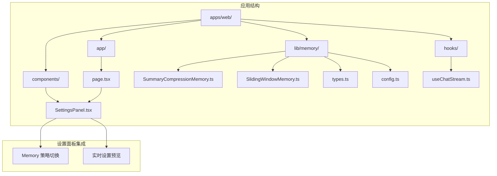
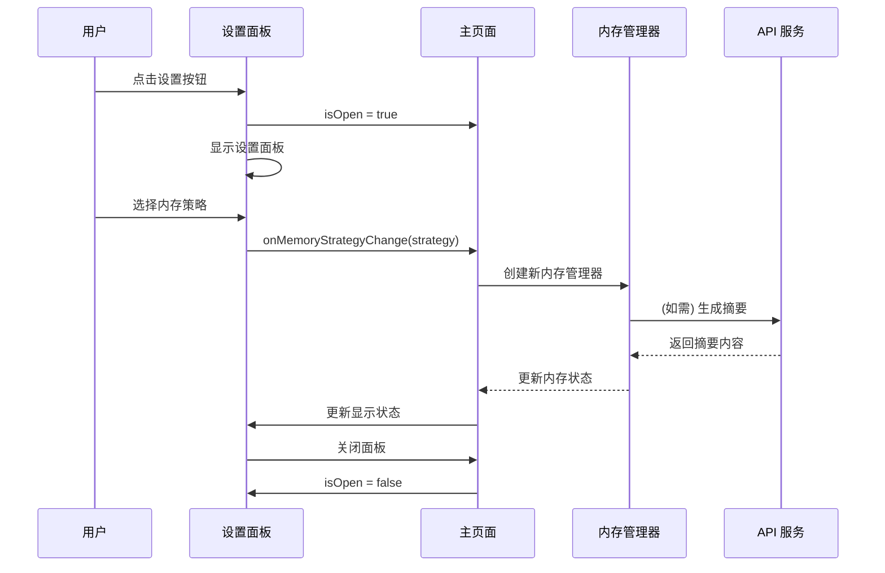
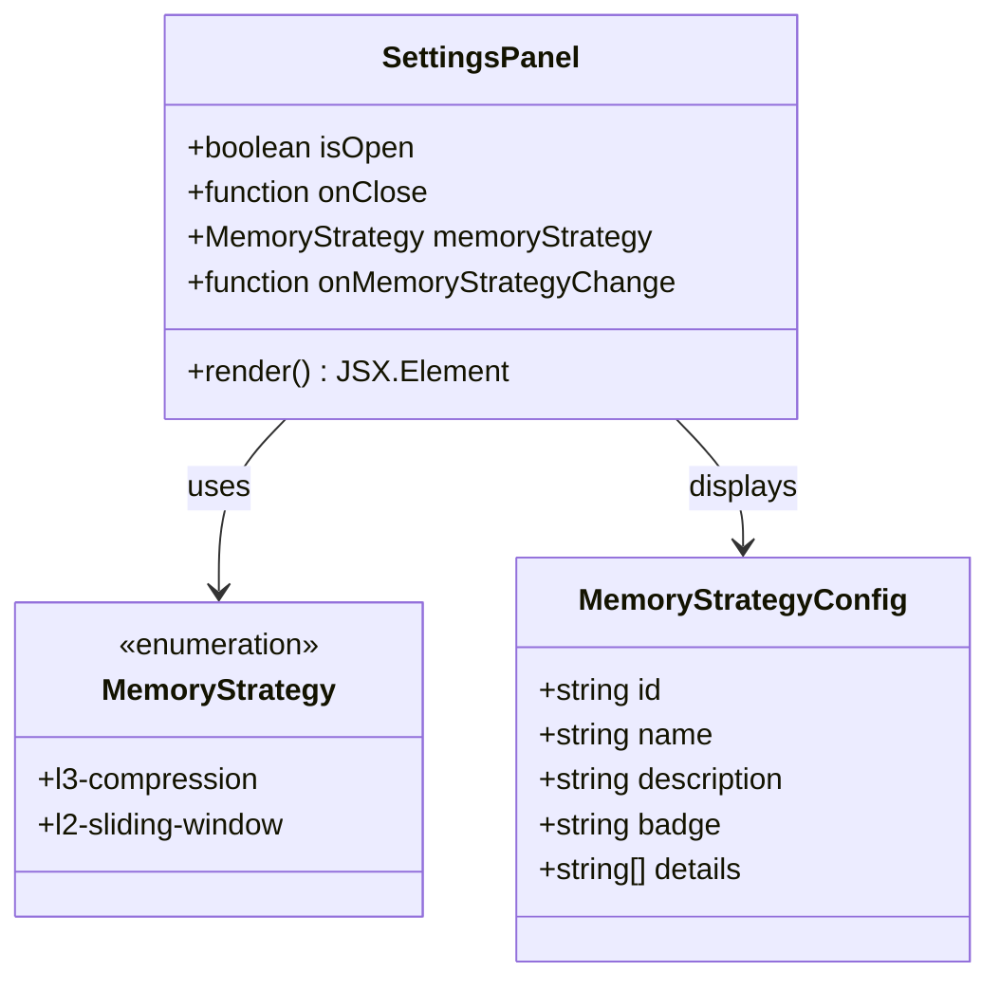
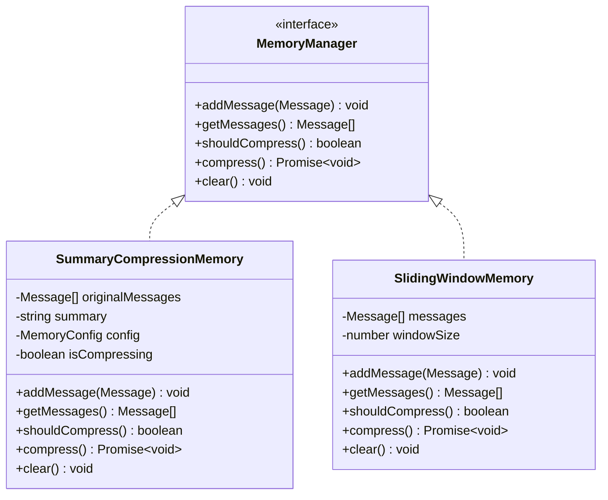
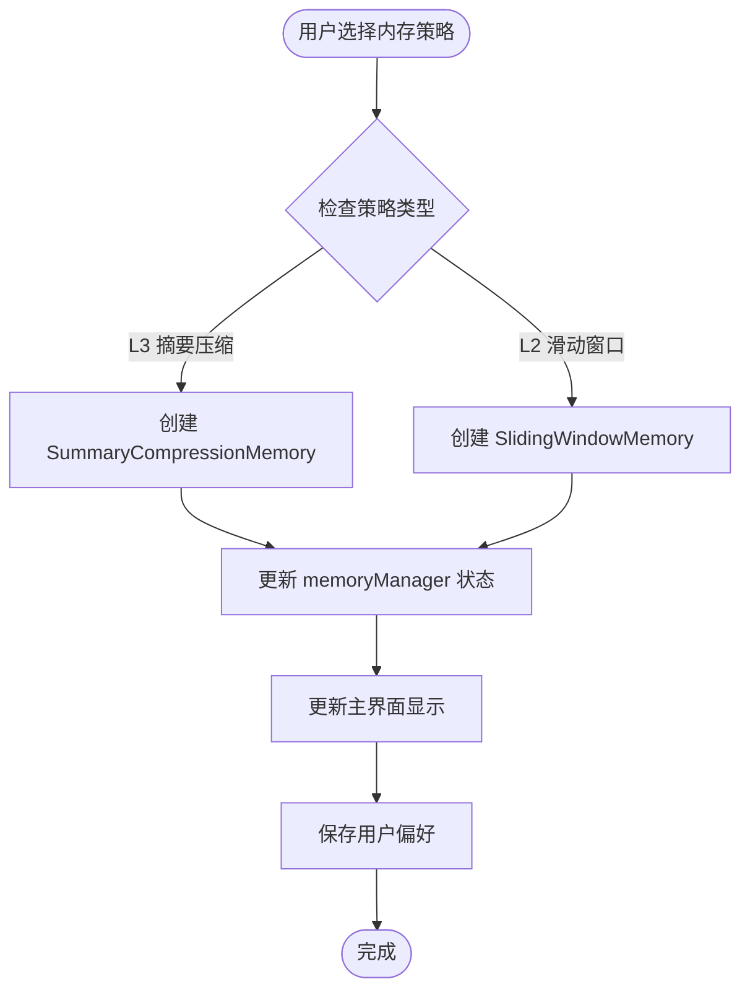
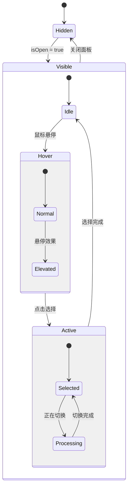
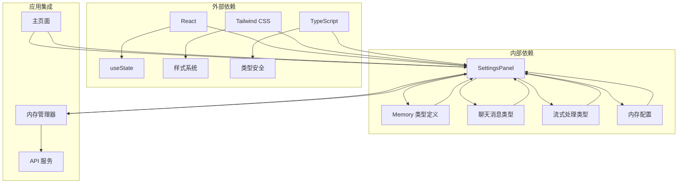
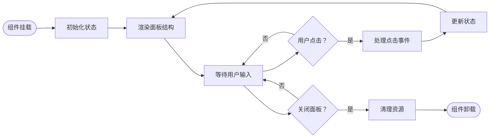

# 设置面板组件

<cite>
**本文档引用的文件**
- [SettingsPanel.tsx](file://apps/web/components/SettingsPanel.tsx)
- [page.tsx](file://apps/web/app/page.tsx)
- [SummaryCompressionMemory.ts](file://apps/web/lib/memory/SummaryCompressionMemory.ts)
- [SlidingWindowMemory.ts](file://apps/web/lib/memory/SlidingWindowMemory.ts)
- [types.ts](file://apps/web/lib/memory/types.ts)
- [config.ts](file://apps/web/lib/memory/config.ts)
- [useChatStream.ts](file://apps/web/hooks/useChatStream.ts)
- [chat.ts](file://apps/web/types/chat.ts)
- [stream.ts](file://apps/web/types/stream.ts)
- [globals.css](file://apps/web/app/globals.css)
</cite>

## 目录
1. [简介](#简介)
2. [项目结构](#项目结构)
3. [核心组件](#核心组件)
4. [架构概览](#架构概览)
5. [详细组件分析](#详细组件分析)
6. [依赖关系分析](#依赖关系分析)
7. [性能考虑](#性能考虑)
8. [故障排除指南](#故障排除指南)
9. [结论](#结论)

## 简介

设置面板组件是 Web3 AI Agent 应用中的一个关键界面组件，负责提供用户友好的设置界面，允许用户自定义对话上下文管理策略。该组件采用现代化的设计理念，结合了响应式布局、动画效果和流畅的用户体验，为用户提供直观的设置选项。

该组件的核心功能包括：
- 内存策略选择（L3 摘要压缩 vs L2 滑动窗口）
- 实时预览设置效果
- 平滑的展开/收起动画
- 无障碍设计支持

## 项目结构

设置面板组件位于应用的组件目录中，与聊天界面紧密集成，形成完整的用户交互体验。



**图表来源**
- [SettingsPanel.tsx:1-192](file://apps/web/components/SettingsPanel.tsx#L1-L192)
- [page.tsx:1-217](file://apps/web/app/page.tsx#L1-L217)

**章节来源**
- [SettingsPanel.tsx:1-192](file://apps/web/components/SettingsPanel.tsx#L1-L192)
- [page.tsx:1-217](file://apps/web/app/page.tsx#L1-L217)

## 核心组件

设置面板组件是一个高度模块化的 React 组件，具有清晰的职责分离和类型安全的接口设计。

### 组件特性

| 特性 | 描述 | 实现方式 |
|------|------|----------|
| **响应式设计** | 支持移动端和桌面端 | 使用 Tailwind CSS 响应式类 |
| **动画效果** | 平滑展开/收起动画 | CSS 过渡和变换属性 |
| **无障碍支持** | 键盘导航和屏幕阅读器友好 | 标准 HTML 属性和语义化标签 |
| **实时预览** | 设置变更即时反映在主界面 | 状态同步和回调机制 |

### 接口定义

组件通过严格的 TypeScript 接口确保类型安全：

```typescript
interface SettingsPanelProps {
  isOpen: boolean
  onClose: () => void
  memoryStrategy: MemoryStrategy
  onMemoryStrategyChange: (strategy: MemoryStrategy) => void
}

type MemoryStrategy = 'l3-compression' | 'l2-sliding-window'
```

**章节来源**
- [SettingsPanel.tsx:7-12](file://apps/web/components/SettingsPanel.tsx#L7-L12)
- [SettingsPanel.tsx:5](file://apps/web/components/SettingsPanel.tsx#L5)

## 架构概览

设置面板组件在整个应用架构中扮演着重要的桥梁角色，连接用户界面和底层内存管理系统。



**图表来源**
- [SettingsPanel.tsx:41-46](file://apps/web/components/SettingsPanel.tsx#L41-L46)
- [page.tsx:43-50](file://apps/web/app/page.tsx#L43-L50)
- [SummaryCompressionMemory.ts:76-103](file://apps/web/lib/memory/SummaryCompressionMemory.ts#L76-L103)

## 详细组件分析

### 设置面板组件结构

设置面板组件采用了现代 React 的函数式组件模式，结合了状态管理和副作用处理的最佳实践。

#### 组件层次结构



**图表来源**
- [SettingsPanel.tsx:41-46](file://apps/web/components/SettingsPanel.tsx#L41-L46)
- [SettingsPanel.tsx:14-39](file://apps/web/components/SettingsPanel.tsx#L14-L39)

#### 内存策略配置

设置面板提供了两种不同的内存管理策略，每种策略都有其独特的特点和适用场景：

| 策略名称 | 技术实现 | 性能特征 | 适用场景 |
|----------|----------|----------|----------|
| **L3 摘要压缩** | AI 生成摘要 + 保留最近消息 | 高质量上下文，有额外 API 调用 | 需要丰富上下文的复杂对话 |
| **L2 滑动窗口** | 纯本地截断，无额外调用 | 性能开销极低 | 简单对话或性能敏感场景 |

**章节来源**
- [SettingsPanel.tsx:14-39](file://apps/web/components/SettingsPanel.tsx#L14-L39)

### 内存管理器集成

设置面板与内存管理系统的集成体现了良好的架构设计原则，实现了松耦合和高内聚。

#### 内存管理器接口



**图表来源**
- [types.ts:12-37](file://apps/web/lib/memory/types.ts#L12-L37)
- [SummaryCompressionMemory.ts:5-13](file://apps/web/lib/memory/SummaryCompressionMemory.ts#L5-L13)
- [SlidingWindowMemory.ts:11-19](file://apps/web/lib/memory/SlidingWindowMemory.ts#L11-L19)

#### 策略切换流程



**图表来源**
- [page.tsx:43-50](file://apps/web/app/page.tsx#L43-L50)
- [SummaryCompressionMemory.ts:11-13](file://apps/web/lib/memory/SummaryCompressionMemory.ts#L11-L13)
- [SlidingWindowMemory.ts:15-19](file://apps/web/lib/memory/SlidingWindowMemory.ts#L15-L19)

**章节来源**
- [page.tsx:43-50](file://apps/web/app/page.tsx#L43-L50)
- [types.ts:12-37](file://apps/web/lib/memory/types.ts#L12-L37)

### 用户界面设计

设置面板采用了现代化的设计语言，注重用户体验和视觉效果。

#### 设计元素

| 元素 | 样式类 | 功能 |
|------|--------|------|
| **背景遮罩** | `fixed inset-0 bg-black/60 backdrop-blur-sm` | 提供焦点和交互区域 |
| **面板容器** | `fixed right-0 top-0 h-full w-full max-w-md` | 确定面板位置和尺寸 |
| **头部区域** | `p-6 border-b border-white/[0.06]` | 包含标题和关闭按钮 |
| **内容区域** | `p-6 space-y-8 overflow-y-auto` | 容纳设置选项和说明 |
| **选项按钮** | `rounded-xl p-4 border transition-all` | 响应用户选择 |

#### 动画系统

设置面板实现了多层次的动画效果，提供流畅的用户体验：



**图表来源**
- [SettingsPanel.tsx:47](file://apps/web/components/SettingsPanel.tsx#L47)
- [SettingsPanel.tsx:96-100](file://apps/web/components/SettingsPanel.tsx#L96-L100)

**章节来源**
- [SettingsPanel.tsx:49-191](file://apps/web/components/SettingsPanel.tsx#L49-L191)

## 依赖关系分析

设置面板组件的依赖关系体现了清晰的分层架构和模块化设计。



**图表来源**
- [SettingsPanel.tsx:3](file://apps/web/components/SettingsPanel.tsx#L3)
- [page.tsx:4-11](file://apps/web/app/page.tsx#L4-L11)
- [types.ts:1-2](file://apps/web/lib/memory/types.ts#L1-L2)

### 依赖注入模式

设置面板采用了依赖注入的设计模式，通过 props 传递依赖，实现了组件的可测试性和可维护性。

| 依赖类型 | 注入方式 | 作用域 | 生命周期 |
|----------|----------|--------|----------|
| **状态管理** | Props 回调 | 组件间共享 | 短期 |
| **内存管理器** | 工厂函数 | 组件实例 | 短期 |
| **配置信息** | 环境变量 | 应用级 | 长期 |
| **样式系统** | Tailwind 类 | 视觉表现 | 永久 |

**章节来源**
- [SettingsPanel.tsx:7-12](file://apps/web/components/SettingsPanel.tsx#L7-L12)
- [page.tsx:25-27](file://apps/web/app/page.tsx#L25-L27)

## 性能考虑

设置面板组件在设计时充分考虑了性能优化，采用了多种技术手段确保流畅的用户体验。

### 性能优化策略

| 优化技术 | 实现方式 | 性能收益 |
|----------|----------|----------|
| **条件渲染** | `isOpen` 状态控制 | 减少 DOM 节点数量 |
| **CSS 过渡** | GPU 加速动画 | 60fps 流畅度 |
| **事件委托** | 单一点击事件处理 | 降低事件监听器数量 |
| **虚拟滚动** | 滚动容器优化 | 大列表渲染性能 |
| **样式缓存** | Tailwind 预编译 | 减少运行时计算 |

### 内存管理

设置面板组件遵循最小内存占用原则：



**图表来源**
- [SettingsPanel.tsx:47](file://apps/web/components/SettingsPanel.tsx#L47)
- [SettingsPanel.tsx:52-55](file://apps/web/components/SettingsPanel.tsx#L52-L55)

**章节来源**
- [SettingsPanel.tsx:47-55](file://apps/web/components/SettingsPanel.tsx#L47-L55)

## 故障排除指南

### 常见问题及解决方案

| 问题类型 | 症状 | 原因 | 解决方案 |
|----------|------|------|----------|
| **面板无法显示** | 组件渲染为空 | `isOpen` 状态为 false | 检查父组件状态传递 |
| **点击无响应** | 点击关闭按钮无效 | 事件处理器未正确绑定 | 验证 `onClick` 回调函数 |
| **样式异常** | 面板显示错位 | Tailwind 类冲突 | 检查样式优先级 |
| **内存泄漏** | 组件卸载后仍有事件监听 | 未清理定时器 | 确保清理副作用 |
| **性能问题** | 动画卡顿 | 过多重绘 | 优化渲染逻辑 |

### 调试技巧

1. **开发者工具检查**
   - 使用 React DevTools 检查组件树
   - 监控组件重新渲染次数
   - 检查 props 和 state 变化

2. **性能分析**
   - 使用浏览器性能面板
   - 监控 FPS 和内存使用
   - 检查 JavaScript 执行时间

3. **网络监控**
   - 检查 API 请求状态
   - 监控流式响应处理
   - 验证错误处理机制

**章节来源**
- [SettingsPanel.tsx:52-55](file://apps/web/components/SettingsPanel.tsx#L52-L55)
- [useChatStream.ts:255-268](file://apps/web/hooks/useChatStream.ts#L255-L268)

## 结论

设置面板组件是 Web3 AI Agent 应用中一个精心设计的界面组件，它不仅提供了实用的功能，还展现了现代前端开发的最佳实践。通过清晰的架构设计、优秀的用户体验和完善的性能优化，该组件成功地将复杂的内存管理概念简化为直观的用户界面。

### 主要成就

1. **用户体验优化**：通过流畅的动画和直观的界面设计，提供了优秀的用户体验
2. **架构设计优雅**：实现了松耦合和高内聚的设计原则
3. **性能表现优秀**：采用了多种优化技术确保流畅的交互体验
4. **可维护性强**：清晰的代码结构和类型安全确保了长期可维护性

### 未来改进方向

1. **国际化支持**：扩展多语言支持以服务全球用户
2. **主题定制**：增加更多主题选项满足个性化需求
3. **高级设置**：提供更多细粒度的配置选项
4. **性能监控**：集成性能指标监控和分析

设置面板组件代表了现代前端开发的高标准，为类似的应用程序提供了优秀的参考实现。