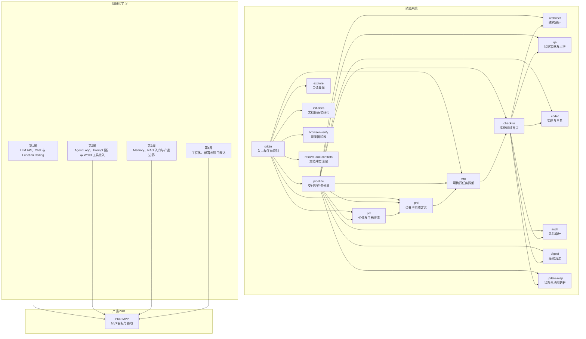
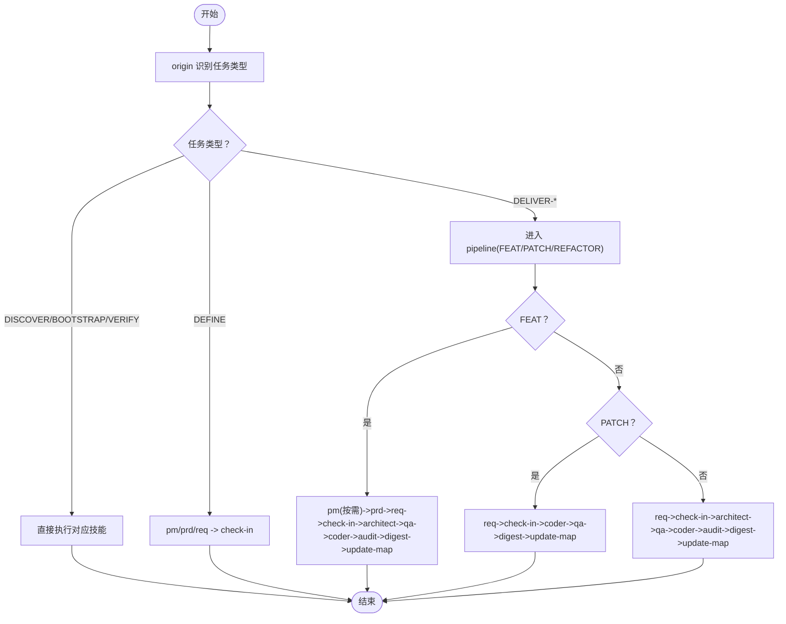
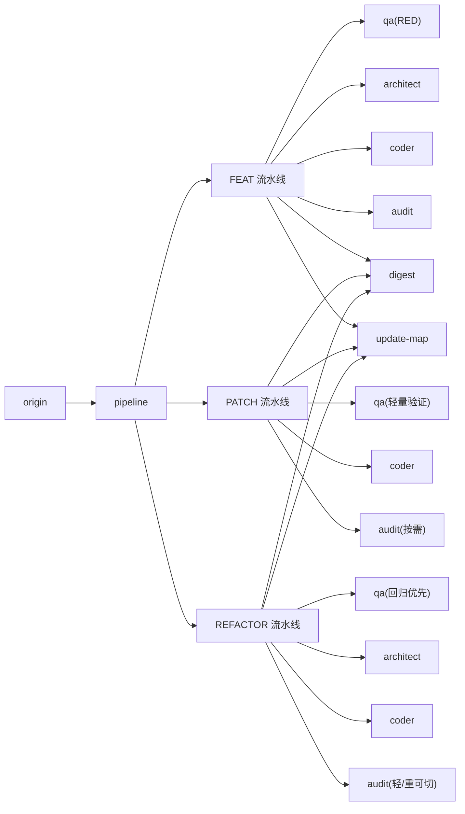

# 核心价值主张

<cite>
**本文引用的文件**
- [AI-Agent.md](file://AI-Agent.md)
- [Web3-AI-Agent-PRD-MVP.md](file://Web3-AI-Agent-PRD-MVP.md)
- [按周拆解的学习资料清单.md](file://按周拆解的学习资料清单.md)
- [skills/web3-ai-agent/SKILL.md](file://skills/web3-ai-agent/SKILL.md)
- [skills/web3-ai-agent/SKILL-SYSTEM-DESIGN-V3.md](file://skills/web3-ai-agent/SKILL-SYSTEM-DESIGN-V3.md)
- [skills/web3-ai-agent/MAP-V3.md](file://skills/web3-ai-agent/MAP-V3.md)
- [skills/web3-ai-agent/COMMANDS.md](file://skills/web3-ai-agent/COMMANDS.md)
- [skills/web3-ai-agent/architect/SKILL.md](file://skills/web3-ai-agent/architect/SKILL.md)
- [skills/web3-ai-agent/coder/SKILL.md](file://skills/web3-ai-agent/coder/SKILL.md)
- [skills/web3-ai-agent/qa/SKILL.md](file://skills/web3-ai-agent/qa/SKILL.md)
- [skills/web3-ai-agent/pm/SKILL.md](file://skills/web3-ai-agent/pm/SKILL.md)
- [skills/web3-ai-agent/prd/SKILL.md](file://skills/web3-ai-agent/prd/SKILL.md)
</cite>

## 目录
1. [引言](#引言)
2. [项目结构](#项目结构)
3. [核心组件](#核心组件)
4. [架构总览](#架构总览)
5. [详细组件分析](#详细组件分析)
6. [依赖分析](#依赖分析)
7. [性能考量](#性能考量)
8. [故障排查指南](#故障排查指南)
9. [结论](#结论)
10. [附录](#附录)

## 引言
本项目面向Web3前端工程师的职业转型需求，提供一套“从零开始的AI Agent开发技能培养路径”。项目以文档驱动的学习方法为核心，结合可操作的技能系统架构，帮助工程师在30天内完成从“理解Agent概念”到“可展示的MVP原型”的闭环实践。项目强调：
- 实用性：以真实项目为载体，边学边做，边做边学
- 系统性：7类任务分层、5层技能分层、3类交付流水线，形成可复用的开发范式
- 可操作性：明确的斜杠命令约定、阶段化学习清单、可落地的执行规则

通过本项目，Web3前端工程师可以系统掌握Agent开发的关键能力（LLM API、Function Calling、Agent Loop、Memory、RAG、工程化与部署），并形成可投递简历的作品集与方法论。

## 项目结构
项目采用“技能系统 + 阶段化学习 + 产品PRD”的三位一体结构：
- 技能系统：以web3-ai-agent为中心，定义7类任务与5层技能分层，配套命令约定与地图
- 阶段化学习：按周拆解学习清单，确保每周聚焦必要知识点与产出
- 产品PRD：明确MVP目标、用户场景、能力边界与验收标准

图表来源
- [skills/web3-ai-agent/MAP-V3.md:1-166](file://skills/web3-ai-agent/MAP-V3.md#L1-L166)
- [按周拆解的学习资料清单.md:1-196](file://按周拆解的学习资料清单.md#L1-L196)
- [Web3-AI-Agent-PRD-MVP.md:1-228](file://Web3-AI-Agent-PRD-MVP.md#L1-L228)

章节来源
- [skills/web3-ai-agent/MAP-V3.md:1-166](file://skills/web3-ai-agent/MAP-V3.md#L1-L166)
- [按周拆解的学习资料清单.md:1-196](file://按周拆解的学习资料清单.md#L1-L196)
- [Web3-AI-Agent-PRD-MVP.md:1-228](file://Web3-AI-Agent-PRD-MVP.md#L1-L228)

## 核心组件
- web3-ai-agent总入口：统一从origin进入，自动识别任务类型并路由到对应技能或流水线
- 7类任务：DISCOVER、BOOTSTRAP、DEFINE、DELIVER-FEAT、DELIVER-PATCH、DELIVER-REFACTOR、VERIFY/GOVERN
- 5层技能分层：入口层(origin、pipeline)、定义层(pm、prd、req、check-in)、交付层(architect、qa、coder、audit)、治理层(digest、update-map)、辅助层(explore、init-docs、browser-verify、resolve-doc-conflicts)
- 3类交付流水线：FEAT（全链路）、PATCH（快速链路）、REFACTOR（设计优先）
- 斜杠命令约定：/origin、/pipeline feat/patch/refactor、/pm、/prd、/req、/check-in、/architect、/qa、/coder、/audit、/digest、/update-map、/explore、/init-docs、/browser-verify、/resolve-doc-conflicts

章节来源
- [skills/web3-ai-agent/SKILL.md:1-224](file://skills/web3-ai-agent/SKILL.md#L1-L224)
- [skills/web3-ai-agent/SKILL-SYSTEM-DESIGN-V3.md:1-719](file://skills/web3-ai-agent/SKILL-SYSTEM-DESIGN-V3.md#L1-L719)
- [skills/web3-ai-agent/COMMANDS.md:1-81](file://skills/web3-ai-agent/COMMANDS.md#L1-L81)

## 架构总览
本项目以“入口识别 → 任务分流 → 定义对齐 → 实施交付 → 治理沉淀”为主线，形成可扩展、可裁剪的Agent开发操作系统。核心规则包括：
- 任何任务必须先经origin识别
- 仅交付型任务进入pipeline
- 实施型任务必须经过check-in
- FEAT默认先由qa执行RED，PATCH/REFACTOR默认轻量验证
- coder最多10轮自愈，超过终止并人工介入
- audit总分100分，≥80通过，<60直接拒绝

图表来源
- [skills/web3-ai-agent/SKILL-SYSTEM-DESIGN-V3.md:222-285](file://skills/web3-ai-agent/SKILL-SYSTEM-DESIGN-V3.md#L222-L285)
- [skills/web3-ai-agent/MAP-V3.md:86-166](file://skills/web3-ai-agent/MAP-V3.md#L86-L166)

章节来源
- [skills/web3-ai-agent/SKILL-SYSTEM-DESIGN-V3.md:222-285](file://skills/web3-ai-agent/SKILL-SYSTEM-DESIGN-V3.md#L222-L285)
- [skills/web3-ai-agent/MAP-V3.md:86-166](file://skills/web3-ai-agent/MAP-V3.md#L86-L166)

## 详细组件分析

### 从零到一：学习路径与技能收益
- 第1周：掌握LLM API、Chat与Function Calling，完成最小聊天页面与2个Web3工具，形成Tool Calling工作原理的认知闭环
- 第2周：构建Agent Loop，接入真实Web3数据能力，完成至少3个工具与系统架构草图
- 第3周：引入Memory与RAG入门，明确产品边界与风险控制策略，输出稳定系统Prompt
- 第4周：工程化与部署，形成在线可访问版本、完整README、项目架构图与简历项目描述

章节来源
- [按周拆解的学习资料清单.md:15-56](file://按周拆解的学习资料清单.md#L15-L56)
- [按周拆解的学习资料清单.md:59-99](file://按周拆解的学习资料清单.md#L59-L99)
- [按周拆解的学习资料清单.md:102-141](file://按周拆解的学习资料清单.md#L102-L141)
- [按周拆解的学习资料清单.md:144-184](file://按周拆解的学习资料清单.md#L144-L184)

### 从概念到产品：PRD与MVP目标
- 产品目标：构建可运行的Web3 AI Agent MVP，覆盖对话、Tool Calling、Agent Loop与最小Memory
- 用户场景：自然语言查询ETH价格、钱包余额、Gas或Token信息；支持多轮跟进与风险提示
- 能力边界：不提供自动交易执行、不捏造链上数据、不给出确定性买卖建议
- 验收标准：至少2个Web3工具可触发、支持一次完整Agent Loop、基础流式输出、高风险问题触发风险提示

章节来源
- [Web3-AI-Agent-PRD-MVP.md:11-228](file://Web3-AI-Agent-PRD-MVP.md#L11-L228)

### 技能系统：从入口到交付的可操作流程
- origin：统一入口，识别任务类型并路由
- pipeline：仅交付型任务进入，按FEAT/PATCH/REFACTOR选择执行深度
- 定义层：pm/prd/req/check-in，将模糊输入转为可实施对象
- 交付层：architect/qa/coder/audit，设计、验证、实现、审计
- 治理层：digest/update-map，沉淀经验与更新地图
- 辅助层：explore/init-docs/browser-verify/resolve-doc-conflicts

章节来源
- [skills/web3-ai-agent/SKILL-SYSTEM-DESIGN-V3.md:164-220](file://skills/web3-ai-agent/SKILL-SYSTEM-DESIGN-V3.md#L164-L220)
- [skills/web3-ai-agent/MAP-V3.md:1-84](file://skills/web3-ai-agent/MAP-V3.md#L1-L84)

### 关键技能详解

#### Architect（架构设计）
- 适用：涉及接口、状态流、模块边界或结构性重构
- 输入：check-in、任务卡
- 输出：模块边界、数据流、消息流、接口契约、错误处理、风险点
- 边界：不直接写测试、不直接承担编码

章节来源
- [skills/web3-ai-agent/architect/SKILL.md:1-53](file://skills/web3-ai-agent/architect/SKILL.md#L1-L53)

#### QA（验证策略与执行）
- 两种模式：RED（FEAT先红后绿）与VERIFY（PATCH/REFACTOR轻量验证）
- 输入：check-in、架构说明、任务卡
- 输出：测试清单、红灯结果或验证结果、回归检查点
- 规则：FEAT先红后绿；PATCH至少保留轻量回归检查

章节来源
- [skills/web3-ai-agent/qa/SKILL.md:1-73](file://skills/web3-ai-agent/qa/SKILL.md#L1-L73)

#### Coder（实现与自愈）
- 目标：在边界清楚前提下实施代码，最多10轮自愈将QA红灯变为绿灯
- 自愈循环：最多10轮，超过终止并输出STUCK报告，请求人工介入
- 规则：没有check-in不进入coder；发现范围变大回退至req/check-in/architect

章节来源
- [skills/web3-ai-agent/coder/SKILL.md:1-72](file://skills/web3-ai-agent/coder/SKILL.md#L1-L72)

#### PM（价值与目标澄清）
- 适用：目标模糊、用户价值不清、需先判断值不值得做
- 输出：目标用户、核心痛点、价值主张、为什么现在做、MVP建议范围、下一跳
- 边界：不写技术实现、不拆工程任务

章节来源
- [skills/web3-ai-agent/pm/SKILL.md:1-53](file://skills/web3-ai-agent/pm/SKILL.md#L1-L53)

#### PRD（边界与验收定义）
- 适用：FEAT正式边界定义、重构影响产品边界、bug根因是需求错误
- 输出：背景、目标、用户场景、范围、非目标、风险边界、验收标准
- 规则：PRD重点是边界，不是实现；没有清晰非目标的PRD视为未完成

章节来源
- [skills/web3-ai-agent/prd/SKILL.md:1-54](file://skills/web3-ai-agent/prd/SKILL.md#L1-L54)

### 命令约定与可操作性
- 推荐入口：/origin + 任务描述
- 命令总表：/origin、/pipeline feat/patch/refactor、/pm、/prd、/req、/check-in、/architect、/qa、/coder、/audit、/digest、/update-map、/explore、/init-docs、/browser-verify、/resolve-doc-conflicts
- 使用建议：即使没有下拉菜单，也推荐按此格式使用，显著降低路由歧义

章节来源
- [skills/web3-ai-agent/COMMANDS.md:1-81](file://skills/web3-ai-agent/COMMANDS.md#L1-L81)

## 依赖分析
- 入口依赖：origin是所有任务的唯一入口，保证系统可分流
- 交付依赖：仅DELIVER-*任务进入pipeline，避免非交付任务被流程拖累
- 实施依赖：check-in是实施前门禁，防止盲目编码与范围漂移
- 质量依赖：QA先红后绿，coder自愈上限10轮，audit评分≥80才通过
- 文档依赖：digest与update-map合并为closeout，沉淀经验并更新地图

图表来源
- [skills/web3-ai-agent/SKILL-SYSTEM-DESIGN-V3.md:288-392](file://skills/web3-ai-agent/SKILL-SYSTEM-DESIGN-V3.md#L288-L392)
- [skills/web3-ai-agent/MAP-V3.md:102-166](file://skills/web3-ai-agent/MAP-V3.md#L102-L166)

章节来源
- [skills/web3-ai-agent/SKILL-SYSTEM-DESIGN-V3.md:288-392](file://skills/web3-ai-agent/SKILL-SYSTEM-DESIGN-V3.md#L288-L392)
- [skills/web3-ai-agent/MAP-V3.md:102-166](file://skills/web3-ai-agent/MAP-V3.md#L102-L166)

## 性能考量
- 流程效率：通过7类任务与5层分层，减少非必要流程消耗，高风险任务强约束，低风险任务轻量化
- 执行效率：coder自愈上限10轮，避免无限试错；audit评分分级，小任务不过度消耗
- 文档效率：digest与update-map合并为closeout，减少流程割裂感，保留文档沉淀但不压垮交付效率

## 故障排查指南
- 无法进入技能：检查是否先经origin识别任务类型
- 编码前无进展：确认是否已完成check-in并输出7项强制结构
- 修复无效：检查是否超过coder自愈上限10轮，若STUCK需人工介入
- 审计未通过：关注audit评分，<60直接拒绝，60-79软拒绝回退修复
- 前端验收问题：按需插入browser-verify，确认视觉与交互回归

章节来源
- [skills/web3-ai-agent/SKILL-SYSTEM-DESIGN-V3.md:696-719](file://skills/web3-ai-agent/SKILL-SYSTEM-DESIGN-V3.md#L696-L719)
- [skills/web3-ai-agent/coder/SKILL.md:18-37](file://skills/web3-ai-agent/coder/SKILL.md#L18-L37)

## 结论
本项目为Web3前端工程师提供了一条“从零到一”的AI Agent开发路径：以文档驱动的学习方法、可操作的技能系统架构、阶段化的实践产出，帮助工程师在30天内完成从概念理解到MVP落地的闭环。相比其他学习路径，本项目的优势在于：
- 实用性强：以真实项目为载体，边学边做，边做边学
- 系统性强：7类任务+5层分层+3类流水线，形成可复用范式
- 可操作性强：明确命令约定、阶段清单与执行规则，降低学习与协作成本

选择本项目，意味着选择了一条可迁移、可复用、可展示的转型路径。

## 附录
- 项目背景与转型目标：从Web3前端工程师升级为AI应用工程师/Agent工程师
- 产品目标与PRD：MVP目标、用户场景、能力边界与验收标准
- 阶段化学习清单：每周聚焦必要知识点与产出，形成可复用的阶段结论

章节来源
- [AI-Agent.md:1-15](file://AI-Agent.md#L1-L15)
- [Web3-AI-Agent-PRD-MVP.md:1-228](file://Web3-AI-Agent-PRD-MVP.md#L1-L228)
- [按周拆解的学习资料清单.md:1-196](file://按周拆解的学习资料清单.md#L1-L196)