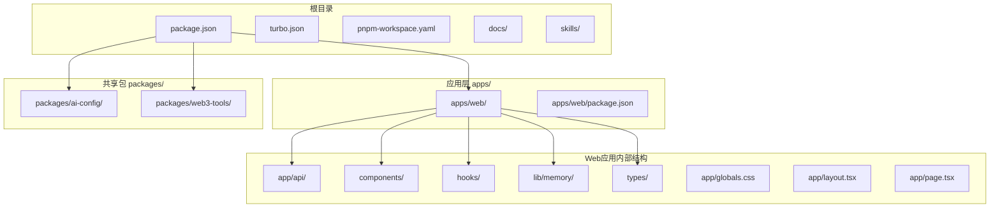
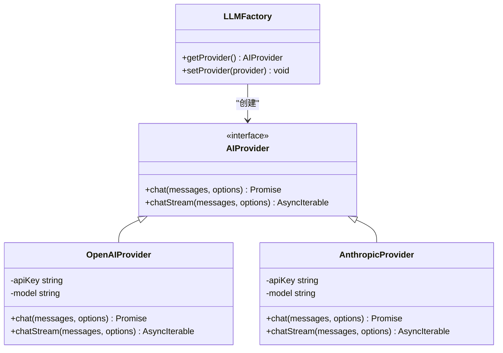
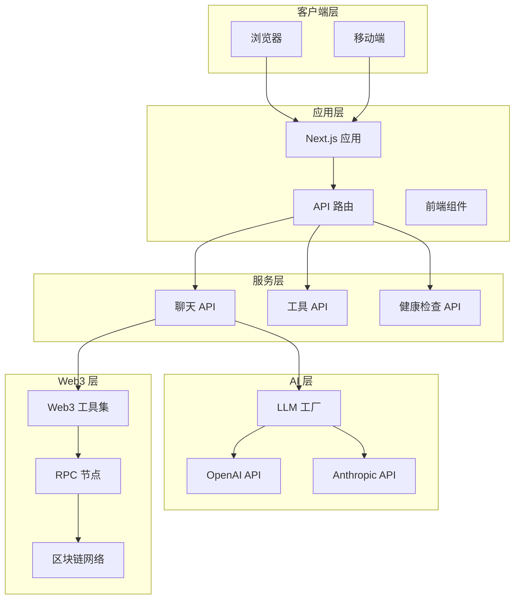
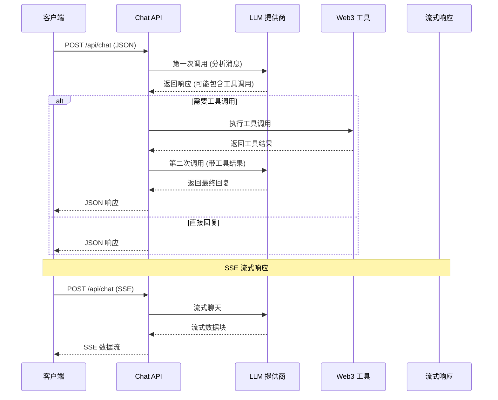

# 部署指南

<cite>
**本文档引用的文件**
- [README.md](file://README.md)
- [package.json](file://package.json)
- [pnpm-workspace.yaml](file://pnpm-workspace.yaml)
- [turbo.json](file://turbo.json)
- [apps/web/package.json](file://apps/web/package.json)
- [apps/web/next.config.js](file://apps/web/next.config.js)
- [apps/web/tailwind.config.ts](file://apps/web/tailwind.config.ts)
- [apps/web/postcss.config.js](file://apps/web/postcss.config.js)
- [apps/web/app/api/chat/route.ts](file://apps/web/app/api/chat/route.ts)
- [apps/web/app/api/health/route.ts](file://apps/web/app/api/health/route.ts)
- [apps/web/app/api/tools/route.ts](file://apps/web/app/api/tools/route.ts)
- [docs/DEPLOYMENT.md](file://docs/DEPLOYMENT.md)
- [packages/ai-config/package.json](file://packages/ai-config/package.json)
- [packages/web3-tools/package.json](file://packages/web3-tools/package.json)
</cite>

## 目录
1. [简介](#简介)
2. [项目结构](#项目结构)
3. [核心组件](#核心组件)
4. [架构概览](#架构概览)
5. [详细组件分析](#详细组件分析)
6. [部署方案](#部署方案)
7. [环境变量配置](#环境变量配置)
8. [性能优化](#性能优化)
9. [监控与日志](#监控与日志)
10. [故障排除](#故障排除)
11. [总结](#总结)

## 简介

Web3 AI Agent 是一个面向 Web3 前端开发者的 AI Agent 项目，实现从需求定义到代码交付的完整 SDLC 自动化流程。该项目采用 Monorepo 架构，使用 Next.js 14 + React + TypeScript 技术栈，结合 OpenAI API 和 Web3 工具集，为用户提供智能对话和链上数据查询能力。

## 项目结构

项目采用 Turborepo + PNPM Workspace 的 Monorepo 架构：



**图表来源**
- [package.json:1-28](file://package.json#L1-L28)
- [pnpm-workspace.yaml:1-4](file://pnpm-workspace.yaml#L1-L4)
- [turbo.json:1-21](file://turbo.json#L1-L21)

**章节来源**
- [README.md:26-38](file://README.md#L26-L38)
- [package.json:23-26](file://package.json#L23-L26)

## 核心组件

### AI 配置模块 (@web3-ai-agent/ai-config)

AI 配置模块提供了统一的 AI 模型抽象层，支持多种 AI 提供商：



**图表来源**
- [packages/ai-config/package.json:13-16](file://packages/ai-config/package.json#L13-L16)

### Web3 工具模块 (@web3-ai-agent/web3-tools)

Web3 工具模块提供了丰富的区块链数据查询能力：

| 工具名称 | 功能描述 | 支持链 |
|---------|----------|--------|
| getTokenPrice | 获取加密货币价格 | ETH, BTC, SOL, MATIC, BNB |
| getBalance | 查询钱包余额 | Ethereum, Polygon, BSC, Bitcoin, Solana |
| getGasPrice | 获取 Gas 价格 | Ethereum, Polygon, BSC |
| getTokenInfo | 查询 Token 元数据 | Ethereum, Polygon, BSC |

**章节来源**
- [apps/web/app/api/chat/route.ts:8-101](file://apps/web/app/api/chat/route.ts#L8-L101)
- [packages/web3-tools/package.json:13-16](file://packages/web3-tools/package.json#L13-L16)

## 架构概览

系统采用前后端分离的架构设计，前端使用 Next.js 构建用户界面，后端通过 API 路由提供 AI 和 Web3 服务：



**图表来源**
- [apps/web/app/api/chat/route.ts:135-405](file://apps/web/app/api/chat/route.ts#L135-L405)
- [apps/web/app/api/tools/route.ts:9-49](file://apps/web/app/api/tools/route.ts#L9-L49)

## 详细组件分析

### 聊天 API 组件

聊天 API 实现了完整的 AI Agent 对话流程，包括工具调用和流式响应：



**图表来源**
- [apps/web/app/api/chat/route.ts:135-405](file://apps/web/app/api/chat/route.ts#L135-L405)

### 健康检查组件

健康检查 API 提供了简单有效的服务状态监控：

```mermaid
flowchart TD
Request[HTTP 请求] --> Handler[GET /api/health]
Handler --> Check[检查服务状态]
Check --> Status{状态正常?}
Status --> |是| OK[返回 {"status":"ok"}]
Status --> |否| Error[返回错误信息]
OK --> Response[HTTP 200]
Error --> ErrorResponse[HTTP 500]
```

**图表来源**
- [apps/web/app/api/health/route.ts:3-9](file://apps/web/app/api/health/route.ts#L3-L9)

**章节来源**
- [apps/web/app/api/chat/route.ts:135-405](file://apps/web/app/api/chat/route.ts#L135-L405)
- [apps/web/app/api/health/route.ts:3-9](file://apps/web/app/api/health/route.ts#L3-L9)

## 部署方案

### 方案一：Vercel 部署（推荐）

Vercel 提供了零配置的云端部署体验，特别适合快速上线和个人项目。

#### 部署步骤

1. **准备工作**
   ```bash
   # 推送代码到 GitHub
   git remote add origin https://github.com/YOUR_USERNAME/web3-ai-agent.git
   git push -u origin main
   
   # 注册 Vercel 账号并连接 GitHub
   ```

2. **创建 Vercel 项目**
   - 访问 Vercel Dashboard
   - 点击 **"Add New..."** → **"Project"**
   - 选择 GitHub 仓库 `web3-ai-agent`
   - 点击 **Import**

3. **配置构建设置**
   ```
   Framework Preset: Next.js
   Root Directory: apps/web
   Build Command: cd ../.. && pnpm install && pnpm build --filter=@web3-ai-agent/web
   Output Directory: .next
   ```

4. **配置环境变量**
   在 Vercel 项目设置中添加以下环境变量：
   ```
   DEFAULT_MODEL_PROVIDER=openai
   OPENAI_API_KEY=your_openai_api_key_here
   OPENAI_MODEL=gpt-3.5-turbo
   ETHEREUM_RPC_URL=https://eth-mainnet.g.alchemy.com/v2/YOUR_ALCHEMY_KEY
   APP_VERSION=0.2.0
   HTTPS_PROXY=http://your-proxy-server:port
   ```

#### Vercel 部署优势

- ✅ 零配置部署
- ✅ 自动 HTTPS
- ✅ 全球 CDN
- ✅ 自动 CI/CD
- ✅ 免费额度充足

**章节来源**
- [docs/DEPLOYMENT.md:50-114](file://docs/DEPLOYMENT.md#L50-L114)

### 方案二：Docker 部署

Docker 提供了环境一致性和易于迁移的优势，适合私有化部署。

#### Dockerfile 配置

```dockerfile
# 多阶段构建
FROM node:20-alpine AS base
RUN corepack enable && corepack prepare pnpm@9.0.0 --activate

# 依赖安装阶段
FROM base AS deps
WORKDIR /app

# 复制 package.json 和 pnpm 配置
COPY package.json pnpm-lock.yaml pnpm-workspace.yaml ./
COPY apps/web/package.json ./apps/web/
COPY packages/ai-config/package.json ./packages/ai-config/
COPY packages/web3-tools/package.json ./packages/web3-tools/

# 安装依赖
RUN pnpm install --frozen-lockfile

# 构建阶段
FROM base AS builder
WORKDIR /app

COPY --from=deps /app/node_modules ./node_modules
COPY --from=deps /app/apps/web/node_modules ./apps/web/node_modules
COPY --from=deps /app/packages/ai-config/node_modules ./packages/ai-config/node_modules
COPY --from=deps /app/packages/web3-tools/node_modules ./packages/web3-tools/node_modules

COPY . .

# 构建项目
RUN pnpm build --filter=@web3-ai-agent/web

# 生产运行阶段
FROM base AS runner
WORKDIR /app

ENV NODE_ENV=production

# 创建非 root 用户
RUN addgroup --system --gid 1001 nodejs
RUN adduser --system --uid 1001 nextjs

# 复制构建产物
COPY --from=builder /app/apps/web/.next/standalone ./
COPY --from=builder /app/apps/web/.next/static ./apps/web/.next/static
COPY --from=builder /app/apps/web/public ./apps/web/public

USER nextjs

EXPOSE 3000

ENV PORT=3000
ENV HOSTNAME="0.0.0.0"

CMD ["node", "apps/web/server.js"]
```

#### docker-compose.yml 配置

```yaml
version: '3.8'

services:
  web:
    build:
      context: .
      dockerfile: Dockerfile
    ports:
      - "3000:3000"
    environment:
      - DEFAULT_MODEL_PROVIDER=openai
      - OPENAI_API_KEY=${OPENAI_API_KEY}
      - OPENAI_MODEL=gpt-3.5-turbo
      - ETHEREUM_RPC_URL=${ETHEREUM_RPC_URL}
      - HTTPS_PROXY=${HTTPS_PROXY:-}
    restart: unless-stopped
    healthcheck:
      test: ["CMD", "wget", "--spider", "http://localhost:3000/api/health"]
      interval: 30s
      timeout: 10s
      retries: 3
```

**章节来源**
- [docs/DEPLOYMENT.md:116-251](file://docs/DEPLOYMENT.md#L116-L251)

### 方案三：传统服务器部署

适合企业环境和完全控制需求的传统部署方式。

#### 服务器准备

```bash
# 更新系统
sudo apt update && sudo apt upgrade -y

# 安装 Node.js 20.x
curl -fsSL https://deb.nodesource.com/setup_20.x | sudo -E bash -
sudo apt install -y nodejs

# 安装 pnpm
npm install -g pnpm

# 验证安装
node -v  # 应该显示 v20.x.x
pnpm -v  # 应该显示 9.x.x
```

#### PM2 进程管理配置

```javascript
module.exports = {
  apps: [{
    name: 'web3-ai-agent',
    script: 'pnpm',
    args: 'start',
    cwd: './apps/web',
    instances: 'max',  // 使用所有 CPU 核心
    exec_mode: 'cluster',
    env_production: {
      NODE_ENV: 'production',
      PORT: 3000
    },
    max_memory_restart: '1G',
    error_file: './logs/pm2-error.log',
    out_file: './logs/pm2-out.log',
    merge_logs: true,
    log_date_format: 'YYYY-MM-DD HH:mm:ss'
  }]
}
```

#### Nginx 反向代理配置

```nginx
server {
    listen 80;
    server_name your-domain.com;

    # 日志配置
    access_log /var/log/nginx/web3-ai-agent-access.log;
    error_log /var/log/nginx/web3-ai-agent-error.log;

    # 反向代理
    location / {
        proxy_pass http://localhost:3000;
        proxy_http_version 1.1;
        proxy_set_header Upgrade $http_upgrade;
        proxy_set_header Connection 'upgrade';
        proxy_set_header Host $host;
        proxy_set_header X-Real-IP $remote_addr;
        proxy_set_header X-Forwarded-For $proxy_add_x_forwarded_for;
        proxy_set_header X-Forwarded-Proto $scheme;
        proxy_cache_bypass $http_upgrade;
        
        # SSE 流式支持
        proxy_buffering off;
        proxy_cache off;
        chunked_transfer_encoding on;
    }

    # 健康检查端点
    location /api/health {
        proxy_pass http://localhost:3000/api/health;
    }
}
```

**章节来源**
- [docs/DEPLOYMENT.md:254-430](file://docs/DEPLOYMENT.md#L254-L430)

## 环境变量配置

### 必需环境变量

| 变量名 | 说明 | 示例值 |
|--------|------|--------|
| `DEFAULT_MODEL_PROVIDER` | AI 模型提供商 | `openai` 或 `anthropic` |
| `OPENAI_API_KEY` | OpenAI API Key | `sk-xxx` |
| `OPENAI_MODEL` | 使用的模型 | `gpt-3.5-turbo` |

### 可选环境变量

| 变量名 | 说明 | 默认值 |
|--------|------|--------|
| `OPENAI_BASE_URL` | OpenAI API 代理 | `https://api.openai.com/v1` |
| `OPENAI_TEMPERATURE` | 温度参数 | `0.7` |
| `OPENAI_MAX_TOKENS` | 最大 Token 数 | `2000` |
| `ANTHROPIC_API_KEY` | Anthropic API Key | - |
| `ANTHROPIC_MODEL` | Anthropic 模型 | `claude-3-sonnet-20240229` |
| `ETHEREUM_RPC_URL` | Ethereum RPC 节点 | 公共节点 |
| `HTTPS_PROXY` | HTTP 代理（国内需要） | - |
| `APP_VERSION` | 应用版本 | `0.2.0` |

### 第三方服务配置示例

#### DeepSeek 配置（免费）
```
DEFAULT_MODEL_PROVIDER=openai
OPENAI_API_KEY=sk-your_deepseek_key
OPENAI_MODEL=deepseek-chat
OPENAI_BASE_URL=https://api.deepseek.com
```

#### 通义千问配置
```
DEFAULT_MODEL_PROVIDER=openai
OPENAI_API_KEY=sk-your_dashscope_key
OPENAI_MODEL=qwen-turbo
OPENAI_BASE_URL=https://dashscope.aliyuncs.com/compatible-mode/v1
```

**章节来源**
- [docs/DEPLOYMENT.md:432-472](file://docs/DEPLOYMENT.md#L432-L472)

## 性能优化

### Next.js 优化配置

```javascript
// next.config.js
module.exports = {
  // 启用 standalone 输出（Docker 部署需要）
  output: 'standalone',
  
  // 图片优化
  images: {
    domains: ['your-image-domain.com'],
  },
  
  // 压缩
  compress: true,
  
  // 生产环境禁用 React 严格模式
  reactStrictMode: false,
}
```

### Nginx 缓存策略

```nginx
# Nginx 静态资源缓存
location /_next/static/ {
    expires 365d;
    access_log off;
    add_header Cache-Control "public, immutable";
}

location /static/ {
    expires 30d;
    access_log off;
}
```

### 安全加固措施

#### 设置安全 Headers
```nginx
add_header X-Frame-Options "SAMEORIGIN" always;
add_header X-Content-Type-Options "nosniff" always;
add_header X-XSS-Protection "1; mode=block" always;
add_header Referrer-Policy "strict-origin-when-cross-origin" always;
add_header Content-Security-Policy "default-src 'self'; script-src 'self' 'unsafe-inline' 'unsafe-eval'; style-src 'self' 'unsafe-inline';" always;
```

#### 限制 API 速率
```nginx
# 限制请求速率
limit_req_zone $binary_remote_addr zone=api_limit:10m rate=10r/s;

location /api/ {
    limit_req zone=api_limit burst=20 nodelay;
    proxy_pass http://localhost:3000;
}
```

**章节来源**
- [docs/DEPLOYMENT.md:475-542](file://docs/DEPLOYMENT.md#L475-L542)

## 监控与日志

### 日志管理

#### PM2 日志配置
```bash
# 查看实时日志
pm2 logs web3-ai-agent

# 查看错误日志
pm2 logs web3-ai-agent --err

# 日志轮转配置
pm2 install pm2-logrotate
pm2 set pm2-logrotate:max_size 10M
pm2 set pm2-logrotate:retain 7
```

#### Nginx 日志分析
```bash
# 查看访问日志
tail -f /var/log/nginx/web3-ai-agent-access.log

# 查看错误日志
tail -f /var/log/nginx/web3-ai-agent-error.log

# 日志分析（安装 goaccess）
sudo apt install goaccess -y
goaccess /var/log/nginx/web3-ai-agent-access.log -o /var/www/html/report.html --log-format=COMBINED
```

### 性能监控

#### Vercel Analytics（Vercel 部署）
- 自动启用
- 访问 Vercel Dashboard → Analytics

#### 外部监控（UptimeRobot）
1. 注册 [UptimeRobot](https://uptimerobot.com/)
2. 添加监控目标：`https://your-domain.com/api/health`
3. 设置检查间隔：5 分钟
4. 配置告警通知（邮件/短信）

**章节来源**
- [docs/DEPLOYMENT.md:567-610](file://docs/DEPLOYMENT.md#L567-L610)

## 故障排除

### 常见问题解答

#### Q1: 构建失败，提示 "Cannot find module"

**解决方案**：
```bash
# 清理缓存
rm -rf node_modules .next
rm -rf apps/web/node_modules apps/web/.next
rm -rf packages/*/node_modules

# 重新安装
pnpm install

# 重新构建
pnpm build
```

#### Q2: 部署后无法访问外部 API（Binance、Huobi 等）

**解决方案**：
```bash
# 配置代理（国内服务器）
export HTTPS_PROXY=http://your-proxy-server:port

# 或者在 .env.production 中添加
HTTPS_PROXY=http://your-proxy-server:port
```

#### Q3: SSE 流式输出不工作

**解决方案**：确保 Nginx 配置中包含：
```nginx
proxy_buffering off;
proxy_cache off;
chunked_transfer_encoding on;
```

#### Q4: 内存不足导致 OOM

**解决方案**：
```bash
# 增加 Swap 空间
sudo fallocate -l 2G /swapfile
sudo chmod 600 /swapfile
sudo mkswap /swapfile
sudo swapon /swapfile

# 验证
free -h

# 永久生效
echo '/swapfile none swap sw 0 0' | sudo tee -a /etc/fstab
```

#### Q5: 如何更新部署？

**Vercel**：
```bash
# 推送到 main 分支自动触发部署
git push origin main
```

**Docker**：
```bash
# 拉取最新代码
git pull

# 重新构建和启动
docker-compose down
docker-compose build
docker-compose up -d
```

**传统服务器**：
```bash
# 拉取最新代码
git pull

# 重新构建
pnpm install
pnpm build

# 重启服务
pm2 restart web3-ai-agent
```

#### Q6: 如何备份数据？

```bash
# 备份环境变量
cp apps/web/.env.production /backup/env-backup-$(date +%Y%m%d)

# 备份日志
tar -czf /backup/logs-$(date +%Y%m%d).tar.gz logs/

# 备份 PM2 配置
pm2 save
cp ~/.pm2/dump.pm2 /backup/pm2-backup-$(date +%Y%m%d)
```

**章节来源**
- [docs/DEPLOYMENT.md:612-713](file://docs/DEPLOYMENT.md#L612-L713)

## 总结

Web3 AI Agent 提供了三种主要的部署方案，每种方案都有其特定的优势和适用场景：

1. **Vercel 部署**：最简单的选择，适合快速上线和个人项目
2. **Docker 部署**：环境一致性好，适合私有化部署
3. **传统服务器部署**：完全控制，适合企业环境

无论选择哪种部署方案，都需要正确配置环境变量、进行性能优化和建立完善的监控体系。项目已经内置了健康检查端点和流式响应支持，为生产环境部署提供了良好的基础。

部署完成后，建议立即配置监控和告警机制，定期备份重要数据，并根据实际使用情况进行性能调优。