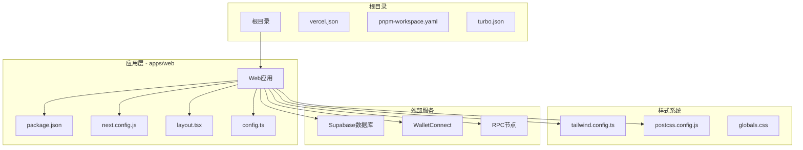
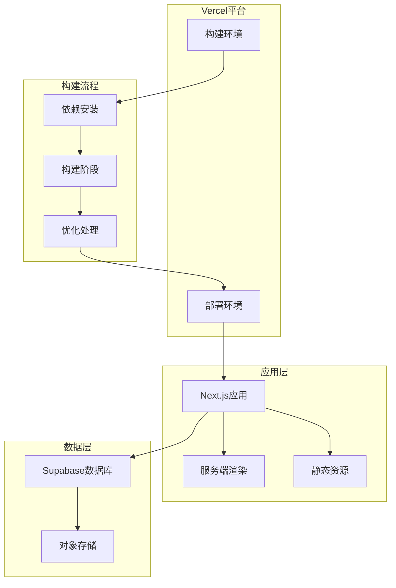
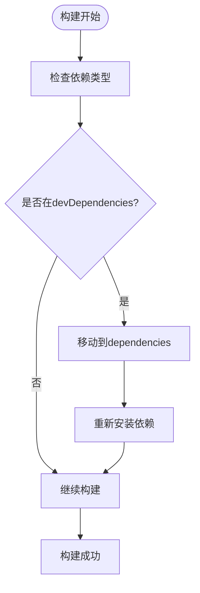
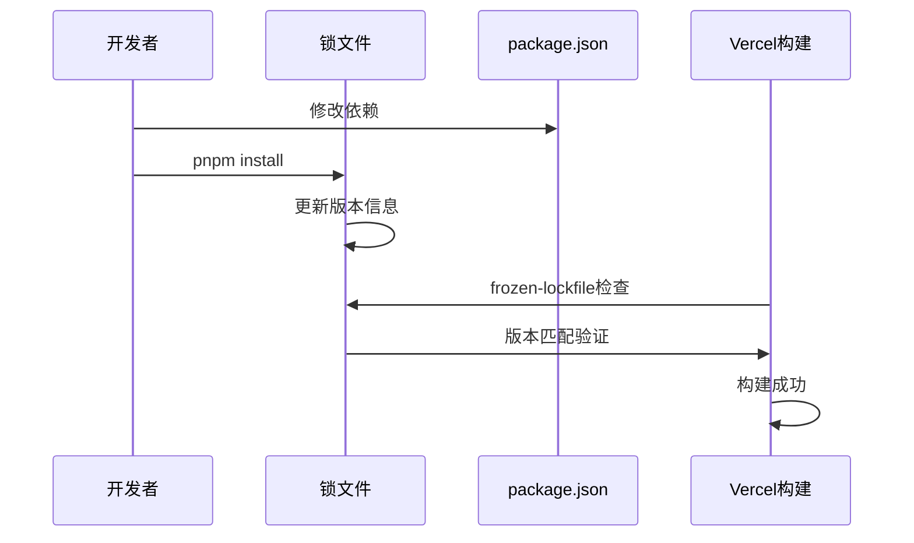
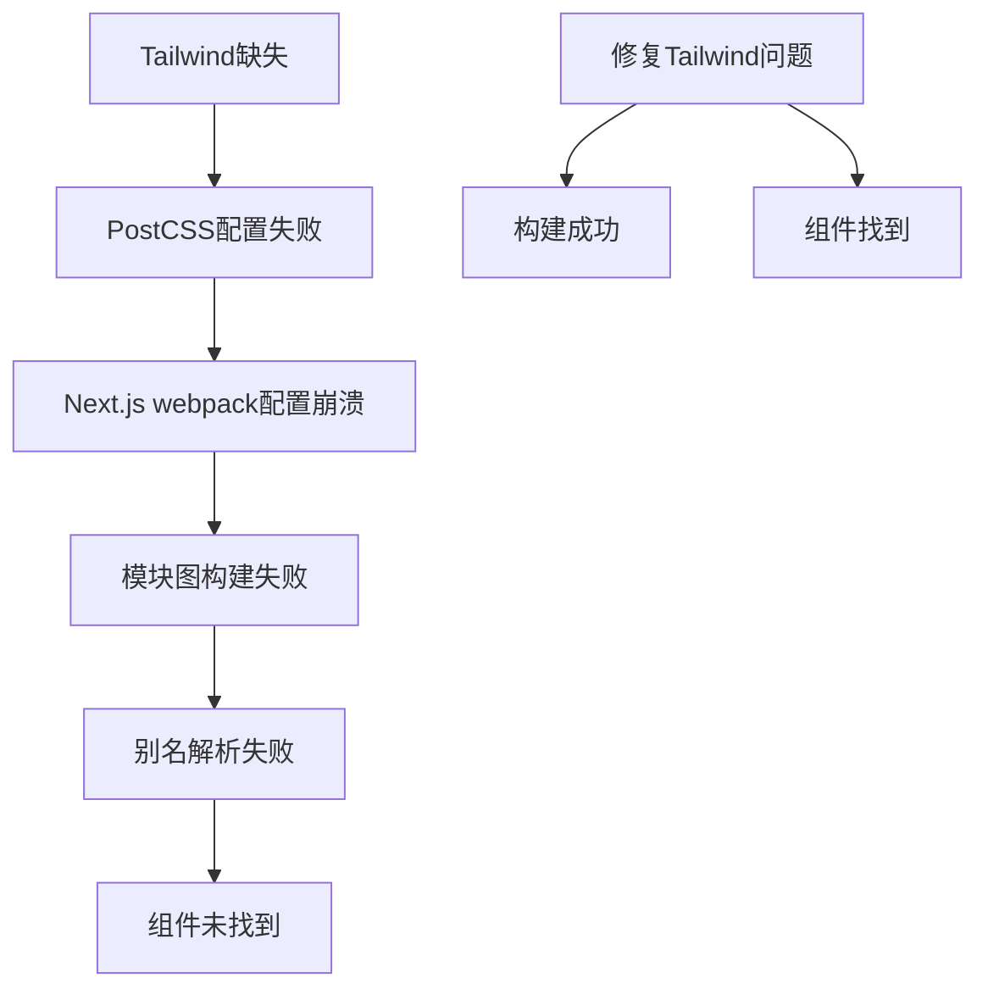
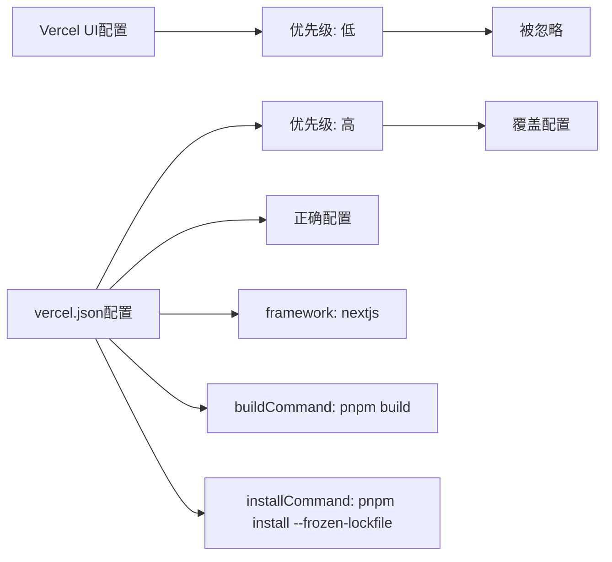
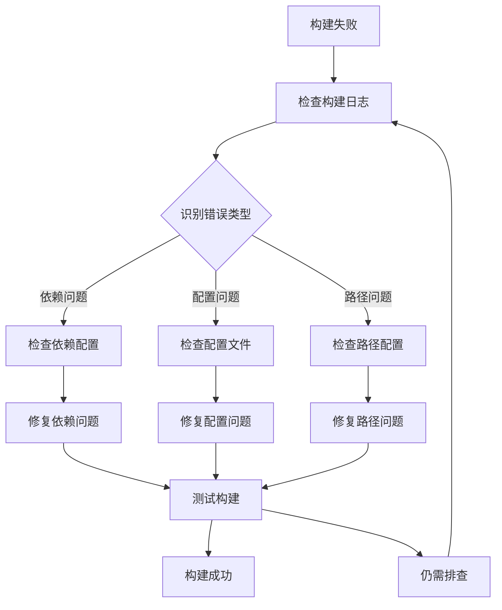

# Vercel部署FAQ

<cite>
**本文档引用的文件**
- [vercel.json](file://vercel.json)
- [Vercel部署FAQ.md](file://docs/Vercel部署FAQ.md)
- [apps/web/package.json](file://apps/web/package.json)
- [apps/web/next.config.js](file://apps/web/next.config.js)
- [apps/web/tailwind.config.ts](file://apps/web/tailwind.config.ts)
- [apps/web/postcss.config.js](file://apps/web/postcss.config.js)
- [pnpm-workspace.yaml](file://pnpm-workspace.yaml)
- [turbo.json](file://turbo.json)
- [apps/web/app/layout.tsx](file://apps/web/app/layout.tsx)
- [apps/web/app/config.ts](file://apps/web/app/config.ts)
- [apps/web/lib/supabase/client.ts](file://apps/web/lib/supabase/client.ts)
- [apps/web/lib/memory/config.ts](file://apps/web/lib/memory/config.ts)
</cite>

## 目录
1. [简介](#简介)
2. [项目结构](#项目结构)
3. [核心组件](#核心组件)
4. [架构概览](#架构概览)
5. [详细组件分析](#详细组件分析)
6. [依赖关系分析](#依赖关系分析)
7. [性能考虑](#性能考虑)
8. [故障排除指南](#故障排除指南)
9. [结论](#结论)

## 简介

本文档是针对基于Next.js 14 + pnpm monorepo架构的Web3 AI Agent项目在Vercel平台部署时遇到的常见问题和解决方案的综合指南。该文档重点解决由于依赖管理、构建配置冲突以及monorepo结构导致的部署失败问题。

该项目采用现代化的技术栈：Next.js 14 + Tailwind CSS + Web3（wagmi/ethers），使用pnpm workspace和Turborepo进行monorepo管理，部署在Vercel平台上。

## 项目结构

项目采用monorepo架构，主要包含以下关键组件：



**图表来源**
- [vercel.json:1-11](file://vercel.json#L1-L11)
- [pnpm-workspace.yaml:1-4](file://pnpm-workspace.yaml#L1-L4)
- [turbo.json:1-25](file://turbo.json#L1-L25)

**章节来源**
- [vercel.json:1-11](file://vercel.json#L1-L11)
- [pnpm-workspace.yaml:1-4](file://pnpm-workspace.yaml#L1-L4)
- [turbo.json:1-25](file://turbo.json#L1-L25)

## 核心组件

### Vercel构建配置

Vercel通过vercel.json文件进行配置，采用Next.js框架模式：

- **构建命令**: `pnpm build`
- **安装命令**: `pnpm install --frozen-lockfile`
- **框架**: Next.js
- **Git集成**: 自动部署启用

### 应用配置

Web应用使用Next.js 14.2.0，配置了AI SDK流式响应支持和图像优化：

- **AI SDK集成**: 启用serverComponentsExternalPackages: ['ai']
- **图像优化**: 放行Coingecko和JsDelivr域名
- **环境变量**: 公开APP_NAME和APP_VERSION

### 样式系统

项目采用Tailwind CSS作为主要样式框架，配置了丰富的颜色系统和动画效果：

- **深色模式支持**: data-theme属性
- **渐变色彩系统**: Quantum Cyan和Nexus Violet主色调
- **Web3主题色**: 支持以太坊、比特币、Solana等区块链颜色

**章节来源**
- [vercel.json:1-11](file://vercel.json#L1-L11)
- [apps/web/next.config.js:1-30](file://apps/web/next.config.js#L1-L30)
- [apps/web/tailwind.config.ts:1-99](file://apps/web/tailwind.config.ts#L1-L99)

## 架构概览

项目部署架构采用分层设计，确保生产环境的一致性和可靠性：



**图表来源**
- [vercel.json:1-11](file://vercel.json#L1-L11)
- [apps/web/package.json:1-54](file://apps/web/package.json#L1-L54)

## 详细组件分析

### 问题一：Tailwind CSS模块缺失

#### 现象描述
构建过程中出现`Cannot find module 'tailwindcss'`错误

#### 根本原因
Tailwind被错误地放置在devDependencies中，而Vercel生产环境不会安装devDependencies

#### 解决方案
将tailwindcss、postcss、autoprefixer从devDependencies移动到dependencies中



**图表来源**
- [apps/web/package.json:37-49](file://apps/web/package.json#L37-L49)
- [apps/web/package.json:14-36](file://apps/web/package.json#L14-L36)

**章节来源**
- [Vercel部署FAQ.md:12-60](file://docs/Vercel部署FAQ.md#L12-L60)
- [apps/web/package.json:37-49](file://apps/web/package.json#L37-L49)

### 问题二：pnpm锁文件版本不匹配

#### 现象描述
出现`ERR_PNPM_OUTDATED_LOCKFILE`错误

#### 根本原因
修改了package.json但没有同步更新pnpm-lock.yaml

#### 解决方案
在项目根目录执行`pnpm install`更新锁文件



**图表来源**
- [Vercel部署FAQ.md:63-104](file://docs/Vercel部署FAQ.md#L63-L104)

**章节来源**
- [Vercel部署FAQ.md:63-104](file://docs/Vercel部署FAQ.md#L63-L104)

### 问题三：模块别名解析失败

#### 现象描述
出现`Module not found: @/components/...`错误

#### 根本原因
实际原因是Tailwind问题导致构建过程提前崩溃

#### 解决方案
修复Tailwind相关问题后，此问题自动消失



**图表来源**
- [Vercel部署FAQ.md:118-155](file://docs/Vercel部署FAQ.md#L118-L155)

**章节来源**
- [Vercel部署FAQ.md:118-155](file://docs/Vercel部署FAQ.md#L118-L155)

### 问题四：配置优先级冲突

#### 现象描述
Vercel UI设置与vercel.json配置冲突

#### 根本原因
vercel.json优先级高于Vercel UI配置

#### 解决方案
采用单一配置源，推荐使用vercel.json



**图表来源**
- [Vercel部署FAQ.md:158-221](file://docs/Vercel部署FAQ.md#L158-L221)
- [vercel.json:1-11](file://vercel.json#L1-L11)

**章节来源**
- [Vercel部署FAQ.md:158-221](file://docs/Vercel部署FAQ.md#L158-L221)
- [vercel.json:1-11](file://vercel.json#L1-L11)

### 问题五：重复安装依赖

#### 现象描述
构建日志显示`pnpm install && pnpm build`

#### 根本原因
buildCommand中重复执行install

#### 解决方案
将buildCommand设置为`pnpm build`

**章节来源**
- [Vercel部署FAQ.md:223-260](file://docs/Vercel部署FAQ.md#L223-L260)

### 问题六：Monorepo路径问题

#### 现象描述
@/components路径无法解析

#### 解决方案
在Vercel设置中将Root Directory设置为apps/web

**章节来源**
- [Vercel部署FAQ.md:262-286](file://docs/Vercel部署FAQ.md#L262-L286)

## 依赖关系分析

项目依赖关系复杂，涉及多个层面的依赖管理：

```mermaid
graph TB
subgraph "运行时依赖"
React[react ^18.2.0]
NextJS[next ^14.2.0]
Wagmi[wagmi ^2.19.5]
Ethers[ethers ^6.11.0]
Supabase[@supabase/supabase-js ^2.104.0]
end
subgraph "构建时依赖"
Tailwind[tailwindcss ^3.4.1]
PostCSS[postcss ^8.4.35]
Autoprefixer[autoprefixer ^10.4.18]
end
subgraph "开发时依赖"
TypeScript[typescript ^5]
ESLint[@types/react ^18.2.0]
TestingLib[@testing-library/react ^16.3.2]
end
subgraph "工作区包"
AIConfig[@web3-ai-agent/ai-config]
Web3Tools[@web3-ai-agent/web3-tools]
end
React --> NextJS
Wagmi --> Ethers
Supabase --> NextJS
Tailwind --> PostCSS
PostCSS --> Autoprefixer
AIConfig --> NextJS
Web3Tools --> NextJS
```

**图表来源**
- [apps/web/package.json:14-49](file://apps/web/package.json#L14-L49)
- [pnpm-workspace.yaml:1-4](file://pnpm-workspace.yaml#L1-L4)

**章节来源**
- [apps/web/package.json:14-49](file://apps/web/package.json#L14-L49)
- [pnpm-workspace.yaml:1-4](file://pnpm-workspace.yaml#L1-L4)

## 性能考虑

### 构建优化策略

1. **依赖管理优化**
   - 将构建时必需的依赖移至dependencies
   - 避免在buildCommand中重复执行pnpm install
   - 使用frozen-lockfile确保构建一致性

2. **样式系统优化**
   - Tailwind CSS提供按需样式生成
   - 预构建常用组件样式减少运行时计算
   - 合理配置content路径避免不必要的扫描

3. **缓存策略**
   - Turborepo提供任务缓存机制
   - Next.js内置构建缓存
   - Vercel平台级缓存优化

### 部署性能指标

- **首次构建时间**: 受依赖数量和大小影响
- **增量构建时间**: 使用Turborepo缓存显著提升
- **运行时性能**: Tailwind CSS类名压缩和Tree Shaking

## 故障排除指南

### 常见部署错误诊断

#### 错误分类与解决方案

| 错误类型 | 症状 | 根本原因 | 解决方案 |
|---------|------|---------|---------|
| 依赖缺失 | `Cannot find module 'tailwindcss'` | devDependencies未安装 | 移动到dependencies |
| 锁文件不匹配 | `ERR_PNPM_OUTDATED_LOCKFILE` | package.json与lockfile不同步 | 在root执行pnpm install |
| 路径解析失败 | `Module not found: @/components/...` | Tailwind问题导致的级联错误 | 修复Tailwind配置 |
| 配置冲突 | Vercel UI设置不生效 | vercel.json优先级更高 | 使用单一配置源 |
| 重复安装 | `pnpm install && pnpm build` | buildCommand包含install | 简化为`pnpm build` |

#### 诊断流程



### 最佳实践建议

1. **依赖管理规范**
   - 所有构建时依赖必须在dependencies中声明
   - 严格遵循`pnpm install`后同步更新锁文件
   - 在项目根目录执行所有pnpm操作

2. **配置管理规范**
   - 优先使用vercel.json进行配置
   - 避免在Vercel UI中重复配置相同项
   - 确保Root Directory指向正确的应用目录

3. **监控与维护**
   - 定期检查依赖版本更新
   - 监控构建时间和成功率
   - 建立标准化的部署检查清单

**章节来源**
- [Vercel部署FAQ.md:288-367](file://docs/Vercel部署FAQ.md#L288-L367)

## 结论

Vercel部署失败的本质并非代码问题，而是依赖管理与构建配置冲突导致的构建环境不一致。通过遵循以下核心原则可以有效避免大多数部署问题：

1. **正确的依赖分类**: 将构建时必需的依赖放入dependencies
2. **严格的版本控制**: 确保package.json与pnpm-lock.yaml完全同步
3. **清晰的配置管理**: 使用单一配置源（vercel.json或Vercel UI）
4. **合理的项目结构**: 正确设置Root Directory指向应用目录
5. **标准化的工作流程**: 在项目根目录执行pnpm操作

这些实践不仅适用于当前项目，也为其他类似的技术栈组合提供了可复用的部署经验。通过建立完善的部署规范和监控机制，可以显著提高部署成功率和团队协作效率。