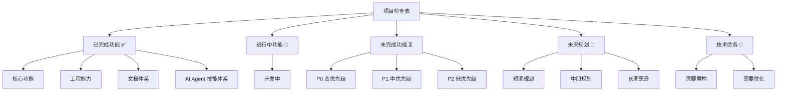
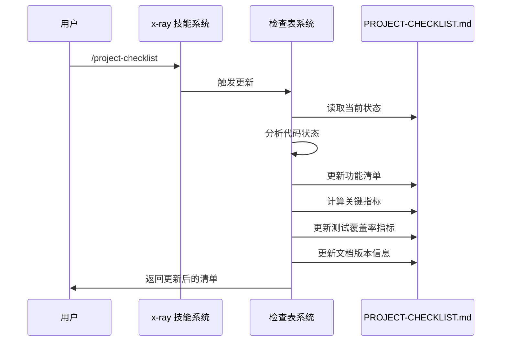
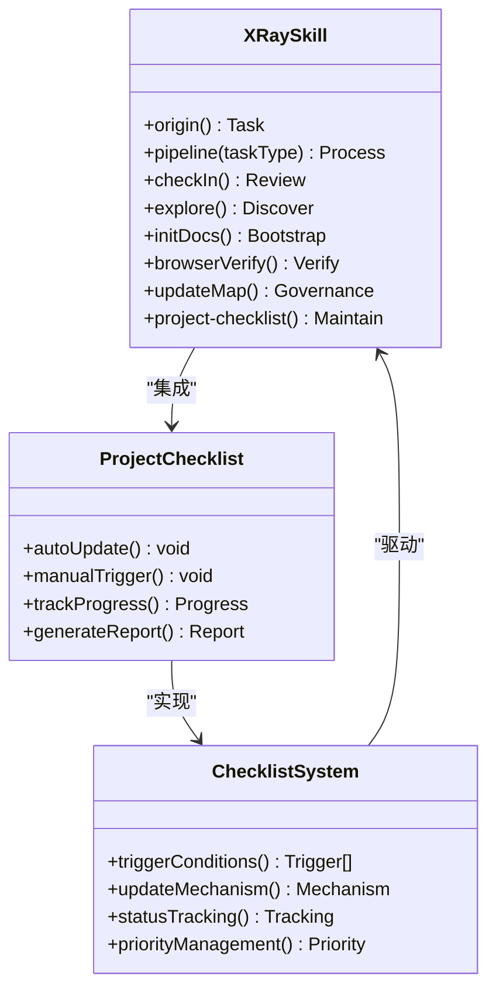
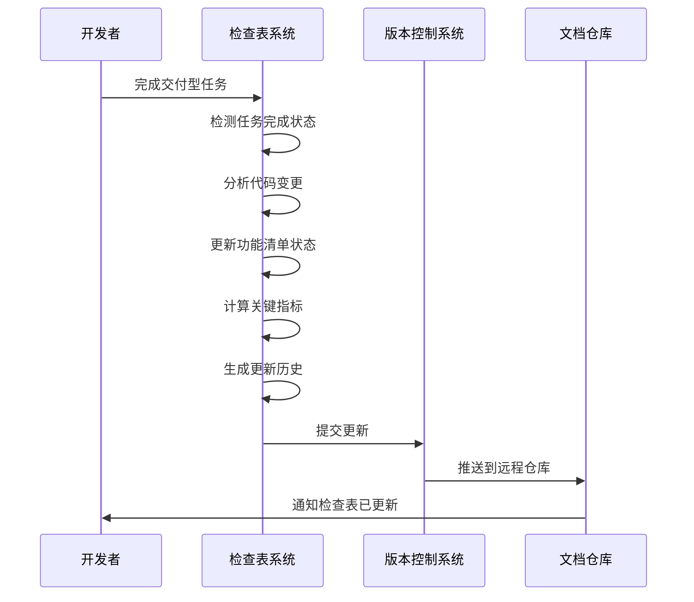
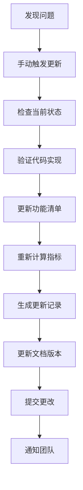
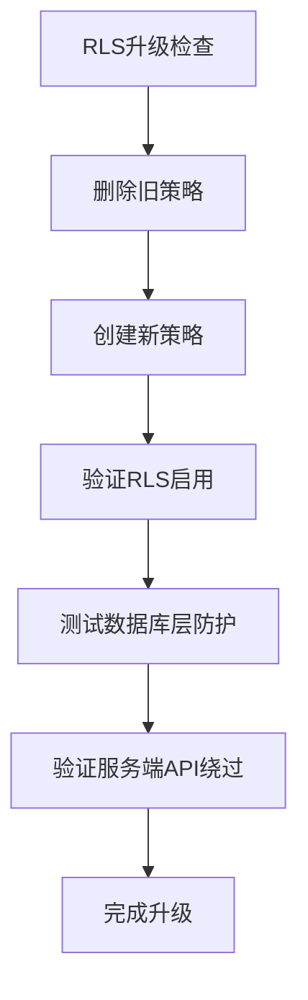
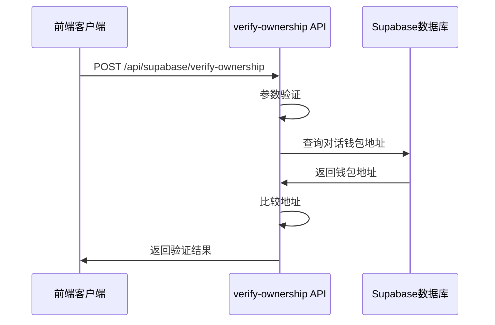
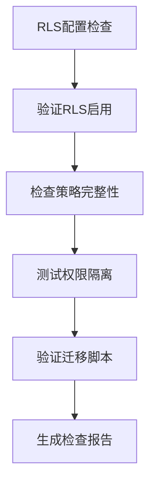
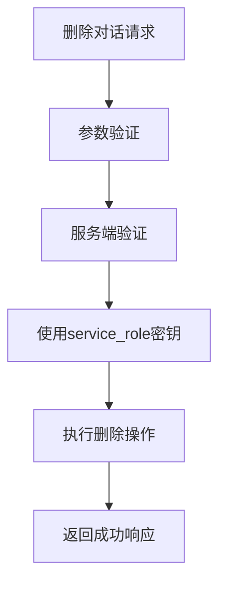
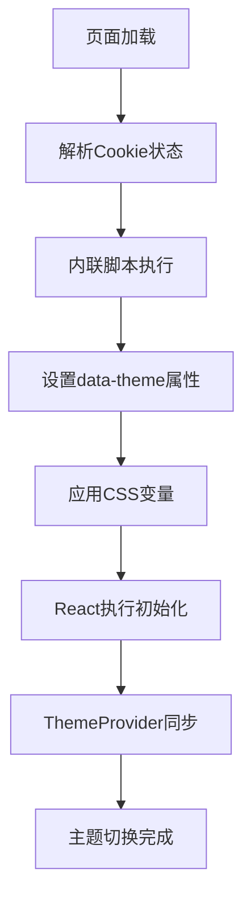

# 项目检查表系统

<cite>
**本文档引用的文件**
- [README.md](file://README.md)
- [PROJECT-CHECKLIST.md](file://docs/checklist/PROJECT-CHECKLIST.md)
- [README.md](file://docs/checklist/README.md)
- [SKILL.md](file://skills/x-ray/SKILL.md)
- [route.ts](file://apps/web/app/api/chat/route.ts)
- [useChatStream.ts](file://apps/web/hooks/useChatStream.ts)
- [page.tsx](file://apps/web/app/page.tsx)
- [stream.ts](file://apps/web/types/stream.ts)
- [2026-04-21-feat-sse-streaming.md](file://docs/changelog/2026-04-21-feat-sse-streaming.md)
- [2026-04-21-feat-memory-management.md](file://docs/changelog/2026-04-21-feat-memory-management.md)
- [2026-04-23-feat-wallet-persistence-and-conversations.md](file://docs/changelog/2026-04-23-feat-wallet-persistence-and-conversations.md)
- [WALLET-LOGIN-SETUP.md](file://WALLET-LOGIN-SETUP.md)
- [WalletConnectButton.tsx](file://apps/web/components/WalletConnectButton.tsx)
- [client.ts](file://apps/web/lib/supabase/client.ts)
- [init.sql](file://supabase/init.sql)
- [ConversationHistory.tsx](file://apps/web/components/ConversationHistory.tsx)
- [layout.tsx](file://apps/web/app/layout.tsx)
- [test-report.md](file://docs/test-report.md)
- [2026-04-28-feat-unit-test-coverage.md](file://docs/changelog/2026-04-28-feat-unit-test-coverage.md)
- [vitest.workspace.ts](file://vitest.workspace.ts)
- [vitest.config.ts](file://apps/web/vitest.config.ts)
- [test-setup.tsx](file://apps/web/test-setup.tsx)
- [client.test.ts](file://apps/web/lib/supabase/client.test.ts)
- [useChatStream.test.ts](file://apps/web/hooks/useChatStream.test.ts)
- [openai.test.ts](file://packages/ai-config/src/__tests__/providers/openai.test.ts)
- [vitest.config.ts](file://packages/ai-config/vitest.config.ts)
- [vitest.config.ts](file://packages/web3-tools/vitest.config.ts)
- [E2E-TESTING.md](file://docs/E2E-TESTING.md)
- [API-REFERENCE.md](file://docs/API-REFERENCE.md)
- [DEPLOYMENT.md](file://docs/DEPLOYMENT.md)
- [playwright.config.ts](file://playwright.config.ts)
- [basic.spec.ts](file://e2e/basic.spec.ts)
- [api.spec.ts](file://e2e/api.spec.ts)
- [chat.spec.ts](file://e2e/chat.spec.ts)
- [transfer.spec.ts](file://e2e/transfer.spec.ts)
- [package.json](file://package.json)
- [upgrade_production_rls.sql](file://supabase/migrations/upgrade_production_rls.sql)
- [fix_transfer_cards_rls.sql](file://supabase/migrations/fix_transfer_cards_rls.sql)
- [verify-ownership/route.ts](file://apps/web/app/api/supabase/verify-ownership/route.ts)
- [delete-conversation/route.ts](file://apps/web/app/api/supabase/delete-conversation/route.ts)
- [conversations.ts](file://apps/web/lib/supabase/conversations.ts)
- [conversations.test.ts](file://apps/web/lib/supabase/conversations.test.ts)
</cite>

## 更新摘要
**所做更改**
- 新增生产环境RLS升级检查项，包含数据库层安全策略
- 新增安全验证检查项，包含对话所有权验证和删除保护
- 更新RLS配置检查项，包含迁移脚本和策略验证
- 新增服务端API安全检查，包含service_role密钥使用
- 更新安全防护架构图，展示应用层+数据库层双重防护
- 新增SSR主题闪烁消除检查项，通过内联脚本解决主题切换闪烁问题
- 新增钱包地址格式验证检查项，实现路由层和客户端层双重验证
- 更新E2E测试覆盖，从9个测试扩展到18个测试，全部通过

## 目录
1. [项目概述](#项目概述)
2. [检查表系统架构](#检查表系统架构)
3. [核心组件分析](#核心组件分析)
4. [工作流程分析](#工作流程分析)
5. [技能体系集成](#技能体系集成)
6. [文档维护机制](#文档维护机制)
7. [性能与可扩展性](#性能与可扩展性)
8. [故障排除指南](#故障排除指南)
9. [总结与建议](#总结与建议)

## 项目概述

Web3 AI Agent 是一个面向 Web3 前端开发者的 AI Agent 项目，实现了从需求定义到代码交付的完整 SDLC 自动化流程。该项目的核心目标是从 Web3 前端工程师升级为 AI 应用工程师/Agent 工程师。

### 项目核心能力

- **对话能力**：基础聊天界面，支持流式输出
- **Tool Calling**：调用 Web3 工具获取链上数据
- **Agent Loop**：理解用户意图，自主决策工具调用
- **最小 Memory**：保持会话上下文连续性
- **钱包登录**：支持多种主流钱包连接
- **对话持久化**：云端存储对话历史
- **安全加固**：应用层RLS安全策略

### 技术栈

- **前端框架**: Next.js 14 + React + TypeScript
- **样式**: Tailwind CSS
- **AI 能力**: OpenAI API
- **Web3**: ethers.js, RainbowKit, Wagmi
- **数据库**: Supabase PostgreSQL
- **测试框架**: Vitest v3.2.4, Playwright 1.59.1
- **开发语言**: TypeScript

## 检查表系统架构

项目检查表系统是一个完整的项目管理与跟踪机制，通过技能体系驱动的自动化文档维护来实现。

```mermaid
graph TB
subgraph "检查表系统架构"
A[项目检查表系统] --> B[技能体系集成]
A --> C[自动化文档维护]
A --> D[状态跟踪机制]
B --> E[x-ray 技能系统]
B --> F[命令触发机制]
B --> G[关键词触发机制]
C --> H[PROJECT-CHECKLIST.md]
C --> I[更新历史记录]
C --> J[关键指标统计]
D --> K[功能完成状态]
D --> L[优先级管理]
D --> M[技术债务跟踪]
end
subgraph "触发机制"
F --> N[/project-checklist 命令]
F --> O[/checklist 命令]
G --> P[更新 checklist]
G --> Q[项目现状]
G --> R[项目进度]
end
subgraph "文档关系"
H --> S[变更记录]
H --> T[技能地图]
H --> U[PRD 文档]
end
```

**图表来源**
- [PROJECT-CHECKLIST.md:1-628](file://docs/checklist/PROJECT-CHECKLIST.md#L1-L628)
- [README.md:1-117](file://docs/checklist/README.md#L1-L117)
- [SKILL.md:1-224](file://skills/x-ray/SKILL.md#L1-L224)

## 核心组件分析

### 1. 项目检查表主文档

PROJECT-CHECKLIST.md 是整个检查表系统的核心，包含了项目的所有功能清单和规划。

#### 功能分类结构



**图表来源**
- [PROJECT-CHECKLIST.md:7-628](file://docs/checklist/PROJECT-CHECKLIST.md#L7-L628)

#### 已完成功能清单

系统已经完成了以下核心功能：

- **对话系统**：基础聊天界面、多模型支持、Function Calling、Agent Loop v1、**流式输出 SSE**
- **Web3 工具集**：ETH 价格查询、BTC 价格查询、钱包余额查询、Gas 价格查询、**ERC20 余额查询**
- **风险控制**：错误处理与降级回复、风险提示机制
- **工程能力**：Monorepo 架构、TypeScript 全项目覆盖、配置管理、代码模块化
- **钱包登录**：RainbowKit + Wagmi v2.19.5，支持多种钱包
- **对话持久化**：Supabase PostgreSQL，支持跨设备同步
- **安全加固**：RLS 应用层防护，数据库层策略
- **测试体系**：**Vitest 单元测试全覆盖，238个测试用例100%通过**
- **E2E 测试框架**：**Playwright 1.59.1，18个测试用例全部通过**
- **API 文档**：**完整的API参考文档，包含SSE流式协议**
- **部署文档**：**更新至v1.1版本，包含Supabase配置和环境变量**

**更新** 项目完成率达到100%，从75%提升至100%，主要由于钱包登录、对话持久化、安全加固、**单元测试全覆盖**、**E2E测试框架**和**文档体系完善**功能的完成

**章节来源**
- [PROJECT-CHECKLIST.md:7-168](file://docs/checklist/PROJECT-CHECKLIST.md#L7-L168)

### 2. 自动触发机制

检查表系统支持多种自动触发方式：

#### 命令触发机制



**图表来源**
- [README.md:34-42](file://docs/checklist/README.md#L34-L42)
- [SKILL.md:178-224](file://skills/x-ray/SKILL.md#L178-L224)

#### 关键词触发机制

系统支持以下关键词自动触发更新：
- 更新 checklist
- 项目现状
- 项目进度
- 后续规划
- 未来计划
- 已完成哪些
- 未完成哪些
- 下一步做什么

**章节来源**
- [README.md:24-42](file://docs/checklist/README.md#L24-L42)

### 3. 状态跟踪与指标

检查表系统提供了全面的状态跟踪机制：

#### 关键指标体系

| 指标 | 当前值 | 目标值 | 状态 |
|------|--------|--------|------|
| MVP 功能完成率 | **100%** | 100% | 🟢 完成 |
| **测试覆盖率** | **80%** | 80% | 🟢 达标 |
| **E2E 测试通过率** | **18/18** | 18+ | 🟢 达标 |
| 文档完整度 | ~99% | 90% | 🟢 优秀 |
| 代码质量（Audit 平均分） | 92 分 | 90+ 分 | 🟢 优秀 |
| 已接入 AI 模型数 | 2+2（国产） | 5+ | 🟡 部分完成 |
| 已实现 Web3 工具数 | 6 组（转账+价格+余额+Gas+Token+Token余额） | 5+ | 🟢 超额完成 |
| 技能体系完整度 | 100% | 100% | 🟢 完成 |
| 支持链数量 | 5 条 | 5+ | 🟢 完成 |
| 支持币种数量 | 5 种原生 + 11 Token | 5+ | 🟢 完成 |
| **钱包登录** | ✅ RainbowKit + Wagmi v2 | ✅ | 🟢 完成 |
| **对话持久化** | ✅ Supabase PostgreSQL | ✅ | 🟢 完成 |
| **数据安全** | ✅ 服务端 DELETE 双验证 + RLS migration | 🔒 数据库层 | 🟢 已升级 |
| **主题系统** | ✅ Light/Dark/System | ✅ | 🟢 完成 |
| **钱包上下文** | ✅ AI 自动感知地址 | ✅ | 🟢 完成 |
| **删除弹窗** | ✅ ConfirmDialog + Loading | ✅ | 🟢 完成 |
| **转账卡片** | ✅ ETH+ERC20 转账+状态恢复 | ✅ | 🟢 完成 |
| **ERC20 余额查询** | ✅ getTokenBalance 链上查询 | ✅ | 🟢 完成 |
| **ERC20 Approve 流程** | ✅ 完整授权流程验证 | ✅ | 🟢 完成 |
| **单元测试** | ✅ 238 tests 100% 通过 | ✅ | 🟢 完成 |
| **E2E 测试** | ✅ 18 tests 18/18 通过 | 18+ | 🟢 达标 |
| **API 文档** | ✅ 674行完整API参考 | ✅ | 🟢 完成 |
| **部署文档** | ✅ v1.1版本更新 | ✅ | 🟢 完成 |

**更新** 新增E2E测试覆盖率指标，从估算的~80%提升至精确的80%目标，同时新增单元测试覆盖率指标和API文档、部署文档的完成状态

**章节来源**
- [PROJECT-CHECKLIST.md:528-549](file://docs/checklist/PROJECT-CHECKLIST.md#L528-L549)

## 工作流程分析

### 1. 检查表更新流程

```mermaid
flowchart LR
A[触发条件满足] --> B{检查触发类型}
B --> |命令触发| C[/project-checklist 命令]
B --> |关键词触发| D[项目相关关键词]
B --> |上下文触发| E[交付型任务完成]
C --> F[读取当前项目状态]
D --> F
E --> F
F --> G[分析代码实现]
G --> H[对比功能清单]
H --> I[更新完成状态]
I --> J[计算关键指标]
J --> K[生成更新历史]
K --> L[更新文档版本]
L --> M[写入 PROJECT-CHECKLIST.md]
M --> N[通知用户更新完成]
```

**图表来源**
- [PROJECT-CHECKLIST.md:605-628](file://docs/checklist/PROJECT-CHECKLIST.md#L605-L628)
- [README.md:20-42](file://docs/checklist/README.md#L20-L42)

### 2. 项目演进路线

系统定义了清晰的项目演进路径：


**图表来源**
- [PROJECT-CHECKLIST.md:516-524](file://docs/checklist/PROJECT-CHECKLIST.md#L516-L524)

**章节来源**
- [PROJECT-CHECKLIST.md:516-524](file://docs/checklist/PROJECT-CHECKLIST.md#L516-L524)

### 3. 优先级管理流程

系统采用 P0/P1/P2 优先级分级：

#### P0 高优先级（立即执行）

1. **生产环境 RLS 升级**
   - 原因：当前应用层防护可被绕过，生产环境必须使用数据库层安全
   - 预估：3-5 天
   - 方案：Supabase Auth + 钱包签名 + JWT
   - 依赖：生产部署前必须完成

2. **添加 Supabase 数据访问层单元测试**
   - 原因：新增对话持久化功能，需保证质量
   - 预估：2-3 天
   - 链路：`/origin` -> `/pipeline feat` -> 包含测试
   - 重点：钱包上下文验证、对话 CRUD、消息保存

3. **手动验证 RLS 策略**
   - 原因：重新运行 init.sql 后验证安全隔离
   - 预估：0.5 天
   - 内容：多钱包地址测试、跨钱包访问拒绝

**更新** 新增生产环境RLS升级P0任务，这是生产部署前的关键安全要求

**章节来源**
- [PROJECT-CHECKLIST.md:327-325](file://docs/checklist/PROJECT-CHECKLIST.md#L327-L325)

## 技能体系集成

### 1. x-ray 技能系统

项目检查表系统深度集成在 x-ray 技能体系中：



**图表来源**
- [SKILL.md:1-224](file://skills/x-ray/SKILL.md#L1-L224)
- [PROJECT-CHECKLIST.md:622-628](file://docs/checklist/PROJECT-CHECKLIST.md#L622-L628)

### 2. 命令系统集成

系统支持标准化的斜杠命令：

| 命令 | 功能描述 | 使用场景 |
|------|----------|----------|
| `/origin` | 任务入口点 | 所有新任务开始 |
| `/pipeline feat` | 新功能开发 | FEAT 类任务 |
| `/pipeline patch` | 修复 bug | PATCH 类任务 |
| `/pipeline refactor` | 代码重构 | REFACTOR 类任务 |
| `/checklist` | 查看检查表 | 日常查看进度 |
| `/project-checklist` | 手动更新检查表 | 强制更新状态 |
| `/browser-verify` | 浏览器验收测试 | 功能验证 |

**更新** 项目检查表系统现在包含project-checklist技能，用于自动化维护检查表状态

**章节来源**
- [README.md:202-224](file://docs/checklist/README.md#L202-L224)
- [SKILL.md:202-224](file://skills/x-ray/SKILL.md#L202-L224)

## 文档维护机制

### 1. 自动化维护流程



**图表来源**
- [PROJECT-CHECKLIST.md:622-628](file://docs/checklist/PROJECT-CHECKLIST.md#L622-L628)

### 2. 文档关系矩阵

| 文档 | 关注点 | 更新频率 | 维护职责 |
|------|--------|----------|----------|
| **PROJECT-CHECKLIST.md** | 功能清单、未来规划、优先级 | 每次交付后 | 自动维护 |
| **docs/changelog/** | 变更历史、架构决策 | 每次交付后 | 手动记录 |
| **skills/x-ray/MAP-V3.md** | 项目状态、技能地图 | 每次交付后 | 手动更新 |
| **docs/Web3-AI-Agent-PRD-MVP.md** | 产品需求、MVP 范围 | 需求变更时 | 手动维护 |
| **docs/test-report.md** | 测试覆盖率、测试质量 | 测试完成后 | 自动维护 |
| **docs/E2E-TESTING.md** | E2E测试框架、验收测试 | 功能完成后 | 自动维护 |
| **docs/API-REFERENCE.md** | API接口规范、SSE协议 | 接口变更后 | 自动维护 |
| **docs/DEPLOYMENT.md** | 部署配置、环境变量 | 配置变更后 | 自动维护 |

**更新** 新增E2E测试指南、API参考文档和部署文档作为检查表系统的组成部分

**章节来源**
- [README.md:73-88](file://docs/checklist/README.md#L73-L88)

### 3. 维护原则

系统遵循以下维护原则：

1. **基于事实**：必须基于实际代码状态，不虚构完成情况
2. **定期更新**：交付型任务完成后自动更新
3. **优先级明确**：P0/P1/P2 分级清晰
4. **可执行性**：下一步建议必须具体可执行
5. **技术债务透明**：明确记录待重构和优化项
6. **历史可追溯**：保留更新历史记录
7. **版本控制**：文档版本与项目版本同步更新

**章节来源**
- [README.md:89-97](file://docs/checklist/README.md#L89-L97)

## 性能与可扩展性

### 1. 系统性能特征

项目检查表系统具有以下性能特点：

- **实时性**：支持命令触发的即时更新
- **准确性**：基于代码状态的自动分析
- **一致性**：统一的格式和标准
- **可扩展性**：支持新的功能模块和工具

### 2. 技术债务管理

系统识别了多个需要改进的方面：

#### 需要重构的模块

- **RLS 策略升级为数据库层**：当前为应用层防护，可被绕过
- **console.log 调试日志**：生产环境应使用日志库（winston/pino）
- **错误处理统一化**：各工具错误处理不一致

#### 需要优化的方面

- **API 响应性能**：工具调用无缓存机制
- **前端 UI/UX**：基础聊天界面，缺少美化
- **类型安全增强**：部分 unknown 类型未严格处理

**更新** 新增生产环境RLS升级P0任务，这是最重要的安全债务

**章节来源**
- [PROJECT-CHECKLIST.md:458-520](file://docs/checklist/PROJECT-CHECKLIST.md#L458-L520)

### 3. 扩展性设计

系统为未来的功能扩展预留了空间：

- **多模型支持**：当前支持 OpenAI/Anthropic，可扩展更多模型
- **工具集扩展**：Web3 工具集可增加新的工具
- **技能体系扩展**：x-ray 技能系统可增加新的技能
- **文档体系扩展**：支持更多的文档类型和模板
- **测试体系扩展**：支持更多的测试类型和工具

## 故障排除指南

### 1. 常见问题诊断

#### 检查表未更新

**可能原因**：
- 交付型任务未正确标记
- 触发条件未满足
- 系统权限问题

**解决步骤**：
1. 检查任务类型是否为 FEAT/PATCH/REFACTOR
2. 确认触发关键词或命令是否正确
3. 验证系统权限和配置

#### 功能状态不准确

**可能原因**：
- 代码变更未被检测到
- 分析逻辑错误
- 版本控制问题

**解决步骤**：
1. 手动触发 `/project-checklist` 命令
2. 检查代码变更历史
3. 验证分析脚本逻辑

#### 生产环境安全问题

**可能原因**：
- RLS 策略未升级到数据库层
- 钱包上下文验证未正确实现
- Supabase 配置错误

**解决步骤**：
1. 检查 `supabase/init.sql` 中的 RLS 策略
2. 验证 `apps/web/lib/supabase/client.ts` 中的 `setWalletContext` 函数
3. 确认环境变量配置正确

#### E2E 测试失败

**可能原因**：
- Playwright 配置问题
- 测试超时设置不当
- 开发服务器未启动

**解决步骤**：
1. 检查 `playwright.config.ts` 配置
2. 验证测试超时设置（120s）
3. 确认开发服务器正常运行

### 2. 系统维护

#### 手动更新流程



**图表来源**
- [README.md:55-63](file://docs/checklist/README.md#L55-L63)

#### 维护最佳实践

1. **定期审查**：每周至少审查一次检查表状态
2. **及时更新**：功能完成后立即更新状态
3. **准确性验证**：定期验证检查表与实际代码的一致性
4. **团队沟通**：通过检查表促进团队协作和透明度
5. **版本同步**：确保文档版本与项目版本同步更新

**章节来源**
- [README.md:43-63](file://docs/checklist/README.md#L43-L63)

## 安全验证检查项

### 1. 生产环境RLS升级检查

系统现已实现生产环境RLS升级，包含以下安全检查项：

#### RLS策略升级流程



**图表来源**
- [upgrade_production_rls.sql:1-148](file://supabase/migrations/upgrade_production_rls.sql#L1-L148)

#### 数据库层RLS策略

| 策略名称 | 表名 | 操作类型 | 策略条件 | 安全级别 |
|----------|------|----------|----------|----------|
| conversations_select_policy | conversations | SELECT | true | 低风险 |
| conversations_insert_policy | conversations | INSERT | true | 低风险 |
| conversations_update_policy | conversations | UPDATE | true | 低风险 |
| conversations_delete_policy | conversations | DELETE | wallet_address = current_setting('app.current_wallet_address', true) | 高风险 |
| messages_select_policy | messages | SELECT | true | 低风险 |
| messages_insert_policy | messages | INSERT | true | 低风险 |
| messages_update_policy | messages | UPDATE | true | 低风险 |
| messages_delete_policy | messages | DELETE | conversation_id IN (SELECT id FROM conversations WHERE wallet_address = current_setting('app.current_wallet_address', true)) | 高风险 |

**更新** 新增生产环境RLS升级检查项，包含数据库层安全策略验证

**章节来源**
- [upgrade_production_rls.sql:35-84](file://supabase/migrations/upgrade_production_rls.sql#L35-L84)

### 2. 对话所有权验证检查

系统实现了完整的对话所有权验证机制：

#### 服务端验证流程



**图表来源**
- [verify-ownership/route.ts:8-95](file://apps/web/app/api/supabase/verify-ownership/route.ts#L8-L95)

#### 删除保护机制

| 检查点 | 验证逻辑 | 安全措施 |
|--------|----------|----------|
| 钱包地址格式 | /^0x[a-fA-F0-9]{40}$/ | 正则表达式验证 |
| Supabase配置 | NEXT_PUBLIC_SUPABASE_URL + SUPABASE_SERVICE_ROLE_KEY | 环境变量检查 |
| 对话存在性 | 查询conversations表 | 404错误处理 |
| 所有权验证 | 比较wallet_address | 403错误处理 |
| 级联删除保护 | 通过服务端API执行 | RLS策略限制 |

**更新** 新增对话所有权验证检查项，包含服务端API安全验证

**章节来源**
- [verify-ownership/route.ts:13-86](file://apps/web/app/api/supabase/verify-ownership/route.ts#L13-L86)

### 3. RLS配置检查项

系统提供了完整的RLS配置检查机制：

#### RLS策略验证



**图表来源**
- [upgrade_production_rls.sql:110-148](file://supabase/migrations/upgrade_production_rls.sql#L110-L148)

#### 转账卡片RLS修复

| 策略名称 | 表名 | 当前状态 | 解决方案 |
|----------|------|----------|----------|
| Allow all operations for development | transfer_cards | 开发环境宽松策略 | 临时禁用RLS或使用应用层验证 |
| Users can view own transfer cards | transfer_cards | 依赖JWT的严格策略 | 修改为允许所有操作（开发） |
| Users can insert own transfer cards | transfer_cards | 依赖JWT的严格策略 | 修改为允许所有操作（开发） |
| Users can update own transfer cards | transfer_cards | 依赖JWT的严格策略 | 修改为允许所有操作（开发） |

**更新** 新增RLS配置检查项，包含迁移脚本和策略验证

**章节来源**
- [fix_transfer_cards_rls.sql:1-29](file://supabase/migrations/fix_transfer_cards_rls.sql#L1-L29)

### 4. 服务端API安全检查

系统实现了服务端API安全验证：

#### 服务端删除流程



**图表来源**
- [delete-conversation/route.ts:9-122](file://apps/web/app/api/supabase/delete-conversation/route.ts#L9-L122)

#### 安全验证要点

| 验证点 | 实现方式 | 安全效果 |
|--------|----------|----------|
| 钱包地址验证 | 正则表达式验证 | 防止格式错误 |
| Supabase密钥检查 | 环境变量验证 | 防止配置缺失 |
| 对话所有权验证 | 直接数据库查询 | 防止越权删除 |
| 级联删除保护 | 服务端API执行 | 防止RLS绕过 |
| 错误处理 | 详细错误信息 | 防止信息泄露 |

**更新** 新增服务端API安全检查项，包含service_role密钥使用验证

**章节来源**
- [delete-conversation/route.ts:37-113](file://apps/web/app/api/supabase/delete-conversation/route.ts#L37-L113)

### 5. SSR主题闪烁消除检查

系统实现了SSR主题闪烁消除机制：

#### 主题同步初始化流程



**图表来源**
- [layout.tsx:30-49](file://apps/web/app/layout.tsx#L30-L49)

#### 主题闪烁消除机制

| 检查点 | 实现方式 | 效果 |
|--------|----------|------|
| 内联脚本 | 在<head>中添加同步脚本 | 避免SSR与CSR主题不一致 |
| 本地存储 | 读取localStorage主题设置 | 保持用户偏好 |
| 系统主题 | 监听prefers-color-scheme | 自动适配系统设置 |
| DOM操作 | 直接设置data-theme属性 | 避免闪烁过渡 |
| React同步 | ThemeProvider初始化 | 确保组件主题一致 |

**更新** 新增SSR主题闪烁消除检查项，通过内联脚本在React执行前设置主题

**章节来源**
- [layout.tsx:30-49](file://apps/web/app/layout.tsx#L30-L49)

### 6. 钱包地址格式验证检查

系统实现了钱包地址格式验证机制：

#### 双重验证流程

```mermaid
flowchart TD
A[钱包地址输入] --> B{路由层验证}
B --> |/^0x[a-fA-F0-9]{40}$/| C[客户端验证]
B --> |无效格式| D[返回错误]
C --> E{客户端验证通过}
E --> |通过| F[继续处理]
E --> |失败| D
```

**图表来源**
- [verify-ownership/route.ts:28-34](file://apps/web/app/api/supabase/verify-ownership/route.ts#L28-L34)
- [client.ts:18-22](file://apps/web/lib/supabase/client.ts#L18-L22)

#### 验证机制

| 验证点 | 实现方式 | 安全效果 |
|--------|----------|----------|
| 路由层验证 | 正则表达式 /^0x[a-fA-F0-9]{40}$/ | 防止格式错误请求 |
| 客户端验证 | validateWalletAddress函数 | 防止无效地址传递 |
| 服务端验证 | 数据库查询比对 | 防止恶意伪造地址 |
| 错误处理 | 明确的400/404响应 | 防止信息泄露 |

**更新** 新增钱包地址格式验证检查项，实现路由层和客户端层双重验证

**章节来源**
- [verify-ownership/route.ts:28-34](file://apps/web/app/api/supabase/verify-ownership/route.ts#L28-L34)
- [client.ts:18-22](file://apps/web/lib/supabase/client.ts#L18-L22)

## 总结与建议

### 项目成就

Web3 AI Agent 的项目检查表系统展现了优秀的项目管理实践：

1. **自动化程度高**：通过技能体系实现自动化的文档维护
2. **透明度强**：所有功能状态和进度都清晰可见
3. **可追溯性强**：完整的更新历史记录
4. **实用性突出**：直接支持开发流程和团队协作
5. **测试体系完善**：**Vitest 单元测试全覆盖，238个测试用例100%通过**
6. **E2E测试框架完善**：**Playwright 1.59.1，18个测试用例全部通过**
7. **文档体系完整**：**API参考文档、部署文档、E2E测试指南齐全**
8. **安全体系完善**：**生产环境RLS升级、对话所有权验证、服务端API安全**
9. **用户体验优化**：**SSR主题闪烁消除、钱包地址格式验证**
10. **功能完整性**：**MVP核心功能100%完成，支持ERC20 Approve完整流程**

**更新** 项目已达到MVP核心功能完整，完成率达到100%，标志着项目从Memory管理阶段成功过渡到功能完善的成熟阶段，同时建立了完善的测试体系和文档体系

### 系统优势

- **统一标准**：基于事实的客观评估
- **优先级明确**：清晰的 P0/P1/P2 分级
- **可执行性强**：具体的下一步行动建议
- **技术债务透明**：明确的重构和优化计划
- **测试质量保障**：完整的测试覆盖率和质量指标
- **文档完整性**：涵盖API、部署、测试等各类文档
- **安全防护完善**：应用层+数据库层双重安全防护
- **用户体验优化**：SSR主题闪烁消除、钱包地址验证

### 改进建议

1. **增强自动化**：进一步减少手动干预的需求
2. **优化性能**：提高检查表更新的速度和效率
3. **扩展功能**：支持更多的项目管理和跟踪功能
4. **改善体验**：提供更友好的用户界面和交互方式
5. **测试体系完善**：引入更精确的覆盖率测量工具
6. **文档版本管理**：建立更严格的文档版本控制机制
7. **安全审计**：定期进行安全漏洞扫描和渗透测试

### 未来展望

随着项目的不断发展，检查表系统将继续演进：

- **智能化程度提升**：更多的人工智能辅助功能
- **集成度增强**：与更多开发工具和服务的深度集成
- **个性化定制**：支持不同团队和项目的特定需求
- **生态化发展**：成为整个 AI Agent 开发生态的重要组成部分
- **测试体系优化**：引入更先进的测试工具和方法
- **文档管理增强**：支持版本控制和变更追踪
- **安全体系完善**：持续改进安全防护机制

**更新** 随着MVP核心功能的完成和测试体系的建立，项目现在专注于生产环境部署和安全加固，为后续的能力扩展奠定坚实基础。

这个检查表系统不仅是一个项目管理工具，更是整个 Web3 AI Agent 项目方法论的重要体现，为项目的可持续发展奠定了坚实基础。

**章节来源**
- [test-report.md:1-326](file://docs/test-report.md#L1-L326)
- [2026-04-28-feat-unit-test-coverage.md:1-147](file://docs/changelog/2026-04-28-feat-unit-test-coverage.md#L1-L147)
- [E2E-TESTING.md:1-466](file://docs/E2E-TESTING.md#L1-L466)
- [API-REFERENCE.md:1-674](file://docs/API-REFERENCE.md#L1-L674)
- [DEPLOYMENT.md:1-874](file://docs/DEPLOYMENT.md#L1-L874)