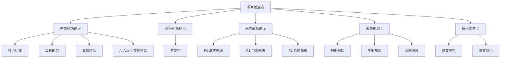
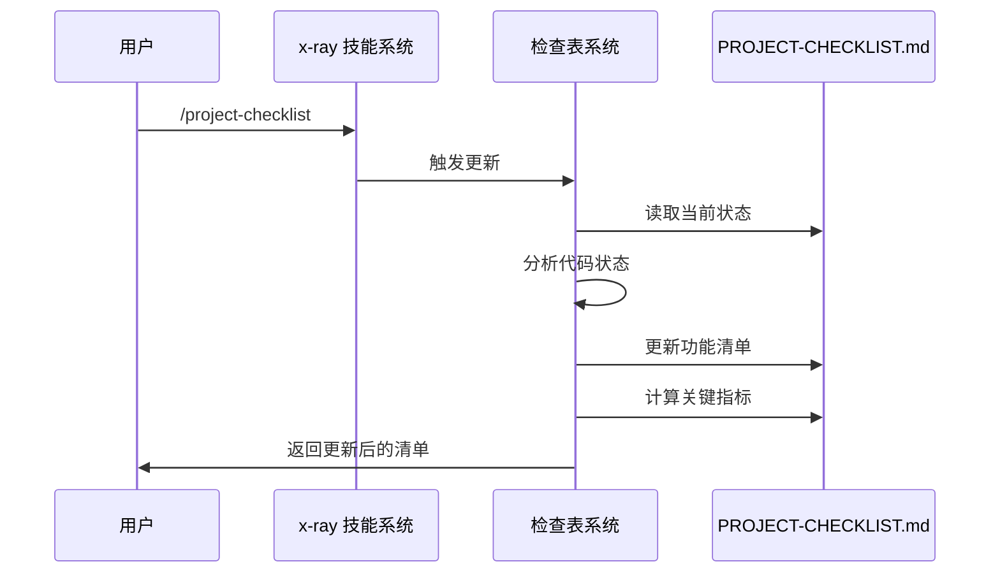
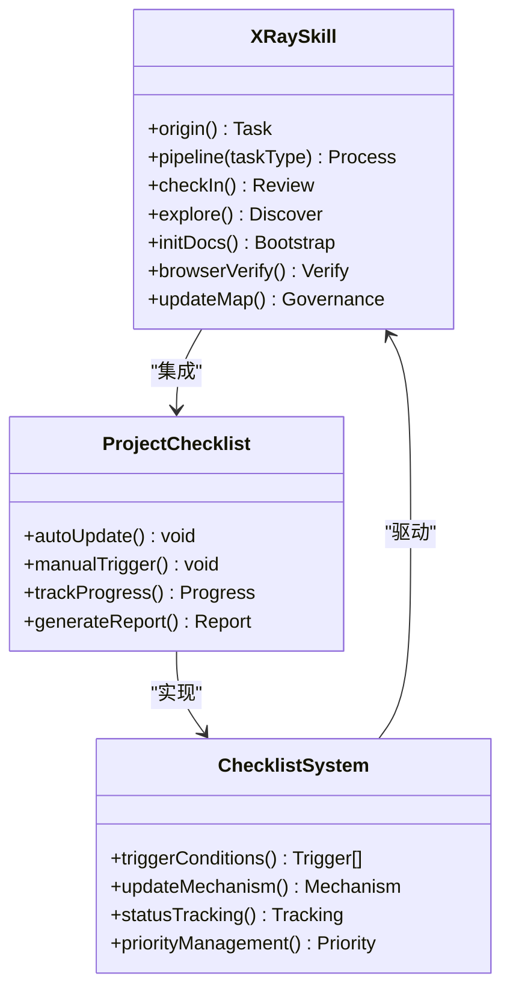
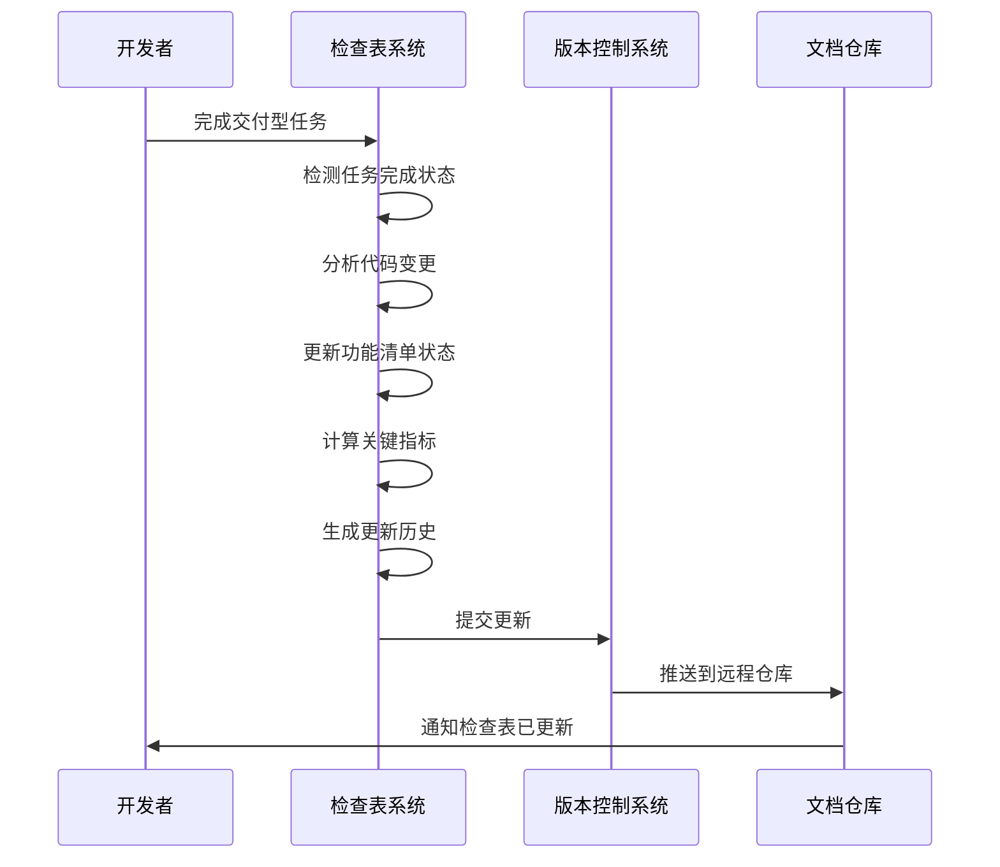
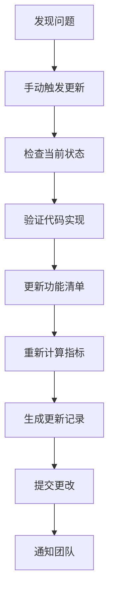

# 项目检查表系统

<cite>
**本文档引用的文件**
- [README.md](file://README.md)
- [PROJECT-CHECKLIST.md](file://docs/checklist/PROJECT-CHECKLIST.md)
- [README.md](file://docs/checklist/README.md)
- [ARCHITECTURE.md](file://ARCHITECTURE.md)
- [Web3-AI-Agent-PRD-MVP.md](file://docs/Web3-AI-Agent-PRD-MVP.md)
- [MAP-V3.md](file://skills/x-ray/MAP-V3.md)
- [SKILL.md](file://skills/x-ray/SKILL.md)
- [route.ts](file://apps/web/app/api/chat/route.ts)
- [page.tsx](file://apps/web/app/page.tsx)
- [turbo.json](file://turbo.json)
- [package.json](file://package.json)
</cite>

## 目录
1. [项目概述](#项目概述)
2. [检查表系统架构](#检查表系统架构)
3. [核心组件分析](#核心组件分析)
4. [工作流程分析](#工作流程分析)
5. [技能体系集成](#技能体系集成)
6. [文档维护机制](#文档维护机制)
7. [性能与可扩展性](#性能与可扩展性)
8. [故障排除指南](#故障排除指南)
9. [总结与建议](#总结与建议)

## 项目概述

Web3 AI Agent 是一个面向 Web3 前端开发者的 AI Agent 项目，实现了从需求定义到代码交付的完整 SDLC 自动化流程。该项目的核心目标是从 Web3 前端工程师升级为 AI 应用工程师/Agent 工程师。

### 项目核心能力

- **对话能力**：基础聊天界面，支持流式输出
- **Tool Calling**：调用 Web3 工具获取链上数据
- **Agent Loop**：理解用户意图，自主决策工具调用
- **最小 Memory**：保持会话上下文连续性

### 技术栈

- **前端框架**: Next.js 14 + React + TypeScript
- **样式**: Tailwind CSS
- **AI 能力**: OpenAI API
- **Web3**: ethers.js
- **开发语言**: TypeScript

## 检查表系统架构

项目检查表系统是一个完整的项目管理与跟踪机制，通过技能体系驱动的自动化文档维护来实现。

```mermaid
graph TB
subgraph "检查表系统架构"
A[项目检查表系统] --> B[技能体系集成]
A --> C[自动化文档维护]
A --> D[状态跟踪机制]
B --> E[x-ray 技能系统]
B --> F[命令触发机制]
B --> G[关键词触发机制]
C --> H[PROJECT-CHECKLIST.md]
C --> I[更新历史记录]
C --> J[关键指标统计]
D --> K[功能完成状态]
D --> L[优先级管理]
D --> M[技术债务跟踪]
end
subgraph "触发机制"
F --> N[/project-checklist 命令]
F --> O[/checklist 命令]
G --> P[更新 checklist]
G --> Q[项目现状]
G --> R[项目进度]
end
subgraph "文档关系"
H --> S[变更记录]
H --> T[技能地图]
H --> U[PRD 文档]
end
```

**图表来源**
- [PROJECT-CHECKLIST.md:1-373](file://docs/checklist/PROJECT-CHECKLIST.md#L1-L373)
- [README.md:1-117](file://docs/checklist/README.md#L1-L117)
- [SKILL.md:1-224](file://skills/x-ray/SKILL.md#L1-L224)

## 核心组件分析

### 1. 项目检查表主文档

PROJECT-CHECKLIST.md 是整个检查表系统的核心，包含了项目的所有功能清单和规划。

#### 功能分类结构



**图表来源**
- [PROJECT-CHECKLIST.md:7-373](file://docs/checklist/PROJECT-CHECKLIST.md#L7-L373)

#### 已完成功能清单

系统已经完成了以下核心功能：

- **对话系统**：基础聊天界面、多模型支持、Function Calling、Agent Loop v1
- **Web3 工具集**：ETH 价格查询、BTC 价格查询、钱包余额查询、Gas 价格查询
- **风险控制**：错误处理与降级回复、风险提示机制
- **工程能力**：Monorepo 架构、TypeScript 全项目覆盖、配置管理、代码模块化

**章节来源**
- [PROJECT-CHECKLIST.md:7-116](file://docs/checklist/PROJECT-CHECKLIST.md#L7-L116)

### 2. 自动触发机制

检查表系统支持多种自动触发方式：

#### 命令触发机制



**图表来源**
- [README.md:34-42](file://docs/checklist/README.md#L34-L42)
- [SKILL.md:178-224](file://skills/x-ray/SKILL.md#L178-L224)

#### 关键词触发机制

系统支持以下关键词自动触发更新：
- 更新 checklist
- 项目现状
- 项目进度
- 后续规划
- 未来计划
- 已完成哪些
- 未完成哪些
- 下一步做什么

**章节来源**
- [README.md:24-42](file://docs/checklist/README.md#L24-L42)

### 3. 状态跟踪与指标

检查表系统提供了全面的状态跟踪机制：

#### 关键指标体系

| 指标 | 当前值 | 目标值 | 状态 |
|------|--------|--------|------|
| MVP 功能完成率 | ~75% | 100% | 进行中 |
| 测试覆盖率 | 0% | 80% | 未开始 |
| 文档完整度 | ~85% | 90% | 良好 |
| 代码质量（Audit 平均分） | 97 分 | 90+ 分 | 优秀 |
| 已接入 AI 模型数 | 2+2（国产） | 5+ | 部分完成 |
| 已实现 Web3 工具数 | 4 | 5+ | 部分完成 |
| 技能体系完整度 | 100% | 100% | 完成 |

**章节来源**
- [PROJECT-CHECKLIST.md:302-312](file://docs/checklist/PROJECT-CHECKLIST.md#L302-L312)

## 工作流程分析

### 1. 检查表更新流程

```mermaid
flowchart LR
A[触发条件满足] --> B{检查触发类型}
B --> |命令触发| C[/project-checklist 命令]
B --> |关键词触发| D[项目相关关键词]
B --> |上下文触发| E[交付型任务完成]
C --> F[读取当前项目状态]
D --> F
E --> F
F --> G[分析代码实现]
G --> H[对比功能清单]
H --> I[更新完成状态]
I --> J[计算关键指标]
J --> K[生成更新历史]
K --> L[写入 PROJECT-CHECKLIST.md]
L --> M[通知用户更新完成]
```

**图表来源**
- [PROJECT-CHECKLIST.md:360-373](file://docs/checklist/PROJECT-CHECKLIST.md#L360-L373)
- [README.md:20-42](file://docs/checklist/README.md#L20-L42)

### 2. 项目演进路线

系统定义了清晰的项目演进路径：


**图表来源**
- [PROJECT-CHECKLIST.md:294-300](file://docs/checklist/PROJECT-CHECKLIST.md#L294-L300)

**章节来源**
- [PROJECT-CHECKLIST.md:292-300](file://docs/checklist/PROJECT-CHECKLIST.md#L292-L300)

### 3. 优先级管理流程

系统采用 P0/P1/P2 优先级分级：

#### P0 高优先级（立即执行）

1. **实现流式输出（SSE）**
   - 原因：PRD MVP 必做功能，显著提升用户体验
   - 预估：2-3 天
   - 链路：`/origin` -> `/pipeline feat` -> 完整流程

2. **实现最小会话 Memory**
   - 原因：PRD MVP 必做功能，支持多轮对话
   - 预估：2-3 天
   - 链路：`/origin` -> `/pipeline feat` -> 完整流程

#### P1 中优先级（本周完成）

3. **添加单元测试**
   - 原因：保证代码质量，防止回归
   - 预估：3-5 天
   - 链路：`/origin` -> `/pipeline feat` -> 包含测试

4. **浏览器验收测试**
   - 原因：验证现有功能是否正常
   - 预估：1 天
   - 链路：`/origin` -> `/browser-verify`

**章节来源**
- [PROJECT-CHECKLIST.md:319-359](file://docs/checklist/PROJECT-CHECKLIST.md#L319-L359)

## 技能体系集成

### 1. x-ray 技能系统

项目检查表系统深度集成在 x-ray 技能体系中：



**图表来源**
- [SKILL.md:1-224](file://skills/x-ray/SKILL.md#L1-L224)
- [PROJECT-CHECKLIST.md:368-373](file://docs/checklist/PROJECT-CHECKLIST.md#L368-L373)

### 2. 命令系统集成

系统支持标准化的斜杠命令：

| 命令 | 功能描述 | 使用场景 |
|------|----------|----------|
| `/origin` | 任务入口点 | 所有新任务开始 |
| `/pipeline feat` | 新功能开发 | FEAT 类任务 |
| `/pipeline patch` | 修复 bug | PATCH 类任务 |
| `/pipeline refactor` | 代码重构 | REFACTOR 类任务 |
| `/checklist` | 查看检查表 | 日常查看进度 |
| `/project-checklist` | 手动更新检查表 | 强制更新状态 |

**章节来源**
- [README.md:178-224](file://docs/checklist/README.md#L178-L224)
- [SKILL.md:202-224](file://skills/x-ray/SKILL.md#L202-L224)

## 文档维护机制

### 1. 自动化维护流程



**图表来源**
- [PROJECT-CHECKLIST.md:368-373](file://docs/checklist/PROJECT-CHECKLIST.md#L368-L373)

### 2. 文档关系矩阵

| 文档 | 关注点 | 更新频率 | 维护职责 |
|------|--------|----------|----------|
| **PROJECT-CHECKLIST.md** | 功能清单、未来规划、优先级 | 每次交付后 | 自动维护 |
| **docs/changelog/** | 变更历史、架构决策 | 每次交付后 | 手动记录 |
| **skills/x-ray/MAP-V3.md** | 项目状态、技能地图 | 每次交付后 | 手动更新 |
| **docs/Web3-AI-Agent-PRD-MVP.md** | 产品需求、MVP 范围 | 需求变更时 | 手动维护 |

**章节来源**
- [README.md:73-88](file://docs/checklist/README.md#L73-L88)

### 3. 维护原则

系统遵循以下维护原则：

1. **基于事实**：必须基于实际代码状态，不虚构完成情况
2. **定期更新**：交付型任务完成后自动更新
3. **优先级明确**：P0/P1/P2 分级清晰
4. **可执行性**：下一步建议必须具体可执行
5. **技术债务透明**：明确记录待重构和优化项
6. **历史可追溯**：保留更新历史记录

**章节来源**
- [README.md:89-97](file://docs/checklist/README.md#L89-L97)

## 性能与可扩展性

### 1. 系统性能特征

项目检查表系统具有以下性能特点：

- **实时性**：支持命令触发的即时更新
- **准确性**：基于代码状态的自动分析
- **一致性**：统一的格式和标准
- **可扩展性**：支持新的功能模块和工具

### 2. 技术债务管理

系统识别了多个需要改进的方面：

#### 需要重构的模块

- **console.log 调试日志**：生产环境应使用日志库（winston/pino）
- **错误处理统一化**：各工具错误处理不一致

#### 需要优化的方面

- **API 响应性能**：工具调用无缓存机制
- **前端 UI/UX**：基础聊天界面，缺少美化
- **类型安全增强**：部分 unknown 类型未严格处理

**章节来源**
- [PROJECT-CHECKLIST.md:256-291](file://docs/checklist/PROJECT-CHECKLIST.md#L256-L291)

### 3. 扩展性设计

系统为未来的功能扩展预留了空间：

- **多模型支持**：当前支持 OpenAI/Anthropic，可扩展更多模型
- **工具集扩展**：Web3 工具集可增加新的工具
- **技能体系扩展**：x-ray 技能系统可增加新的技能
- **文档体系扩展**：支持更多的文档类型和模板

## 故障排除指南

### 1. 常见问题诊断

#### 检查表未更新

**可能原因**：
- 交付型任务未正确标记
- 触发条件未满足
- 系统权限问题

**解决步骤**：
1. 检查任务类型是否为 FEAT/PATCH/REFACTOR
2. 确认触发关键词或命令是否正确
3. 验证系统权限和配置

#### 功能状态不准确

**可能原因**：
- 代码变更未被检测到
- 分析逻辑错误
- 版本控制问题

**解决步骤**：
1. 手动触发 `/project-checklist` 命令
2. 检查代码变更历史
3. 验证分析脚本逻辑

### 2. 系统维护

#### 手动更新流程



**图表来源**
- [README.md:55-63](file://docs/checklist/README.md#L55-L63)

#### 维护最佳实践

1. **定期审查**：每周至少审查一次检查表状态
2. **及时更新**：功能完成后立即更新状态
3. **准确性验证**：定期验证检查表与实际代码的一致性
4. **团队沟通**：通过检查表促进团队协作和透明度

**章节来源**
- [README.md:43-63](file://docs/checklist/README.md#L43-L63)

## 总结与建议

### 项目成就

Web3 AI Agent 的项目检查表系统展现了优秀的项目管理实践：

1. **自动化程度高**：通过技能体系实现自动化的文档维护
2. **透明度强**：所有功能状态和进度都清晰可见
3. **可追溯性强**：完整的更新历史记录
4. **实用性突出**：直接支持开发流程和团队协作

### 系统优势

- **统一标准**：基于事实的客观评估
- **优先级明确**：清晰的 P0/P1/P2 分级
- **可执行性强**：具体的下一步行动建议
- **技术债务透明**：明确的重构和优化计划

### 改进建议

1. **增强自动化**：进一步减少手动干预的需求
2. **优化性能**：提高检查表更新的速度和效率
3. **扩展功能**：支持更多的项目管理和跟踪功能
4. **改善体验**：提供更友好的用户界面和交互方式

### 未来展望

随着项目的不断发展，检查表系统将继续演进：

- **智能化程度提升**：更多的人工智能辅助功能
- **集成度增强**：与更多开发工具和服务的深度集成
- **个性化定制**：支持不同团队和项目的特定需求
- **生态化发展**：成为整个 AI Agent 开发生态的重要组成部分

这个检查表系统不仅是一个项目管理工具，更是整个 Web3 AI Agent 项目方法论的重要体现，为项目的可持续发展奠定了坚实基础。