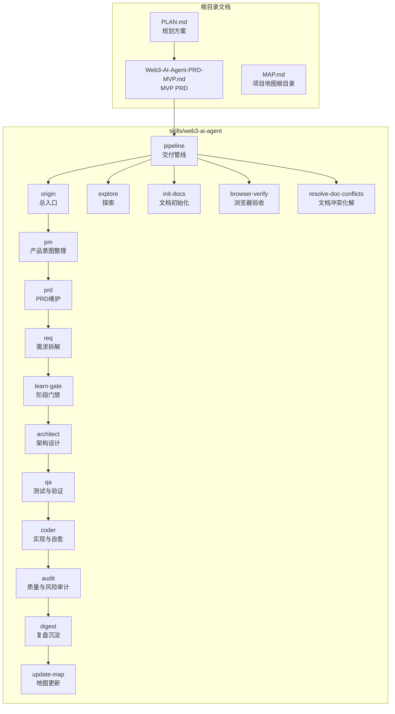
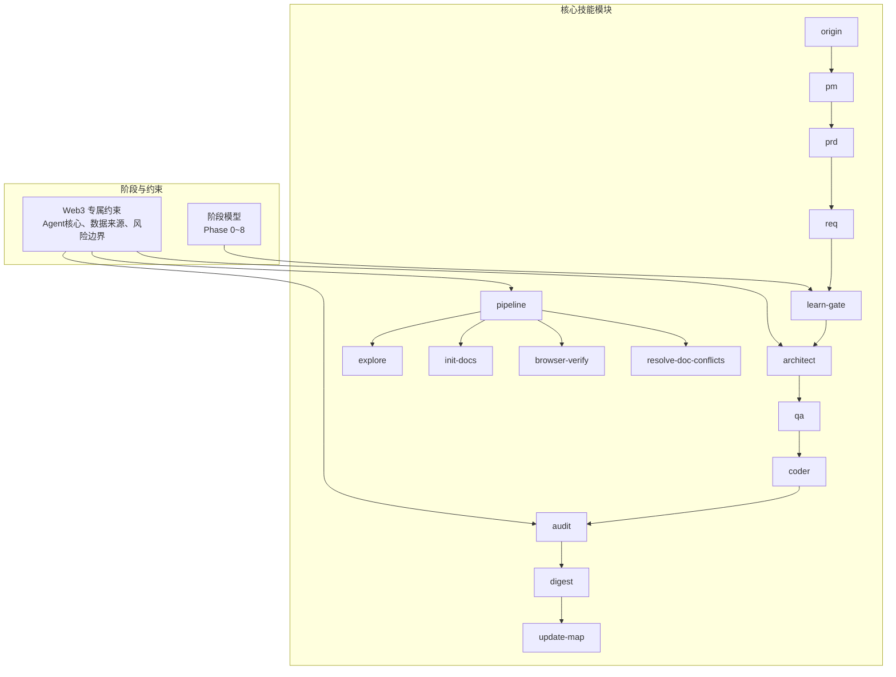
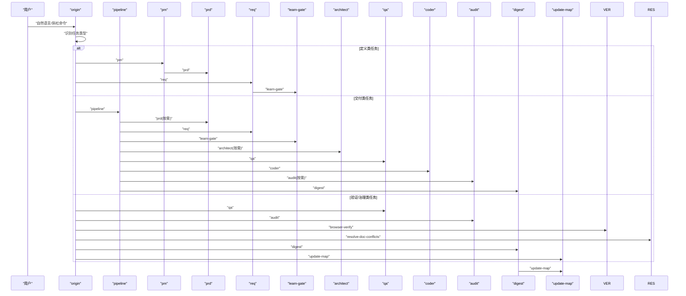
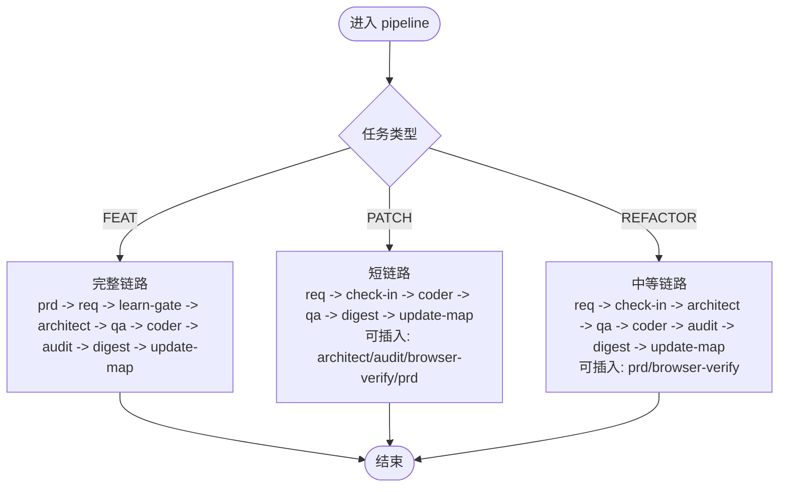
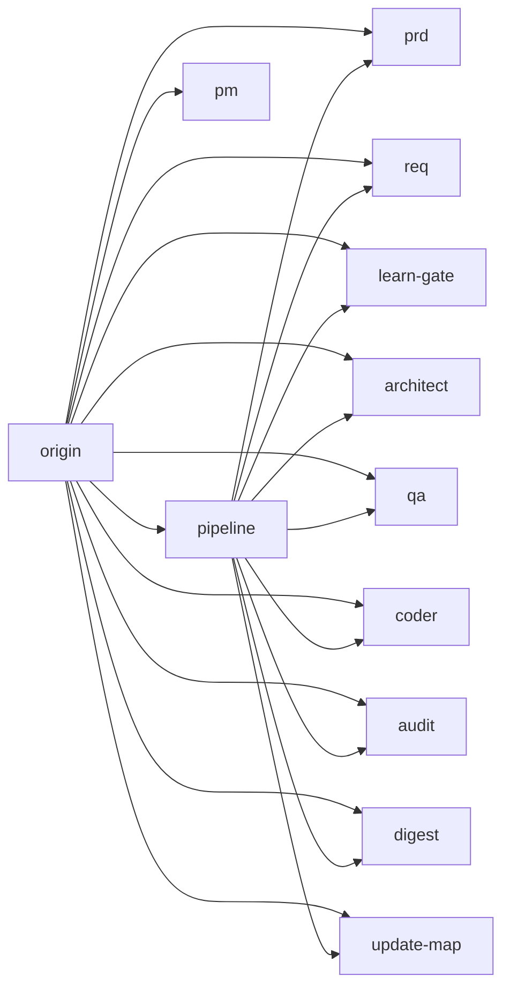

# 项目概述

<cite>
**本文引用的文件**
- [AI-Agent.md](file://AI-Agent.md)
- [PLAN.md](file://PLAN.md)
- [Web3-AI-Agent-PRD-MVP.md](file://Web3-AI-Agent-PRD-MVP.md)
- [skills/web3-ai-agent/SKILL.md](file://skills/web3-ai-agent/SKILL.md)
- [skills/web3-ai-agent/MAP.md](file://skills/web3-ai-agent/MAP.md)
- [skills/web3-ai-agent/SKILL-SYSTEM-DESIGN.md](file://skills/web3-ai-agent/SKILL-SYSTEM-DESIGN.md)
- [skills/web3-ai-agent/TEMPLATES.md](file://skills/web3-ai-agent/TEMPLATES.md)
- [skills/web3-ai-agent/architect/SKILL.md](file://skills/web3-ai-agent/architect/SKILL.md)
- [skills/web3-ai-agent/pm/SKILL.md](file://skills/web3-ai-agent/pm/SKILL.md)
- [skills/web3-ai-agent/req/SKILL.md](file://skills/web3-ai-agent/req/SKILL.md)
- [skills/web3-ai-agent/pipeline/SKILL.md](file://skills/web3-ai-agent/pipeline/SKILL.md)
- [skills/web3-ai-agent/qa/SKILL.md](file://skills/web3-ai-agent/qa/SKILL.md)
- [skills/web3-ai-agent/coder/SKILL.md](file://skills/web3-ai-agent/coder/SKILL.md)
</cite>

## 目录
1. [简介](#简介)
2. [项目结构](#项目结构)
3. [核心组件](#核心组件)
4. [架构总览](#架构总览)
5. [详细组件分析](#详细组件分析)
6. [依赖分析](#依赖分析)
7. [性能考量](#性能考量)
8. [故障排查指南](#故障排查指南)
9. [结论](#结论)
10. [附录](#附录)

## 简介
本项目旨在帮助Web3前端工程师实现职业转型，从传统前端开发转向AI Agent工程实践。项目以“文档驱动开发”为核心理念，构建了一套面向Web3场景的多技能（Skill）自治开发体系，通过标准化流程、阶段性门禁与约束，确保在进入编码前完成需求、架构、测试与风险评估，从而降低试错成本、提升交付质量。

项目背景与目标：
- 背景：AI对前端岗位带来冲击，需要拥抱新方向以延长职业生命周期。
- 目标：打造可运行的Web3 AI Agent MVP，覆盖“对话+工具调用+Agent循环+最小记忆”，并沉淀一套可复用的开发方法论。

价值主张：
- 为Web3前端工程师提供一条“从文档到Agent实现”的可落地路径。
- 以技能系统串联PRD、需求、架构、测试、实现、审计与沉淀，形成闭环。
- 内置Web3专用约束，强调数据来源、风险提示与不可伪造链上实时数据。

目标受众：
- Web3前端工程师（希望转型Agent工程师）
- 希望以项目驱动学习Agent开发的学习者
- 需要建立可复用Agent开发方法论的团队或个人

为什么需要转向AI Agent开发：
- 市场趋势：AI成为新一轮生产力工具，Agent是面向未来的交互范式。
- 技能迁移：前端工程化的流程化思维、对用户体验与交互的敏感度，可迁移到Agent工程中。
- 职业发展：Agent工程能力是未来跨领域协作与产品创新的关键抓手。

项目的独特性：
- 文档驱动开发：以PRD、阶段说明、模板与地图为先，再进入vibe coding。
- 技能系统架构：12个核心技能模块按阶段有序串联，形成可自治的流水线。
- Web3专用约束：Agent核心为“LLM + 工具 + 循环 + 记忆”，强调数据来源与风险边界。

## 项目结构
项目采用“根目录文档 + skills目录”的双轨结构：
- 根目录文档：学习计划、里程碑、PRD与阶段说明，确保学习与开发路径清晰。
- skills目录：以“流程型多技能”组织，每个技能独立文档，职责边界清晰，便于自治与复用。

图表来源
- [PLAN.md:1-176](file://PLAN.md#L1-L176)
- [Web3-AI-Agent-PRD-MVP.md:1-228](file://Web3-AI-Agent-PRD-MVP.md#L1-L228)
- [skills/web3-ai-agent/MAP.md:1-52](file://skills/web3-ai-agent/MAP.md#L1-L52)
- [skills/web3-ai-agent/SKILL-SYSTEM-DESIGN.md:1-293](file://skills/web3-ai-agent/SKILL-SYSTEM-DESIGN.md#L1-L293)

章节来源
- [PLAN.md:1-176](file://PLAN.md#L1-L176)
- [Web3-AI-Agent-PRD-MVP.md:1-228](file://Web3-AI-Agent-PRD-MVP.md#L1-L228)
- [skills/web3-ai-agent/MAP.md:1-52](file://skills/web3-ai-agent/MAP.md#L1-L52)

## 核心组件
- 总入口（origin）：统一接收外部请求，识别任务类型并路由至对应技能或管线。
- 交付管线（pipeline）：根据任务类型（FEAT/PATCH/REFACTOR）选择执行深度，串联必要技能。
- 阶段门禁（learn-gate）：每进入一个阶段，必须先输出“要解决的问题、需要掌握的知识点、技术方案、完成标准”，确保学习与产出对齐。
- 产品（pm）、需求（req）、PRD（prd）：从用户价值与场景出发，形成可执行的产品语言与需求卡片。
- 架构（architect）、测试（qa）、实现（coder）、审计（audit）、复盘（digest）、地图更新（update-map）：形成从设计到实现再到沉淀的完整闭环。

章节来源
- [skills/web3-ai-agent/SKILL.md:1-224](file://skills/web3-ai-agent/SKILL.md#L1-L224)
- [skills/web3-ai-agent/pipeline/SKILL.md:1-89](file://skills/web3-ai-agent/pipeline/SKILL.md#L1-L89)
- [skills/web3-ai-agent/architect/SKILL.md:1-53](file://skills/web3-ai-agent/architect/SKILL.md#L1-L53)
- [skills/web3-ai-agent/pm/SKILL.md:1-53](file://skills/web3-ai-agent/pm/SKILL.md#L1-L53)
- [skills/web3-ai-agent/req/SKILL.md:1-57](file://skills/web3-ai-agent/req/SKILL.md#L1-L57)
- [skills/web3-ai-agent/qa/SKILL.md:1-73](file://skills/web3-ai-agent/qa/SKILL.md#L1-L73)
- [skills/web3-ai-agent/coder/SKILL.md:1-72](file://skills/web3-ai-agent/coder/SKILL.md#L1-L72)

## 架构总览
整体架构以“文档先行 + 分阶段学习 + 再进入vibe coding”为主线，通过12个核心技能模块形成可自治的流水线。系统内置Web3专用约束，确保Agent在可信范围内运作。

图表来源
- [skills/web3-ai-agent/SKILL-SYSTEM-DESIGN.md:154-203](file://skills/web3-ai-agent/SKILL-SYSTEM-DESIGN.md#L154-L203)
- [skills/web3-ai-agent/SKILL-SYSTEM-DESIGN.md:166-203](file://skills/web3-ai-agent/SKILL-SYSTEM-DESIGN.md#L166-L203)
- [skills/web3-ai-agent/pipeline/SKILL.md:29-89](file://skills/web3-ai-agent/pipeline/SKILL.md#L29-L89)

章节来源
- [skills/web3-ai-agent/SKILL-SYSTEM-DESIGN.md:1-293](file://skills/web3-ai-agent/SKILL-SYSTEM-DESIGN.md#L1-L293)
- [skills/web3-ai-agent/MAP.md:1-52](file://skills/web3-ai-agent/MAP.md#L1-L52)

## 详细组件分析

### 总入口（origin）与主流程
- 作用：统一入口，识别任务类型（发现、启动、定义、交付功能、交付补丁、交付重构、验证/治理），并按规则路由。
- 规则：强制从origin进入；交付型任务进入pipeline；部分任务必须先check-in；存在硬性规则限制跳过与顺序。
- 使用方式：支持自然语言发起，或以斜杠命令形式统一格式，降低路由歧义。

图表来源
- [skills/web3-ai-agent/SKILL.md:73-158](file://skills/web3-ai-agent/SKILL.md#L73-L158)
- [skills/web3-ai-agent/pipeline/SKILL.md:29-89](file://skills/web3-ai-agent/pipeline/SKILL.md#L29-L89)

章节来源
- [skills/web3-ai-agent/SKILL.md:1-224](file://skills/web3-ai-agent/SKILL.md#L1-L224)

### 交付管线（pipeline）与任务类型
- 作用：为交付型任务选择执行深度，避免“为完整而完整”的过度开销。
- 路由规则：
  - FEAT：通常走完整链路（pm/按需 -> prd -> req -> check-in -> architect -> qa -> coder -> audit -> digest -> update-map）。
  - PATCH：默认短链路（req -> check-in -> coder -> qa -> digest -> update-map），可按需插入architect/audit/browser-verify/prd。
  - REFACTOR：默认中等链路（req -> check-in -> architect -> qa -> coder -> audit -> digest -> update-map），可按需插入prd/browser-verify。
- 硬规则：未完成check-in不得进入architect/qa/coder；不同任务类型的默认路径不同；小任务优先短链路。

图表来源
- [skills/web3-ai-agent/pipeline/SKILL.md:29-89](file://skills/web3-ai-agent/pipeline/SKILL.md#L29-L89)

章节来源
- [skills/web3-ai-agent/pipeline/SKILL.md:1-89](file://skills/web3-ai-agent/pipeline/SKILL.md#L1-L89)

### 阶段门禁（learn-gate）与模板
- 作用：每进入一个阶段，必须先输出“要解决的问题、必须掌握的知识点、技术方案、不做什么、产物、完成标准、进入下一阶段前要调用的skill”。
- 价值：将“学习-产出-验收”对齐，避免盲目进入实现阶段。
- 与阶段模型结合：Phase 0~8每个阶段均需先通过learn-gate，确保目标、方法与验收标准明确。

章节来源
- [skills/web3-ai-agent/SKILL-SYSTEM-DESIGN.md:253-274](file://skills/web3-ai-agent/SKILL-SYSTEM-DESIGN.md#L253-L274)
- [skills/web3-ai-agent/SKILL-SYSTEM-DESIGN.md:166-203](file://skills/web3-ai-agent/SKILL-SYSTEM-DESIGN.md#L166-L203)

### 产品（pm）、需求（req）、PRD（prd）
- pm：将模糊想法整理为价值主张、用户场景与MVP方向，帮助判断“值不值得做”。
- req：将PRD、缺陷或重构目标拆成最小可执行任务卡，明确范围、依赖与验收。
- prd：专门维护Web3 AI Agent的PRD，固定包含背景、目标用户、核心场景、MVP范围、非目标、关键流程、验收标准、风险边界等。

章节来源
- [skills/web3-ai-agent/pm/SKILL.md:1-53](file://skills/web3-ai-agent/pm/SKILL.md#L1-L53)
- [skills/web3-ai-agent/req/SKILL.md:1-57](file://skills/web3-ai-agent/req/SKILL.md#L1-L57)
- [skills/web3-ai-agent/SKILL-SYSTEM-DESIGN.md:41-71](file://skills/web3-ai-agent/SKILL-SYSTEM-DESIGN.md#L41-L71)

### 架构（architect）、测试（qa）、实现（coder）、审计（audit）、复盘（digest）、地图更新（update-map）
- architect：定义模块边界、数据流、消息流、接口契约与错误处理策略。
- qa：定义验证策略（RED优先，FEAT先红后绿），输出测试清单与验证结果。
- coder：在边界清晰前提下实施代码，最多10轮自愈循环，将QA红灯变为绿灯。
- audit：重点检查高风险问题（错误工具调用、虚构链上数据、不安全建议、状态混乱、过度承诺）。
- digest：阶段复盘与知识沉淀，输出问题清单、经验结论与下一步建议。
- update-map：维护阶段索引、文档索引与当前状态，推动项目可视化演进。

章节来源
- [skills/web3-ai-agent/architect/SKILL.md:1-53](file://skills/web3-ai-agent/architect/SKILL.md#L1-L53)
- [skills/web3-ai-agent/qa/SKILL.md:1-73](file://skills/web3-ai-agent/qa/SKILL.md#L1-L73)
- [skills/web3-ai-agent/coder/SKILL.md:1-72](file://skills/web3-ai-agent/coder/SKILL.md#L1-L72)
- [skills/web3-ai-agent/SKILL-SYSTEM-DESIGN.md:98-117](file://skills/web3-ai-agent/SKILL-SYSTEM-DESIGN.md#L98-L117)

### Web3 专属约束与风险控制
- Agent核心：LLM + 工具 + 循环 + 记忆。
- 数据来源：Web3数据必须标明来源；链上数据与价格数据应明确区分。
- 风险边界：模型不能伪造链上实时数据；高风险问题必须给出风险提示，不提供确定性投资建议。
- MVP限制：禁止提前扩展到自动交易与复杂多链平台。

章节来源
- [skills/web3-ai-agent/SKILL-SYSTEM-DESIGN.md:154-163](file://skills/web3-ai-agent/SKILL-SYSTEM-DESIGN.md#L154-L163)
- [Web3-AI-Agent-PRD-MVP.md:143-171](file://Web3-AI-Agent-PRD-MVP.md#L143-L171)

## 依赖分析
- 耦合与内聚：各技能职责边界清晰，通过check-in与learn-gate形成强约束的耦合点，保证流程可控。
- 直接依赖：
  - origin依赖pm/req/prd/learn-gate/architect/qa/coder/audit/digest/update-map/pipeline。
  - pipeline依赖prd/req/learn-gate/architect/qa/coder/audit/digest/update-map。
  - 其他技能如explore/init-docs/browser-verify/resolve-doc-conflicts在特定任务中按需插入。
- 外部依赖：Web3数据与工具调用，必须遵循数据来源与风险控制约束。

图表来源
- [skills/web3-ai-agent/SKILL.md:92-158](file://skills/web3-ai-agent/SKILL.md#L92-L158)
- [skills/web3-ai-agent/pipeline/SKILL.md:29-89](file://skills/web3-ai-agent/pipeline/SKILL.md#L29-L89)

章节来源
- [skills/web3-ai-agent/SKILL.md:1-224](file://skills/web3-ai-agent/SKILL.md#L1-L224)
- [skills/web3-ai-agent/pipeline/SKILL.md:1-89](file://skills/web3-ai-agent/pipeline/SKILL.md#L1-L89)

## 性能考量
- 流程效率：通过pipeline按任务类型选择执行深度，避免不必要的完整链路，缩短交付周期。
- 验证前置：QA阶段先RED，减少实现阶段返工，提高整体效率。
- 自愈机制：coder最多10轮自愈，防止无限循环，同时在第10轮后输出STUCK报告，及时引入人工干预。
- 文档先行：PRD与阶段说明固定输出，减少临时决策带来的性能损耗。

## 故障排查指南
常见问题与定位建议：
- 未按顺序进入：若未先learn-gate或未完成check-in，直接进入architect/qa/coder将被拒绝。请回到learn-gate或check-in。
- RED未通过：FEAT必须先RED并通过验证，再进入coder。若RED意外通过，需审视测试是否足够严格。
- 任务类型混淆：FEAT通常需要prd/req/learn-gate/architect/qa/coder/audit/digest；PATCH默认短链路；REFACTOR中等链路。确认任务类型是否正确。
- 风险边界违规：出现虚构链上数据或风险建议，需回退audit或architect，强化约束与校验。
- 文档冲突：使用resolve-doc-conflicts技能梳理冲突，确保PRD与实现一致。

章节来源
- [skills/web3-ai-agent/SKILL.md:160-167](file://skills/web3-ai-agent/SKILL.md#L160-L167)
- [skills/web3-ai-agent/qa/SKILL.md:51-57](file://skills/web3-ai-agent/qa/SKILL.md#L51-L57)
- [skills/web3-ai-agent/coder/SKILL.md:39-48](file://skills/web3-ai-agent/coder/SKILL.md#L39-L48)

## 结论
本项目以“文档驱动 + 技能自治 + Web3专用约束”为核心，为Web3前端工程师提供了一条从学习到交付的可落地路径。通过12个核心技能模块的有序串联与阶段门禁的强制约束，项目在进入vibe coding之前，完成了需求、架构、测试与风险评估，显著降低了试错成本并提升了交付质量。对于初学者，项目提供了清晰的概念框架与模板；对于有经验的开发者，项目提供了可复用的流程与约束，便于快速复制与扩展。

## 附录
- 实际使用场景示例（基于PRD与技能系统）：
  - 场景1：查询实时价格。用户输入“ETH 现在价格是多少？”。系统识别为价格查询，调用getETHPrice工具，返回结构化结果并说明数据来源。
  - 场景2：查询地址余额。用户输入“帮我查一下这个地址的 ETH 余额：0x...”。系统识别钱包地址，调用getWalletBalance工具，返回余额并注明来源。
  - 场景3：多轮跟进。用户先问价格，再问“如果是我刚才那个地址呢？”。系统保留最小上下文，合理复用已有上下文。
  - 场景4：风险边界处理。用户输入“你帮我判断现在该不该重仓买 ETH”。系统不直接给出交易建议，提供数据参考、风险提示与免责声明。

章节来源
- [Web3-AI-Agent-PRD-MVP.md:42-81](file://Web3-AI-Agent-PRD-MVP.md#L42-L81)
- [Web3-AI-Agent-PRD-MVP.md:174-197](file://Web3-AI-Agent-PRD-MVP.md#L174-L197)