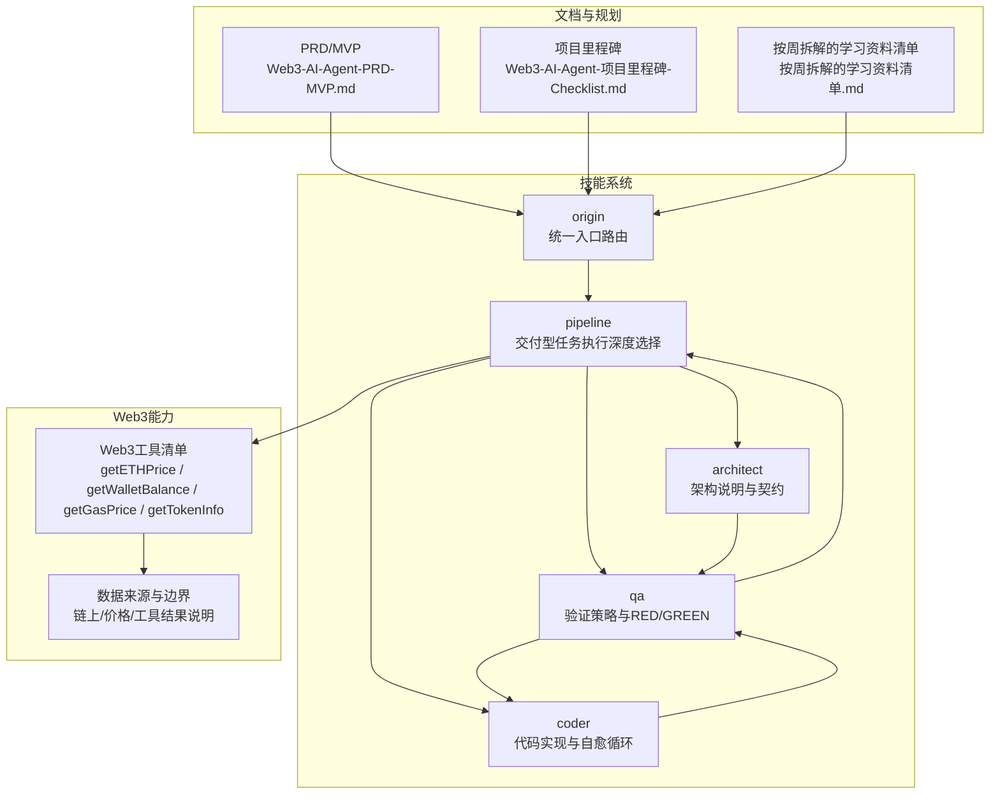
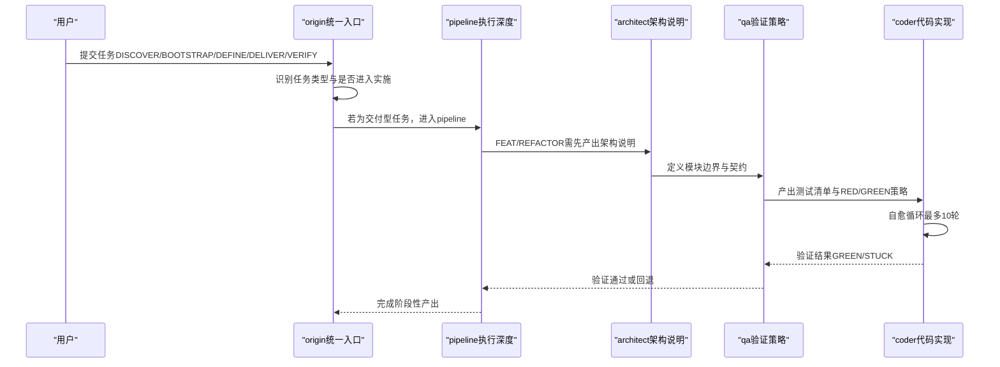
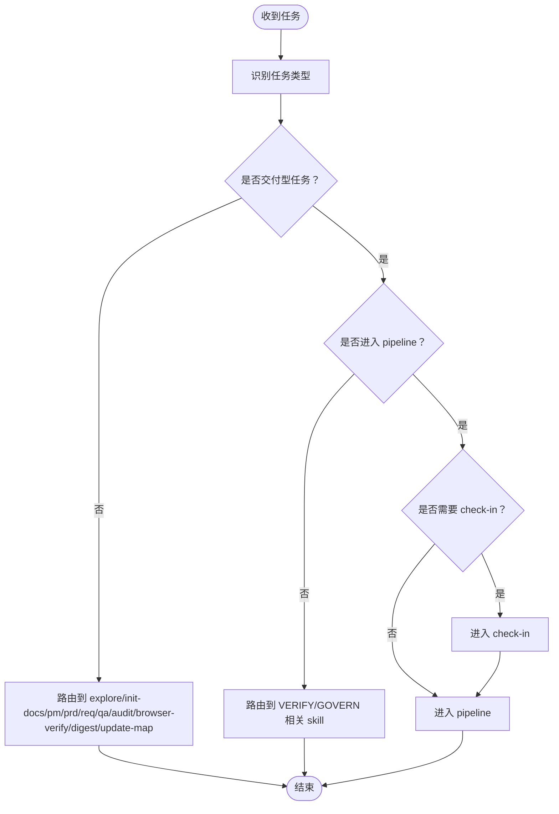
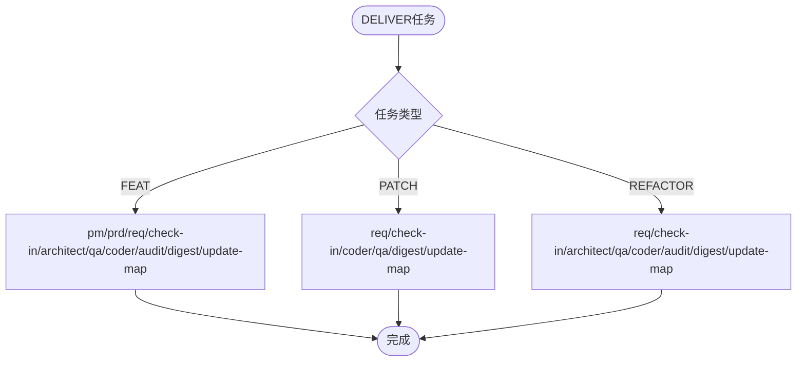
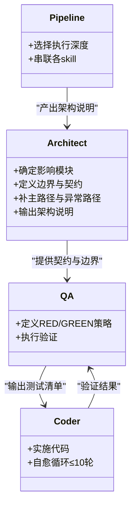
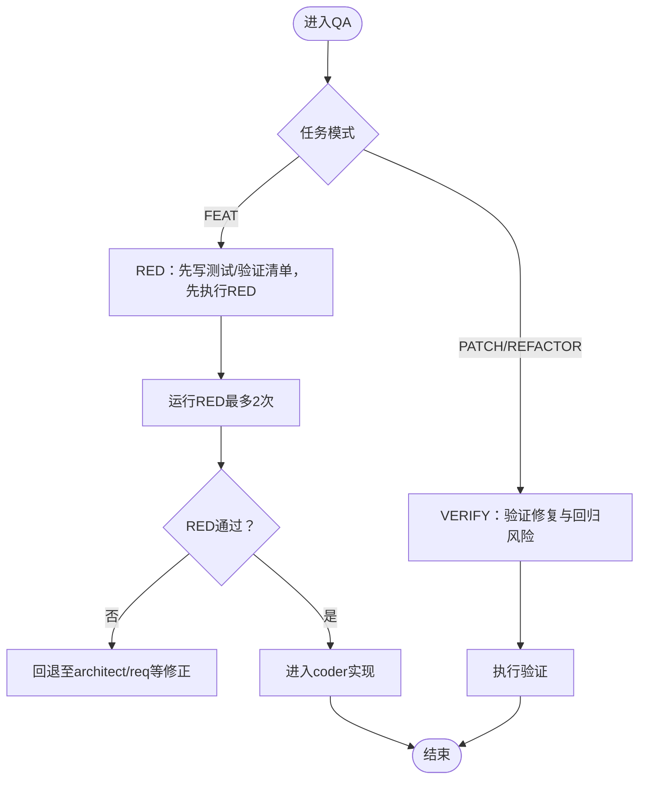
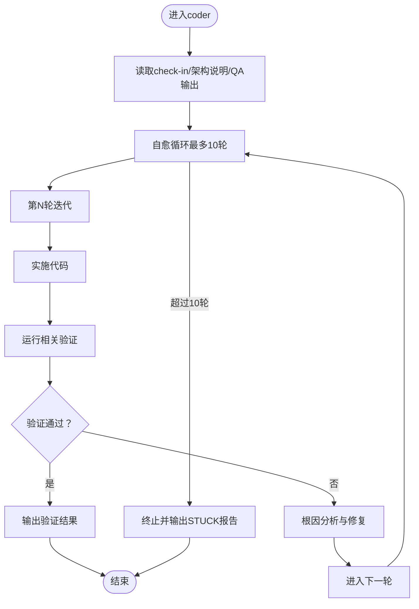
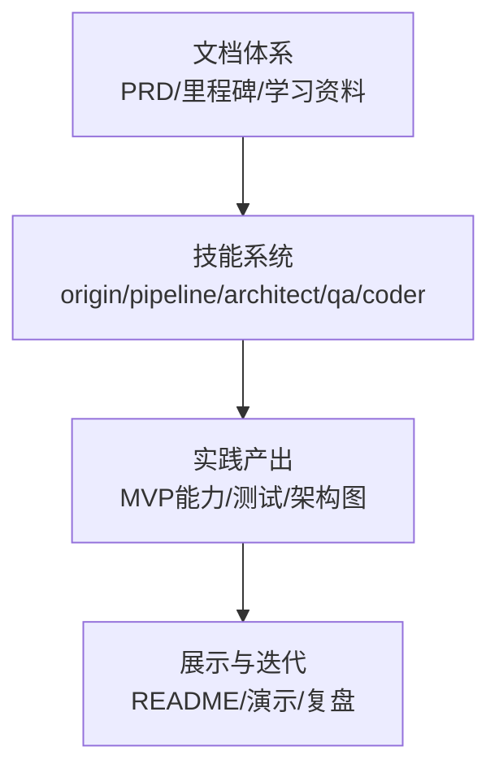
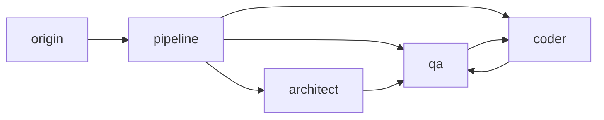

# 项目背景

<cite>
**本文引用的文件**
- [AI-Agent.md](file://AI-Agent.md)
- [Web3-AI-Agent-PRD-MVP.md](file://Web3-AI-Agent-PRD-MVP.md)
- [Web3-AI-Agent-项目里程碑-Checklist.md](file://Web3-AI-Agent-项目里程碑-Checklist.md)
- [按周拆解的学习资料清单.md](file://按周拆解的学习资料清单.md)
- [skills/web3-ai-agent/SKILL.md](file://skills/web3-ai-agent/SKILL.md)
- [skills/web3-ai-agent/origin/SKILL.md](file://skills/web3-ai-agent/origin/SKILL.md)
- [skills/web3-ai-agent/pipeline/SKILL.md](file://skills/web3-ai-agent/pipeline/SKILL.md)
- [skills/web3-ai-agent/architect/SKILL.md](file://skills/web3-ai-agent/architect/SKILL.md)
- [skills/web3-ai-agent/qa/SKILL.md](file://skills/web3-ai-agent/qa/SKILL.md)
- [skills/web3-ai-agent/coder/SKILL.md](file://skills/web3-ai-agent/coder/SKILL.md)
</cite>

## 目录
1. [引言](#引言)
2. [项目结构](#项目结构)
3. [核心组件](#核心组件)
4. [架构总览](#架构总览)
5. [详细组件分析](#详细组件分析)
6. [依赖分析](#依赖分析)
7. [性能考虑](#性能考虑)
8. [故障排查指南](#故障排查指南)
9. [结论](#结论)
10. [附录](#附录)

## 引言
本项目背景面向Web3前端工程师的职业转型需求，旨在应对当前前端开发行业面临的市场变化与技术冲击，探索AI Agent方向的发展机会。项目发起者基于自身岗位需求与职业规划，提出从“Web3前端工程师”向“AI应用工程师/Agent工程师”的转型目标，并以本项目为载体，构建一套可运行、可验证、可复用的技能系统与开发体系。

- 背景驱动：前端开发岗位需求减少、前景不明朗，促使发起者寻求新的技术方向以延长职业寿命。
- 转型目标：从“聊天页面”到“能理解意图、调用Web3工具、返回可信结果、具备最小风险边界的AI Agent”。
- 产品定位：以文档先行、分阶段推进、适合vibe coding的开发体系为核心，形成可展示、可迭代的作品集。

**章节来源**
- [AI-Agent.md:1-15](file://AI-Agent.md#L1-L15)
- [Web3-AI-Agent-PRD-MVP.md:3-228](file://Web3-AI-Agent-PRD-MVP.md#L3-L228)

## 项目结构
项目采用“文档+技能系统+里程碑”的组织方式，围绕MVP目标逐步推进，确保每一步都有明确的产出与验收标准。整体结构包括：
- 顶层文档：PRD、里程碑、学习资料清单等，用于统一目标与节奏。
- 技能系统：以origin为主入口，结合pipeline、architect、qa、coder等子技能，形成闭环的交付流程。
- Web3工具与数据：围绕链上价格、余额、Gas/Token信息等能力进行设计与实现。

**图表来源**
- [Web3-AI-Agent-PRD-MVP.md:100-121](file://Web3-AI-Agent-PRD-MVP.md#L100-L121)
- [Web3-AI-Agent-项目里程碑-Checklist.md:29-229](file://Web3-AI-Agent-项目里程碑-Checklist.md#L29-L229)
- [skills/web3-ai-agent/SKILL.md:92-158](file://skills/web3-ai-agent/SKILL.md#L92-L158)

**章节来源**
- [Web3-AI-Agent-PRD-MVP.md:100-121](file://Web3-AI-Agent-PRD-MVP.md#L100-L121)
- [Web3-AI-Agent-项目里程碑-Checklist.md:29-229](file://Web3-AI-Agent-项目里程碑-Checklist.md#L29-L229)
- [按周拆解的学习资料清单.md:187-196](file://按周拆解的学习资料清单.md#L187-L196)

## 核心组件
本项目的核心在于“技能系统”与“MVP能力边界”的协同推进，确保从需求到实现的每一步都有清晰的职责划分与验收标准。

- 技能系统总入口：origin负责任务类型识别与下一跳路由，保证所有任务从统一入口进入，避免跳过流程或直接实施。
- 交付型任务执行：pipeline根据FEAT/PATCH/REFACTOR选择不同执行深度，确保小任务走短链路，复杂任务按需插入架构/审计/浏览器验收等环节。
- 架构与验证：architect产出模块边界、数据流、接口契约；qa定义RED/GREEN验证策略；coder在边界清晰前提下实施代码并通过最多10轮自愈循环解决问题。
- Web3能力边界：PRD明确了MVP的功能范围、非目标、能力边界与风险控制原则，确保系统在“可运行、可验证、可展示”的前提下持续演进。

**章节来源**
- [skills/web3-ai-agent/SKILL.md:21-167](file://skills/web3-ai-agent/SKILL.md#L21-L167)
- [skills/web3-ai-agent/origin/SKILL.md:12-125](file://skills/web3-ai-agent/origin/SKILL.md#L12-L125)
- [skills/web3-ai-agent/pipeline/SKILL.md:29-89](file://skills/web3-ai-agent/pipeline/SKILL.md#L29-L89)
- [skills/web3-ai-agent/architect/SKILL.md:8-53](file://skills/web3-ai-agent/architect/SKILL.md#L8-L53)
- [skills/web3-ai-agent/qa/SKILL.md:12-73](file://skills/web3-ai-agent/qa/SKILL.md#L12-L73)
- [skills/web3-ai-agent/coder/SKILL.md:18-72](file://skills/web3-ai-agent/coder/SKILL.md#L18-L72)
- [Web3-AI-Agent-PRD-MVP.md:84-171](file://Web3-AI-Agent-PRD-MVP.md#L84-L171)

## 架构总览
从“任务识别—执行深度—架构—验证—实现—复盘”的闭环流程，确保项目在可控范围内持续交付。

**图表来源**
- [skills/web3-ai-agent/origin/SKILL.md:41-125](file://skills/web3-ai-agent/origin/SKILL.md#L41-L125)
- [skills/web3-ai-agent/pipeline/SKILL.md:29-89](file://skills/web3-ai-agent/pipeline/SKILL.md#L29-L89)
- [skills/web3-ai-agent/architect/SKILL.md:34-53](file://skills/web3-ai-agent/architect/SKILL.md#L34-L53)
- [skills/web3-ai-agent/qa/SKILL.md:51-73](file://skills/web3-ai-agent/qa/SKILL.md#L51-L73)
- [skills/web3-ai-agent/coder/SKILL.md:18-72](file://skills/web3-ai-agent/coder/SKILL.md#L18-L72)

## 详细组件分析

### 组件A：统一入口（origin）
- 作用：对所有新任务进行分类，决定是否进入实施链路、是否需要check-in、是否进入pipeline。
- 路由规则：DISCOVER→explore；BOOTSTRAP→init-docs→update-map；DEFINE→pm/prd/req→check-in；DELIVER→pipeline；VERIFY→qa/audit/browser-verify/resolve-doc-conflicts/digest/update-map。
- 边界：不跳过任务判断、不直接写需求/代码/架构。

**图表来源**
- [skills/web3-ai-agent/origin/SKILL.md:41-125](file://skills/web3-ai-agent/origin/SKILL.md#L41-L125)

**章节来源**
- [skills/web3-ai-agent/origin/SKILL.md:12-125](file://skills/web3-ai-agent/origin/SKILL.md#L12-L125)

### 组件B：交付型任务执行（pipeline）
- 作用：为FEAT/PATCH/REFACTOR选择合适的执行深度，避免“为完整而完整”。
- 路由规则：FEAT包含pm/prd/req/check-in/architect/qa/coder/audit/digest/update-map；PATCH包含req/check-in/coder/qa/digest/update-map；REFACTOR包含req/check-in/architect/qa/coder/audit/digest/update-map。
- 硬规则：未check-in不得进入architect/qa/coder；FEAT默认必须有prd+req；PATCH默认不走pm/prd；REFACTOR默认不走pm。

**图表来源**
- [skills/web3-ai-agent/pipeline/SKILL.md:29-89](file://skills/web3-ai-agent/pipeline/SKILL.md#L29-L89)

**章节来源**
- [skills/web3-ai-agent/pipeline/SKILL.md:29-89](file://skills/web3-ai-agent/pipeline/SKILL.md#L29-L89)

### 组件C：架构说明（architect）
- 适用场景：接口变化、状态流变化、模块边界变化、结构性重构。
- 输出：模块边界、数据流、消息流、接口契约、错误处理、风险点。
- 边界：不直接写测试、不直接承担编码；如发现需求边界变化，回退prd/req。

**图表来源**
- [skills/web3-ai-agent/architect/SKILL.md:8-53](file://skills/web3-ai-agent/architect/SKILL.md#L8-L53)
- [skills/web3-ai-agent/qa/SKILL.md:12-73](file://skills/web3-ai-agent/qa/SKILL.md#L12-L73)
- [skills/web3-ai-agent/coder/SKILL.md:18-72](file://skills/web3-ai-agent/coder/SKILL.md#L18-L72)

**章节来源**
- [skills/web3-ai-agent/architect/SKILL.md:8-53](file://skills/web3-ai-agent/architect/SKILL.md#L8-L53)

### 组件D：验证策略（qa）
- 定位：将完成标准转化为验证清单；FEAT走RED优先，PATCH/REFACTOR走轻量验证或回归验证。
- 红绿规则：FEAT先红后绿；coder负责把RED全部变成GREEN；若RED意外通过，说明测试可能写弱，需要修正。
- 边界：不直接写业务实现、不扩大需求范围。

**图表来源**
- [skills/web3-ai-agent/qa/SKILL.md:14-73](file://skills/web3-ai-agent/qa/SKILL.md#L14-L73)

**章节来源**
- [skills/web3-ai-agent/qa/SKILL.md:14-73](file://skills/web3-ai-agent/qa/SKILL.md#L14-L73)

### 组件E：代码实现（coder）
- 定位：在边界清晰前提下实施代码，通过最多10轮自愈循环把QA红灯变为绿灯。
- 自愈循环：每次迭代读取失败信息、根因分析、修复并验证，超过10轮则终止并输出STUCK报告。
- 边界：不修改需求定义、不擅自修改验收标准、不跳过失败验证。

**图表来源**
- [skills/web3-ai-agent/coder/SKILL.md:18-72](file://skills/web3-ai-agent/coder/SKILL.md#L18-L72)

**章节来源**
- [skills/web3-ai-agent/coder/SKILL.md:18-72](file://skills/web3-ai-agent/coder/SKILL.md#L18-L72)

### 概念性总览
项目通过“文档—技能系统—里程碑—学习资料”的协同，形成“边学边做、边做边学”的闭环。每周围绕当前阶段必需内容进行学习与产出，确保知识与实践紧密结合。

[此图为概念性流程图，无需图表来源]

## 依赖分析
- 组件耦合：origin是唯一入口，其他skill均依赖其路由决策；pipeline在交付型任务中串联多个skill，形成强依赖链。
- 依赖关系：architect→qa→coder，形成“设计—验证—实现”的顺序依赖；origin→pipeline→architect/qa/coder，形成“任务识别—执行—实现”的主干依赖。
- 外部依赖：Web3工具依赖链上RPC与价格API，需在PRD中明确数据来源与边界，避免模型伪造数据。

**图表来源**
- [skills/web3-ai-agent/origin/SKILL.md:41-125](file://skills/web3-ai-agent/origin/SKILL.md#L41-L125)
- [skills/web3-ai-agent/pipeline/SKILL.md:29-89](file://skills/web3-ai-agent/pipeline/SKILL.md#L29-L89)
- [skills/web3-ai-agent/architect/SKILL.md:34-53](file://skills/web3-ai-agent/architect/SKILL.md#L34-L53)
- [skills/web3-ai-agent/qa/SKILL.md:51-73](file://skills/web3-ai-agent/qa/SKILL.md#L51-L73)
- [skills/web3-ai-agent/coder/SKILL.md:18-72](file://skills/web3-ai-agent/coder/SKILL.md#L18-L72)

**章节来源**
- [skills/web3-ai-agent/SKILL.md:92-158](file://skills/web3-ai-agent/SKILL.md#L92-L158)
- [Web3-AI-Agent-PRD-MVP.md:143-171](file://Web3-AI-Agent-PRD-MVP.md#L143-L171)

## 性能考虑
- 任务路由效率：通过origin统一分类与路由，避免重复判断与绕路，提升整体流转效率。
- 执行深度控制：pipeline按任务类型选择执行深度，小任务走短链路，避免不必要的验证与评审成本。
- 自愈循环上限：coder最多10轮自愈，防止无效循环导致资源浪费，超过阈值及时终止并输出STUCK报告，便于人工介入。
- 验证策略：FEAT先RED后GREEN，确保测试质量与覆盖率，减少后期返工。

[本节为通用性能讨论，无需章节来源]

## 故障排查指南
- 任务未进入实施：检查origin是否正确识别任务类型与是否需要check-in；若未进入pipeline，确认DELIVER任务是否满足前置条件。
- RED意外通过：说明测试可能过于宽松，应回退至qa修正测试用例，确保能有效证明“当前尚未通过”。
- 自愈循环卡住：超过10轮后自动终止并输出STUCK报告，需人工介入分析阻塞点与建议方向。
- 验证失败回退：若发现需求边界变化，应回退至prd/req进行澄清与调整，避免范围蔓延。

**章节来源**
- [skills/web3-ai-agent/origin/SKILL.md:51-125](file://skills/web3-ai-agent/origin/SKILL.md#L51-L125)
- [skills/web3-ai-agent/qa/SKILL.md:51-73](file://skills/web3-ai-agent/qa/SKILL.md#L51-L73)
- [skills/web3-ai-agent/coder/SKILL.md:39-72](file://skills/web3-ai-agent/coder/SKILL.md#L39-L72)

## 结论
本项目以“技能系统+PRD+里程碑+学习资料”为主线，围绕Web3 AI Agent的MVP目标，构建了一套可运行、可验证、可展示的开发体系。通过origin统一入口、pipeline执行深度选择、architect架构说明、qa验证策略与coder自愈实现，形成闭环交付流程。项目不仅服务于发起者的转型需求，也为前端工程师拥抱AI Agent提供了可复制的方法论与实践路径。

[本节为总结性内容，无需章节来源]

## 附录
- 项目里程碑与验收标准：涵盖初始化、PRD与需求边界确认、Agent核心能力定义、Web3工具与数据能力设计、系统架构与模块契约、测试与验收设计、Vibe Coding实现、审计与复盘等阶段。
- 学习资料清单：按周拆解，确保每周聚焦当前阶段必需内容，避免知识过载，学习必须服务于项目产出。

**章节来源**
- [Web3-AI-Agent-项目里程碑-Checklist.md:1-242](file://Web3-AI-Agent-项目里程碑-Checklist.md#L1-L242)
- [按周拆解的学习资料清单.md:1-196](file://按周拆解的学习资料清单.md#L1-L196)