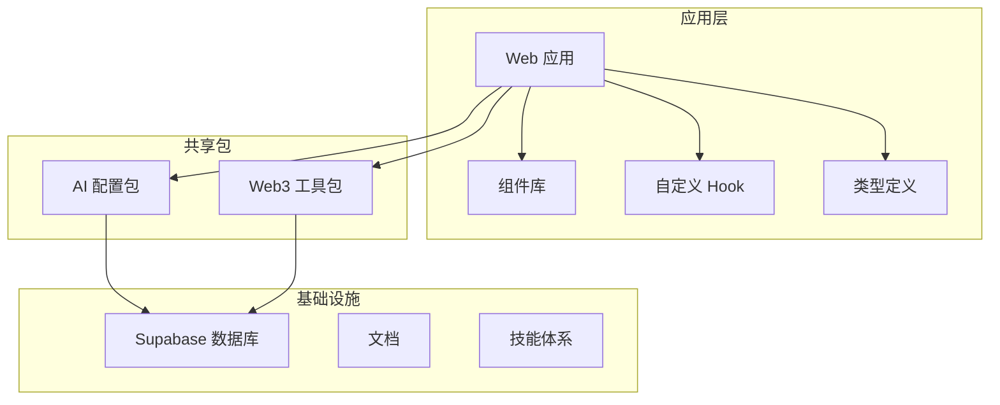
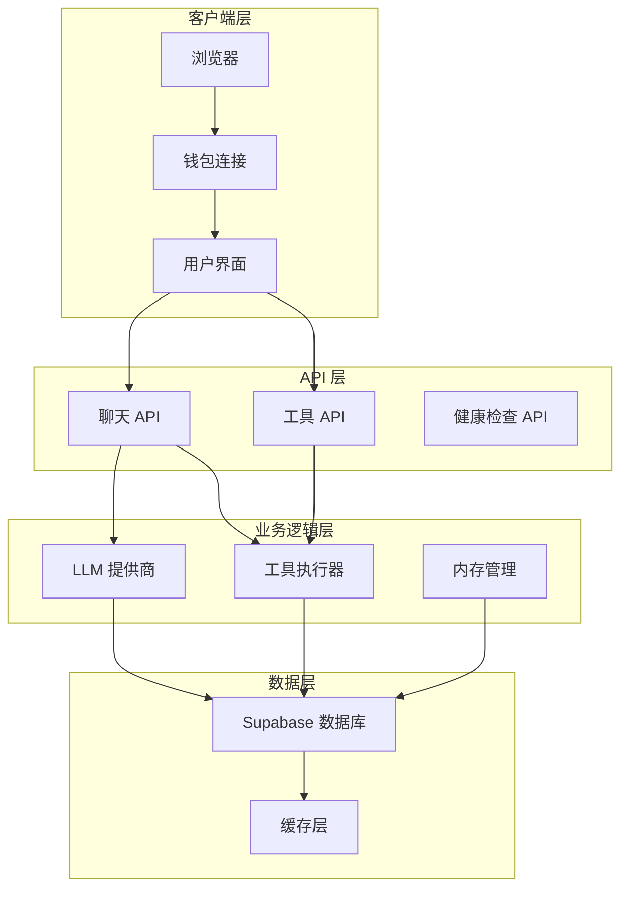
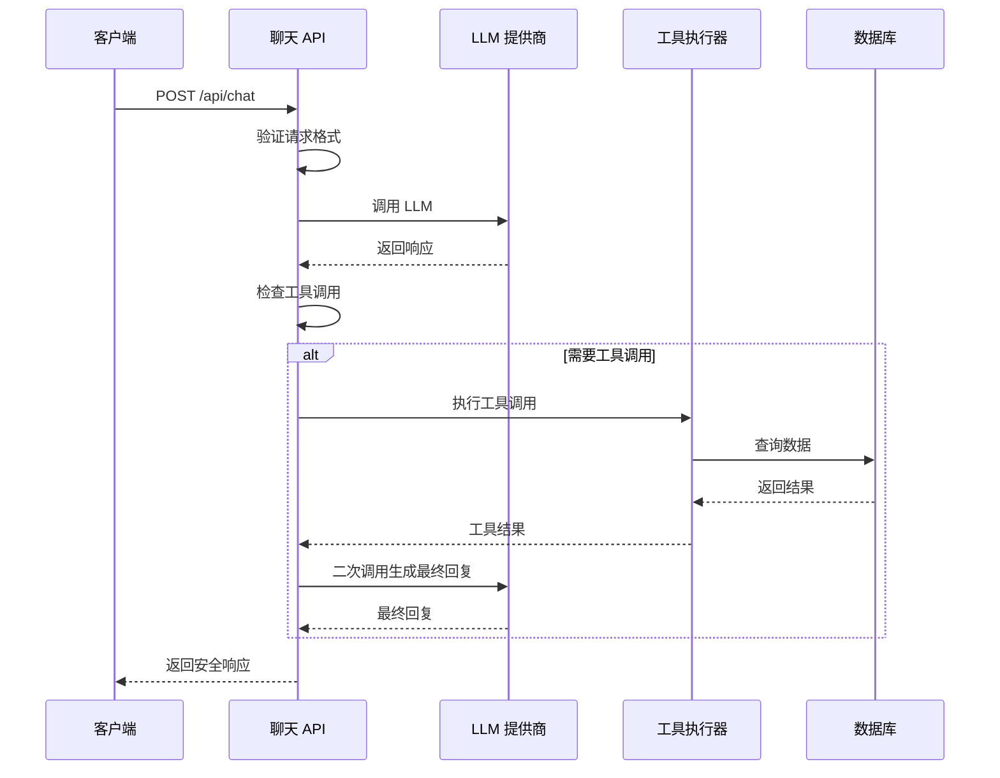
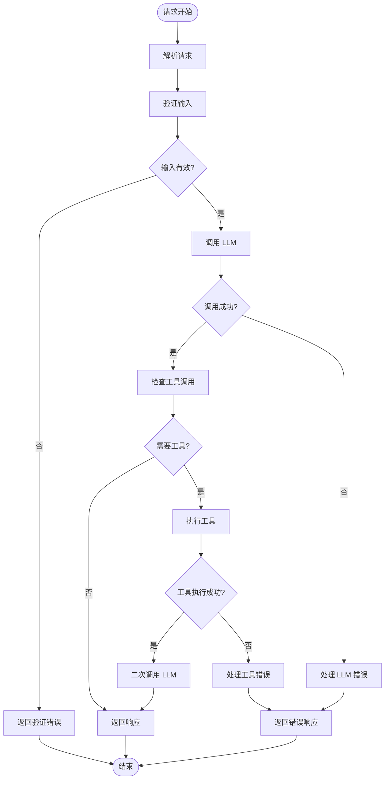
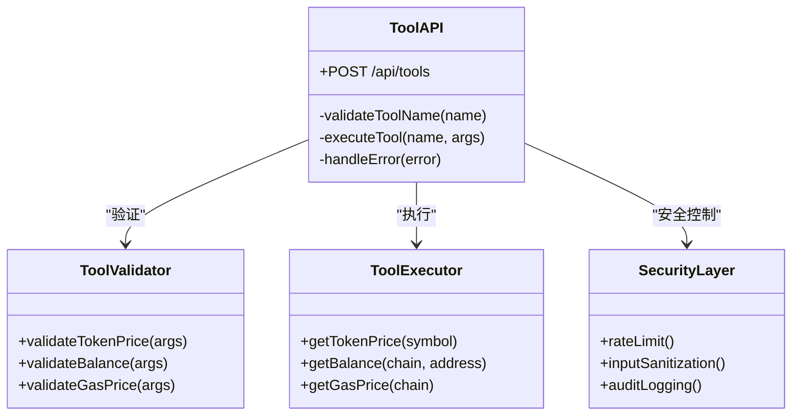
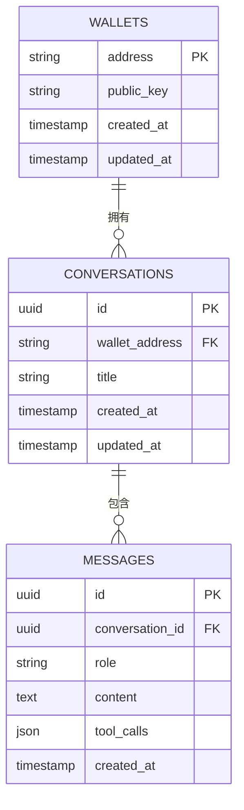
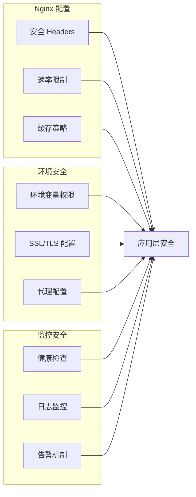
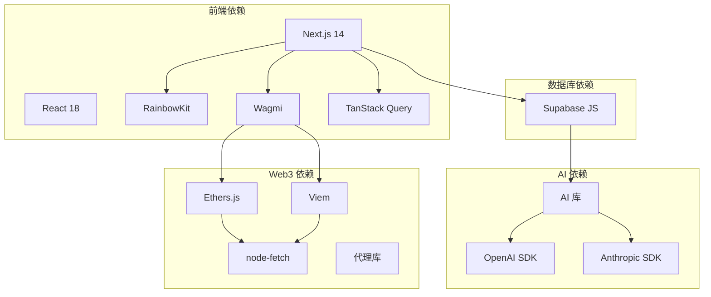
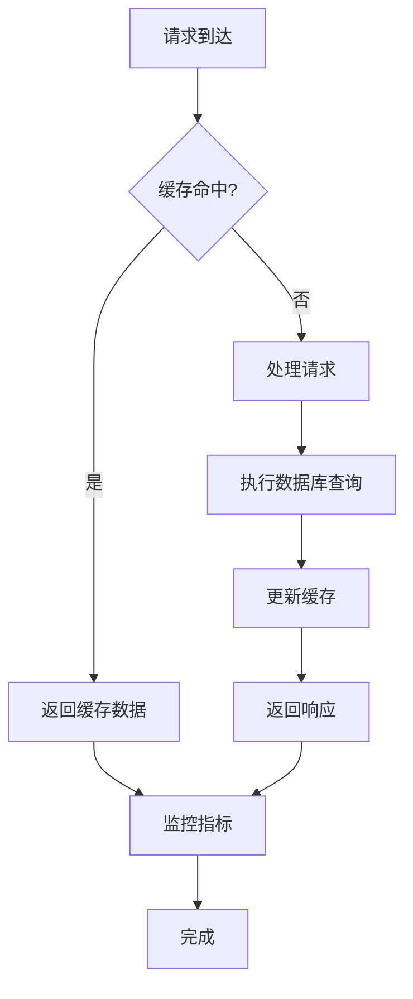
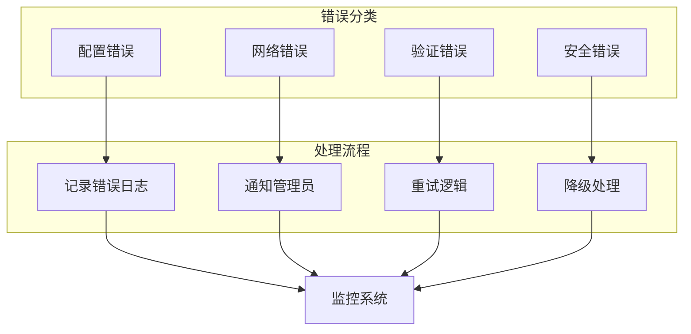

# 安全增强系统

<cite>
**本文档引用的文件**
- [README.md](file://README.md)
- [package.json](file://package.json)
- [apps/web/package.json](file://apps/web/package.json)
- [apps/web/app/layout.tsx](file://apps/web/app/layout.tsx)
- [apps/web/app/providers.tsx](file://apps/web/app/providers.tsx)
- [apps/web/app/config.ts](file://apps/web/app/config.ts)
- [apps/web/app/api/chat/route.ts](file://apps/web/app/api/chat/route.ts)
- [apps/web/app/api/tools/route.ts](file://apps/web/app/api/tools/route.ts)
- [apps/web/app/api/health/route.ts](file://apps/web/app/api/health/route.ts)
- [apps/web/components/WalletConnectButton.tsx](file://apps/web/components/WalletConnectButton.tsx)
- [apps/web/lib/supabase/client.ts](file://apps/web/lib/supabase/client.ts)
- [supabase/init.sql](file://supabase/init.sql)
- [docs/DEPLOYMENT.md](file://docs/DEPLOYMENT.md)
- [packages/ai-config/package.json](file://packages/ai-config/package.json)
- [packages/web3-tools/package.json](file://packages/web3-tools/package.json)
</cite>

## 目录
1. [简介](#简介)
2. [项目结构](#项目结构)
3. [核心组件](#核心组件)
4. [架构概览](#架构概览)
5. [详细组件分析](#详细组件分析)
6. [依赖关系分析](#依赖关系分析)
7. [性能考虑](#性能考虑)
8. [故障排除指南](#故障排除指南)
9. [结论](#结论)

## 简介

Web3 AI Agent 是一个面向 Web3 前端开发者的 AI Agent 项目，实现了从需求定义到代码交付的完整 SDLC 自动化流程。该项目的核心目标是构建一个能够理解用户意图、调用 Web3 工具、返回可信结果，并具备最小风险边界的 AI Agent。

本项目采用了多层次的安全增强系统，包括身份认证、数据验证、API 安全、数据库安全等多个方面，确保系统的整体安全性。

## 项目结构

项目采用 Monorepo 结构，主要分为以下几个部分：

**图表来源**
- [package.json:1-28](file://package.json#L1-L28)
- [apps/web/package.json:1-44](file://apps/web/package.json#L1-L44)

**章节来源**
- [README.md:26-38](file://README.md#L26-L38)
- [package.json:1-28](file://package.json#L1-L28)

## 核心组件

### 身份认证系统

项目实现了基于钱包的去中心化身份认证系统，主要通过以下组件实现：

- **RainbowKit 集成**：提供用户友好的钱包连接界面
- **Wagmi 配置**：管理钱包连接状态和链上交互
- **Cookie 持久化**：支持 SSR 环境下的状态恢复

### 数据验证系统

系统在多个层面实现了数据验证机制：

- **钱包地址验证**：确保钱包地址格式正确
- **工具参数验证**：验证工具调用参数的有效性
- **输入内容过滤**：防止恶意输入和注入攻击

### API 安全系统

API 层面的安全措施包括：

- **流式输出安全**：SSE 流式响应的安全处理
- **错误处理机制**：区分配置错误和运行时错误
- **速率限制**：通过 Nginx 实现 API 速率限制

**章节来源**
- [apps/web/app/providers.tsx:1-51](file://apps/web/app/providers.tsx#L1-L51)
- [apps/web/app/config.ts:1-59](file://apps/web/app/config.ts#L1-L59)
- [apps/web/lib/supabase/client.ts:15-54](file://apps/web/lib/supabase/client.ts#L15-L54)

## 架构概览

**图表来源**
- [apps/web/app/api/chat/route.ts:135-406](file://apps/web/app/api/chat/route.ts#L135-L406)
- [apps/web/app/api/tools/route.ts:10-58](file://apps/web/app/api/tools/route.ts#L10-L58)
- [apps/web/lib/supabase/client.ts:1-54](file://apps/web/lib/supabase/client.ts#L1-L54)

## 详细组件分析

### 聊天 API 安全分析

聊天 API 是系统的核心安全组件，实现了多层安全防护：

**图表来源**
- [apps/web/app/api/chat/route.ts:135-320](file://apps/web/app/api/chat/route.ts#L135-L320)

#### 错误处理流程

**图表来源**
- [apps/web/app/api/chat/route.ts:360-406](file://apps/web/app/api/chat/route.ts#L360-L406)

**章节来源**
- [apps/web/app/api/chat/route.ts:135-406](file://apps/web/app/api/chat/route.ts#L135-L406)

### 工具 API 安全分析

工具 API 提供了独立的 Web3 工具调用接口，具有严格的安全控制：

**图表来源**
- [apps/web/app/api/tools/route.ts:10-58](file://apps/web/app/api/tools/route.ts#L10-L58)

**章节来源**
- [apps/web/app/api/tools/route.ts:10-58](file://apps/web/app/api/tools/route.ts#L10-L58)

### 数据库安全分析

Supabase 数据库实现了多层安全保护：

**图表来源**
- [supabase/init.sql:31-74](file://supabase/init.sql#L31-L74)

#### 行级安全策略

数据库实现了基于钱包地址的行级安全策略：

| 表名 | 选择操作 | 插入操作 | 更新操作 | 删除操作 |
|------|----------|----------|----------|----------|
| conversations | 基于钱包地址过滤 | 仅认证用户 | 基于钱包地址 | 基于钱包地址 |
| messages | 允许所有用户 | 仅认证用户 | 基于会话 | 基于会话 |

**章节来源**
- [supabase/init.sql:31-74](file://supabase/init.sql#L31-L74)

### 部署安全配置

**图表来源**
- [docs/DEPLOYMENT.md:514-542](file://docs/DEPLOYMENT.md#L514-L542)

**章节来源**
- [docs/DEPLOYMENT.md:514-542](file://docs/DEPLOYMENT.md#L514-L542)

## 依赖关系分析

**图表来源**
- [apps/web/package.json:12-31](file://apps/web/package.json#L12-L31)
- [packages/ai-config/package.json:13-16](file://packages/ai-config/package.json#L13-L16)
- [packages/web3-tools/package.json:13-17](file://packages/web3-tools/package.json#L13-L17)

**章节来源**
- [apps/web/package.json:12-31](file://apps/web/package.json#L12-L31)
- [packages/ai-config/package.json:13-16](file://packages/ai-config/package.json#L13-L16)
- [packages/web3-tools/package.json:13-17](file://packages/web3-tools/package.json#L13-L17)

## 性能考虑

### 缓存策略

系统实现了多层次的缓存机制：

- **静态资源缓存**：Nginx 配置 365 天缓存
- **API 响应缓存**：React Query 默认 5 分钟缓存
- **数据库查询缓存**：智能查询优化

### 性能监控

### 安全性能平衡

系统在保证安全性的前提下优化性能：

- **异步处理**：工具调用采用异步执行
- **流式响应**：SSE 流式输出提升用户体验
- **连接池管理**：数据库连接池优化

## 故障排除指南

### 常见安全问题

| 问题类型 | 症状 | 解决方案 | 相关文件 |
|----------|------|----------|----------|
| 身份认证失败 | 无法连接钱包 | 检查钱包连接状态和网络配置 | apps/web/app/config.ts |
| 数据库访问错误 | 查询失败或权限不足 | 验证 Supabase 连接和 RLS 策略 | apps/web/lib/supabase/client.ts |
| API 调用超时 | 请求无响应 | 检查代理配置和网络连接 | docs/DEPLOYMENT.md |
| 缓存问题 | 数据不一致 | 清理缓存并检查缓存配置 | Nginx 配置 |

### 错误监控

系统提供了完善的错误监控机制：

**章节来源**
- [apps/web/app/api/chat/route.ts:360-406](file://apps/web/app/api/chat/route.ts#L360-L406)
- [apps/web/lib/supabase/client.ts:8-10](file://apps/web/lib/supabase/client.ts#L8-L10)

## 结论

Web3 AI Agent 的安全增强系统通过多层次的安全防护机制，为用户提供了可靠的安全保障。系统的主要安全特性包括：

1. **身份认证安全**：基于钱包的去中心化身份认证
2. **数据验证安全**：多层输入验证和过滤机制
3. **API 安全**：完整的错误处理和安全响应机制
4. **数据库安全**：行级安全策略和访问控制
5. **部署安全**：全面的 Nginx 安全配置和监控

该系统在保证功能完整性的同时，充分考虑了安全性需求，为 Web3 应用的安全发展提供了良好的参考模板。建议在生产环境中进一步完善 Supabase Auth 集成和更严格的访问控制策略。