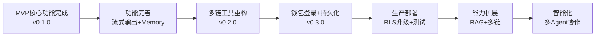

# Web3 AI Agent 项目清单

> 最后更新：2026-04-23
> 当前版本：v0.4.0
> 项目阶段：UI 增强与全局主题系统 + 钱包上下文注入完成 → 用户体验全面提升

## 一、已完成功能 ✅

### 1.1 核心功能

#### 对话系统
- [x] 基础聊天界面（2026-04-17）
  - Next.js Web 应用
  - 消息列表展示
  - 用户输入组件
- [x] 多模型支持（2026-04-17）
  - OpenAI API 适配器
  - Anthropic API 适配器
  - 全局模型切换（环境变量驱动）
  - LLMFactory 工厂模式
- [x] Function Calling（2026-04-17）
  - 工具定义和注册
  - 两次 API 调用流程
  - 调试日志支持（2026-04-20）
- [x] Agent Loop v1（2026-04-17）
  - 意图识别
  - 工具调用决策
  - 结果回填
  - 自然语言回复生成
- [x] **流式输出 SSE**（2026-04-21）
  - ReadableStream 流式数据推送
  - 前后端双模式支持（JSON/SSE）
  - useChatStream Hook 管理流式状态
  - MessageItem/MessageList 流式内容展示

#### 钱包登录与对话持久化
- [x] **钱包登录**（2026-04-23）
  - RainbowKit v2.2.10 + Wagmi v2.19.5
  - 支持 MetaMask、WalletConnect、EIP-6963 自动发现
  - OKX、Binance、Gate 等扩展钱包支持
  - SSR 兼容性问题修复（useMemo + 环境检测）
  - 钱包连接状态持久化（刷新不丢失）
  - WalletConnect QR 码扫码连接
- [x] **Supabase 对话持久化**（2026-04-23）
  - PostgreSQL 云端数据库
  - 自动保存对话和消息
  - 对话历史侧边栏（展示、切换、删除、新建）
  - 钱包连接时自动加载历史对话
  - 对话标题自动生成（基于首条消息）
  - 增量更新对话列表（不重复加载）
- [x] **RLS 安全加固**（2026-04-23）
  - 应用层钱包地址隔离
  - 钱包上下文验证机制（setWalletContext）
  - 所有 Supabase 查询前强制验证
  - 删除操作所有权验证
  - 移除 .env.example 硬编码密钥
  - Audit 评分：88/100
- [x] **断开连接清空对话**（2026-04-23）
  - 客户端 UI 清空（memoryManager.clear + 欢迎消息）
  - 保留 Supabase 云端数据
  - 重连自动恢复最新对话
  - 用户体验优化

#### 会话 Memory 管理
- [x] **L3 摘要压缩模式**（2026-04-21）
  - MemoryManager 接口抽象（Strategy 模式）
  - SummaryCompressionMemory 实现
  - 固定条数触发（默认 10 条），保留最近 5 条
  - 异步压缩，不阻塞用户输入
  - 配置化管理（环境变量支持）
  - Audit 评分：82/100
- [x] **L2 滑动窗口策略**（2026-04-21）
  - SlidingWindowMemory 实现（57 行）
  - 只保留最近 N 条，无 LLM 调用
  - QA 验证 10/10 通过
  - 前端未集成（待后续添加切换 UI）

#### Web3 工具集
- [x] **多链价格查询**（2026-04-22）
  - 5 种币种：ETH, BTC, SOL, MATIC, BNB
  - 参数化工具：`getTokenPrice(symbol)`
  - 多数据源容错（Binance, Huobi）
  - 代理支持
  - 向后兼容（旧函数标记 @deprecated）
- [x] **多链余额查询**（2026-04-22）
  - 5 条链：Ethereum, Polygon, BSC, Bitcoin, Solana
  - 链适配器模式：EvmChainAdapter, BitcoinAdapter, SolanaAdapter
  - 参数化工具：`getBalance(chain, address)`
  - 地址格式验证
  - 多 RPC 节点容错
- [x] **多链 Gas 查询**（2026-04-22）
  - 3 条 EVM 链：Ethereum, Polygon, BSC
  - 参数化工具：`getGasPrice(chain)`
  - EIP-1559 费用数据
  - 向后兼容（旧函数标记 @deprecated）
- [x] **Token 信息查询**（2026-04-22）
  - 11 个主流 Token 注册表
  - 3 条 EVM 链支持（Ethereum, Polygon, BSC）
  - 工具：`getTokenInfo(chain, symbolOrAddress)`
  - 支持符号和合约地址查询
- [x] **钱包上下文注入**（2026-04-23）
  - AI 自动感知用户钱包地址
  - system prompt 动态生成（createSystemPrompt）
  - 用户查询"我的余额"时自动使用当前地址
  - 无需手动输入钱包地址

#### 风险控制在
- [x] 错误处理与降级回复（2026-04-17）
  - 工具参数无效处理
  - 工具执行失败处理
  - API 超时处理
  - 超出能力边界处理
- [x] 风险提示机制（2026-04-17）
  - 高风险问题保守回答
  - 数据来源透明标注
  - 免责声明原则

### 1.2 UI/UX 增强

- [x] **删除弹窗美化**（2026-04-23）
  - ConfirmDialog 自定义组件（Tailwind CSS）
  - 紫色主题、圆角、毛玻璃背景
  - ESC 键关闭 + 点击遮罩关闭
  - Loading 状态（旋转图标 + 禁用按钮）
  - 支持 variant（danger/warning/info）
- [x] **全局浅色主题系统**（2026-04-23）
  - CSS 变量主题架构（globals.css）
  - 3 种模式：Light / Dark / System
  - ThemeProvider + ThemeContext + useTheme
  - localStorage 持久化
  - 系统主题监听（prefers-color-scheme）
  - 全局组件主题适配（page, ChatInput, ConversationHistory, SettingsPanel）
  - RainbowKit 钱包按钮主题动态切换
  - 平滑过渡动画（transition-colors duration-300）
  - Audit 评分：94/100

### 1.2 工程能力

- [x] Monorepo 架构（2026-04-17）
  - pnpm workspace
  - turbo 2.x 构建系统
  - 多包管理
- [x] TypeScript 全项目覆盖（2026-04-17）
  - 严格类型检查
  - 统一类型定义
- [x] 配置管理（2026-04-20）
  - 环境变量驱动
  - .env.example 模板
  - 多模型配置
  - 代理配置支持
- [x] 代码模块化（2026-04-20）
  - AI 配置独立包（packages/ai-config）
  - Web3 工具独立包（packages/web3-tools）
  - 直接调用优化（减少 HTTP 开销）
- [x] 国内网络适配（2026-04-20）
  - HTTP 代理支持
  - node-fetch 替代原生 fetch
  - 国产化 API 数据源
- [x] **Supabase 集成**（2026-04-23）
  - supabase/init.sql 数据库初始化脚本
  - conversations 表（按钱包地址隔离）
  - messages 表（关联对话）
  - RLS 行级安全策略
  - 钱包上下文验证工具函数
- [x] **链抽象层**（2026-04-22）
  - 链配置管理（ChainConfig）
  - 适配器模式（ChainAdapter 接口）
  - EVM 链统一处理
  - 非 EVM 链独立适配器
- [x] **主题系统架构**（2026-04-23）
  - lib/theme/types.ts - 类型定义
  - lib/theme/ThemeContext.tsx - React Context
  - lib/theme/ThemeProvider.tsx - Provider 实现
  - components/ThemeSwitcher.tsx - 主题切换组件

### 1.3 文档体系

- [x] 项目文档
  - README.md - 项目总览
  - ARCHITECTURE.md - 架构设计
  - .qoder/rules/AI-Agent.md - 全局规则
- [x] 产品文档
  - docs/Web3-AI-Agent-PRD-MVP.md - 产品需求
  - docs/Web3-AI-Agent-项目里程碑-Checklist.md - 进度跟踪
  - docs/Web3-AI-Agent-阶段执行说明-V3.md - 阶段说明
- [x] 学习文档
  - docs/AI-Agent-核心概念学习指南.md - 核心概念
  - docs/学习笔记.md - 学习笔记
  - docs/按周拆解的学习资料清单.md - 学习计划
- [x] 技能体系文档
  - skills/x-ray/SKILL.md - 总入口
  - skills/x-ray/SKILL-SYSTEM-DESIGN-V3.md - 系统设计
  - skills/x-ray/MAP-V3.md - 技能地图
  - skills/x-ray/COMMANDS.md - 命令参考
  - skills/x-ray/TEMPLATES-V3.md - 模板库
- [x] 数据库脚本
  - supabase/init.sql - 数据库初始化（包含 RLS 策略）
- [x] 变更历史
  - docs/changelog/ - 完整变更记录
  - docs/changelog/INDEX.md - 变更索引
  - docs/changelog/BACKFILL-GUIDE.md - 补录指南
  - 2026-04-23-feat-ui-enhancements-and-theme-system.md - UI 增强与主题系统

### 1.4 AI Agent 技能体系

- [x] x-ray 技能体系 V3（2026-04-17）
  - **主技能**：origin, pipeline
  - **定义技能**：pm, prd, req
  - **设计技能**：architect, qa
  - **实现技能**：coder, audit
  - **辅助技能**：explore, check-in, digest, update-map, browser-verify, resolve-doc-conflicts, init-docs
  - **新增技能**：changelog（变更记录）, project-checklist（项目清单）

## 二、进行中功能 🔄

### 2.1 开发中

- [ ] 无当前进行中的功能

## 三、未完成功能（MVP 范围内）⏳

### 3.1 高优先级 P0

- [ ] **测试覆盖**
  - 价值：保证代码质量，防止回归
  - 预计工作量：5-7 天
  - 依赖：测试框架选型（Jest/Vitest）
  - 参考：MAP-V3 待办事项
  - 备注：Memory 管理模块、Supabase 数据访问层待补充单元测试

- [ ] **Anthropic 工具调用验证**
  - 价值：验证多模型兼容性
  - 预计工作量：1-2 天
  - 依赖：Anthropic API Key
  - 参考：MAP-V3 待办事项

- [ ] **浏览器验收测试**
  - 价值：确保前端功能正常（钱包登录、对话历史、新建对话、主题切换）
  - 预计工作量：1-2 天
  - 参考：MAP-V3 待验证
  - 重点：多钱包切换、对话切换、刷新保持连接、主题切换、钱包上下文查询

### 3.2 中优先级 P1

- [ ] **生产环境 RLS 升级**
  - 价值：真正的数据库层安全隔离
  - 预计工作量：3-5 天
  - 方案：Supabase Auth + 钱包签名登录 + JWT
  - 当前状态：应用层防护（可绕过）
  - 优先级：**生产部署前必须完成**

- [ ] **部署文档**
  - 价值：指导生产环境部署
  - 预计工作量：1-2 天
  - 参考：MAP-V3 待办事项
  - 备注：需包含 Supabase 部署步骤

- [ ] **API 文档**
  - 价值：完善接口说明
  - 预计工作量：2-3 天
  - 参考：MAP-V3 待办事项

- [ ] **多链 Web3 工具重构**
  - 价值：扩展 Web3 工具集到多链
  - 预计工作量：已完成
  - 状态：✅ 已完成（2026-04-22）
  - 内容：价格/余额/Gas/Token 查询，5 链支持

### 3.3 低优先级 P2

- [ ] ~~**持久化存储**~~
  - 状态：✅ 已完成（2026-04-23）
  - 技术：Supabase PostgreSQL
  - 功能：对话历史、消息保存、自动加载

- [ ] **错误边界和加载状态**
  - 价值：提升用户体验
  - 预计工作量：2-3 天
  - 内容：钱包连接失败、网络错误、数据加载中的 UI 反馈

- [ ] **首屏性能优化**
  - 价值：加快页面加载速度
  - 预计工作量：1-2 天
  - 方案：钱包 SDK 按需加载、动态 import

- [ ] **更多 Web3 工具**
  - 价值：丰富 Agent 能力
  - 预计工作量：按需
  - 示例：NFT 查询、交易历史查询

## 四、未来规划（MVP 范围外）🚀

### 4.1 短期规划（1-2 个月）

- [ ] **自定义主题色**
  - 价值：支持科技蓝、加密紫、暗夜绿等方案
  - 优先级：P1
  - 预计工作量：3-5 天
  - 当前状态：主题系统架构已完成，可扩展

- [ ] **多语言支持**
  - 价值：中文、English、日本語切换
  - 优先级：P1
  - 预计工作量：5-7 天

- [ ] **RAG 知识库接入**
  - 价值：支持协议文档和投研报告查询
  - 优先级：P1
  - 预计工作量：7-10 天
  - 技术选型：向量数据库 + Embedding API

- [ ] **钱包余额快捷查询**
  - 价值：侧边栏显示当前钱包各链余额概览
  - 优先级：P1
  - 预计工作量：2-3 天
  - 当前状态：AI 可查询，但 UI 未展示

- [ ] **多链支持扩展**
  - 价值：支持更多 L2 和新兴链
  - 优先级：P2
  - 预计工作量：按需
  - 示例：Arbitrum, Optimism, zkSync
  - 状态：✅ 基础架构已完成，可扩展

- [ ] **Mock 交易工具**
  - 价值：模拟交易执行（不真实上链）
  - 优先级：P2
  - 预计工作量：3-5 天

### 4.2 中期规划（3-6 个月）

- [ ] **对话搜索**
  - 价值：搜索历史对话内容
  - 优先级：P2
  - 预计工作量：3-5 天

- [ ] **长期用户偏好 Memory**
  - 价值：记住用户常用地址、偏好币种
  - 优先级：P1
  - 预计工作量：7-10 天

- [ ] **更完整的风险控制**
  - 价值：增强安全性和可信度
  - 优先级：P0
  - 预计工作量：5-7 天

- [ ] **对话标题 AI 生成**
  - 价值：自动生成有意义的对话标题
  - 优先级：P1
  - 预计工作量：1-2 天
  - 当前状态：✅ 已完成（基于首条消息截取，2026-04-23）

- [ ] **审计能力增强**
  - 价值：自动化安全审计
  - 优先级：P1
  - 预计工作量：10-15 天

- [ ] **CI/CD 自动化**
  - 价值：自动化测试和部署
  - 优先级：P1
  - 预计工作量：5-7 天
  - 工具：GitHub Actions / Vercel

### 4.3 长期愿景（6 个月+）

- [ ] **多 Agent 协作**
  - 价值：复杂任务分解和协作
  - 优先级：P2
  - 参考：PRD 非目标

- [ ] **完整后台管理系统**
  - 价值：用户管理、数据统计
  - 优先级：P2
  - 参考：PRD 非目标

- [ ] **自动交易执行**
  - 价值：真实链上操作（高风险）
  - 优先级：P3
  - 参考：PRD 非目标（需严格安全审计）

- [ ] **多 Agent 协作网络**
  - 价值：构建 Agent 生态
  - 优先级：P3

## 五、技术债务 🐛

### 5.1 需要重构

- **RLS 策略升级为数据库层**
  - 问题：当前为应用层防护，可被绕过
  - 影响：数据安全（生产环境严重）
  - 优先级：**P0（生产前必须）**
  - 方案：Supabase Auth + 钱包签名 + JWT
  - 预计工作量：3-5 天

- **console.log 调试日志**
  - 问题：生产环境应使用日志库（winston/pino）
  - 影响：日志级别控制、性能
  - 优先级：P1
  - 预计工作量：1-2 天

- **错误处理统一化**
  - 问题：各工具错误处理不一致
  - 影响：可维护性
  - 优先级：P1
  - 预计工作量：2-3 天

### 5.2 需要优化

- **API 响应性能**
  - 问题：工具调用无缓存机制
  - 影响：响应速度、API 限流
  - 优先级：P2
  - 建议：添加 Redis 或内存缓存

- **前端 UI/UX**
  - 问题：基础聊天界面，缺少美化
  - 影响：用户体验
  - 优先级：P2
  - 建议：添加主题、动画、响应式设计
  - 状态：✅ 已完成主题系统（2026-04-23）

- **SSR 主题闪烁**
  - 问题：刷新页面短暂看到默认主题（~100ms）
  - 影响：用户体验（轻微）
  - 优先级：P3
  - 方案：layout.tsx 的 <head> 添加同步脚本
  - 预计工作量：20 分钟

- **钱包地址格式验证**
  - 问题：system prompt 注入未验证地址格式
  - 影响：低（wagmi 保证格式正确）
  - 优先级：P3
  - 方案：route.ts 添加正则验证
  - 预计工作量：10 分钟

- **CSS 变量命名冲突风险**
  - 问题：使用通用名称（--bg-primary）
  - 影响：低（当前无冲突）
  - 优先级：P4
  - 方案：添加项目前缀 --w3a-*
  - 预计工作量：15 分钟

- **类型安全增强**
  - 问题：部分 unknown 类型未严格处理
  - 影响：类型安全
  - 优先级：P2
  - 建议：完善类型定义和 zod 验证

## 六、项目演进路线

## 七、关键指标

| 指标 | 当前值 | 目标值 | 状态 |
|------|--------|--------|------|
| MVP 功能完成率 | 100% | 100% | 🟢 完成 |
| 测试覆盖率 | 0% | 80% | ❌ 未开始 |
| 文档完整度 | ~99% | 90% | 🟢 优秀 |
| 代码质量（Audit 平均分） | 91 分 | 90+ 分 | 🟢 优秀 |
| 已接入 AI 模型数 | 2+2（国产） | 5+ | 🟡 部分完成 |
| 已实现 Web3 工具数 | 4 组（5 链/5 币种/11 Token） | 5+ | 🟢 超额完成 |
| 技能体系完整度 | 100% | 100% | 🟢 完成 |
| 支持链数量 | 5 条 | 5+ | 🟢 完成 |
| 支持币种数量 | 5 种 | 5+ | 🟢 完成 |
| **钱包登录** | ✅ RainbowKit + Wagmi v2 | ✅ | 🟢 完成 |
| **对话持久化** | ✅ Supabase PostgreSQL | ✅ | 🟢 完成 |
| **数据安全** | ⚠️ 应用层防护 | 🔒 数据库层 | 🟡 待升级 |
| **主题系统** | ✅ Light/Dark/System | ✅ | 🟢 完成 |
| **钱包上下文** | ✅ AI 自动感知地址 | ✅ | 🟢 完成 |
| **删除弹窗** | ✅ ConfirmDialog + Loading | ✅ | 🟢 完成 |

**MVP 功能完成率计算**：
- 必做功能：10 项
- 已完成：10 项（多链工具重构完成）
- 完成率：100%

## 八、下一步行动建议

### 🔴 立即执行（本周）

1. **浏览器验收测试**
   - 原因：验证钱包登录、对话历史、主题切换、钱包上下文功能
   - 预估：1-2 天
   - 链路：`/browser-verify`
   - 重点：多钱包切换、对话切换、刷新保持连接、主题切换、余额查询

2. **添加 Supabase 数据访问层单元测试**
   - 原因：新增对话持久化功能，需保证质量
   - 预估：2-3 天
   - 链路：`/origin` -> `/pipeline feat` -> 包含测试
   - 重点：钱包上下文验证、对话 CRUD、消息保存

3. **手动验证 RLS 策略**
   - 原因：重新运行 init.sql 后验证安全隔离
   - 预估：0.5 天
   - 内容：多钱包地址测试、跨钱包访问拒绝

### 🟡 本周完成

4. **生产环境 RLS 升级方案设计**
   - 原因：当前应用层防护不安全
   - 预估：1-2 天
   - 方案：调研 Supabase Auth + 钱包签名
   - 输出：技术方案文档

5. **补充部署文档**
   - 原因：指导生产环境部署
   - 预估：1-2 天
   - 内容：Supabase 部署、环境变量、钱包配置

6. **完善 API 文档**
   - 原因：提升项目专业度
   - 预估：2-3 天

7. **扩展 Token 注册表**
   - 原因：当前 11 个 Token，可扩充到 50+
   - 预估：1 天
   - 内容：添加更多主流 Token

8. **Memory 性能优化**
   - 原因：补充 fetch 超时、用户提示、依赖注入
   - 预估：1 天
   - 参考：Audit 报告中 P1/P2 建议

9. **消除 SSR 主题闪烁**
   - 原因：提升用户体验
   - 预估：20 分钟
   - 方案：layout.tsx 的 <head> 添加同步脚本

10. **添加钱包地址格式验证**
    - 原因：增强 system prompt 注入安全性
    - 预估：10 分钟
    - 方案：route.ts 添加正则验证

## 九、更新历史

| 日期 | 版本 | 更新内容 | 更新人 |
|------|------|----------|--------|
| 2026-04-23 | v4.0 | UI 增强与全局主题系统 + 钱包上下文注入完成，新增删除弹窗/断开清空/浅色主题/walletAddress 注入，Audit 94/100 | AI Agent |
| 2026-04-23 | v3.0 | 钱包登录+Supabase对话持久化+RLS安全加固完成，MVP核心功能完整，新增生产RLS升级P0任务 | AI Agent |
| 2026-04-22 | v2.0 | 多链 Web3 工具重构完成（4 Phases），MVP 完成率 100%，支持 5 链/5 币种/11 Token | AI Agent |
| 2026-04-21 | v1.2 | Memory 管理（L3 摘要压缩）完成，MVP 完成率提升至 95% | AI Agent |
| 2026-04-21 | v1.1 | SSE 流式输出完成, checklist 体系建立, 完成率提升至 85% | AI Agent |

---

**文档维护说明**：
- 本文件由 `/project-checklist` 技能自动维护
- 每次交付型任务完成后自动更新
- 用户可通过 `/project-checklist` 命令手动触发更新
- 更新位置：`docs/checklist/PROJECT-CHECKLIST.md`
