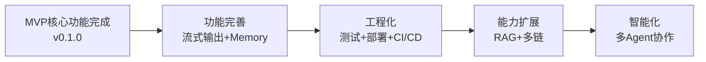

# Web3 AI Agent 项目清单

> 最后更新：2026-04-21
> 当前版本：v0.1.2
> 项目阶段：MVP 核心功能完成，Memory 管理已实现（L3 摘要压缩），待测试覆盖

## 一、已完成功能 ✅

### 1.1 核心功能

#### 对话系统
- [x] 基础聊天界面（2026-04-17）
  - Next.js Web 应用
  - 消息列表展示
  - 用户输入组件
- [x] 多模型支持（2026-04-17）
  - OpenAI API 适配器
  - Anthropic API 适配器
  - 全局模型切换（环境变量驱动）
  - LLMFactory 工厂模式
- [x] Function Calling（2026-04-17）
  - 工具定义和注册
  - 两次 API 调用流程
  - 调试日志支持（2026-04-20）
- [x] Agent Loop v1（2026-04-17）
  - 意图识别
  - 工具调用决策
  - 结果回填
  - 自然语言回复生成
- [x] **流式输出 SSE**（2026-04-21）
  - ReadableStream 流式数据推送
  - 前后端双模式支持（JSON/SSE）
  - useChatStream Hook 管理流式状态
  - MessageItem/MessageList 流式内容展示

#### 会话 Memory 管理
- [x] **L3 摘要压缩模式**（2026-04-21）
  - MemoryManager 接口抽象（Strategy 模式）
  - SummaryCompressionMemory 实现
  - 固定条数触发（默认 10 条），保留最近 5 条
  - 异步压缩，不阻塞用户输入
  - 配置化管理（环境变量支持）
  - Audit 评分：82/100

#### Web3 工具集
- [x] ETH 价格查询（2026-04-17）
  - Binance CN API（主数据源）
  - Huobi API（备用数据源）
  - 多数据源容错机制
  - HTTP 代理支持
- [x] BTC 价格查询（2026-04-21）
  - Binance CN API（主数据源）
  - Huobi API（备用数据源）
  - 与 ETH 价格共享容错机制
- [x] 钱包余额查询（2026-04-17）
  - 以太坊地址余额查询
  - 代理支持
- [x] Gas 价格查询（2026-04-17）
  - 当前 Gas 价格查询
  - 代理支持

#### 风险控制在
- [x] 错误处理与降级回复（2026-04-17）
  - 工具参数无效处理
  - 工具执行失败处理
  - API 超时处理
  - 超出能力边界处理
- [x] 风险提示机制（2026-04-17）
  - 高风险问题保守回答
  - 数据来源透明标注
  - 免责声明原则

### 1.2 工程能力

- [x] Monorepo 架构（2026-04-17）
  - pnpm workspace
  - turbo 2.x 构建系统
  - 多包管理
- [x] TypeScript 全项目覆盖（2026-04-17）
  - 严格类型检查
  - 统一类型定义
- [x] 配置管理（2026-04-20）
  - 环境变量驱动
  - .env.example 模板
  - 多模型配置
  - 代理配置支持
- [x] 代码模块化（2026-04-20）
  - AI 配置独立包（packages/ai-config）
  - Web3 工具独立包（packages/web3-tools）
  - 直接调用优化（减少 HTTP 开销）
- [x] 国内网络适配（2026-04-20）
  - HTTP 代理支持
  - node-fetch 替代原生 fetch
  - 国产化 API 数据源

### 1.3 文档体系

- [x] 项目文档
  - README.md - 项目总览
  - ARCHITECTURE.md - 架构设计
  - .qoder/rules/AI-Agent.md - 全局规则
- [x] 产品文档
  - docs/Web3-AI-Agent-PRD-MVP.md - 产品需求
  - docs/Web3-AI-Agent-项目里程碑-Checklist.md - 进度跟踪
  - docs/Web3-AI-Agent-阶段执行说明-V3.md - 阶段说明
- [x] 学习文档
  - docs/AI-Agent-核心概念学习指南.md - 核心概念
  - docs/学习笔记.md - 学习笔记
  - docs/按周拆解的学习资料清单.md - 学习计划
- [x] 技能体系文档
  - skills/x-ray/SKILL.md - 总入口
  - skills/x-ray/SKILL-SYSTEM-DESIGN-V3.md - 系统设计
  - skills/x-ray/MAP-V3.md - 技能地图
  - skills/x-ray/COMMANDS.md - 命令参考
  - skills/x-ray/TEMPLATES-V3.md - 模板库
- [x] 变更历史
  - docs/changelog/ - 完整变更记录
  - docs/changelog/INDEX.md - 变更索引
  - docs/changelog/BACKFILL-GUIDE.md - 补录指南

### 1.4 AI Agent 技能体系

- [x] x-ray 技能体系 V3（2026-04-17）
  - **主技能**：origin, pipeline
  - **定义技能**：pm, prd, req
  - **设计技能**：architect, qa
  - **实现技能**：coder, audit
  - **辅助技能**：explore, check-in, digest, update-map, browser-verify, resolve-doc-conflicts, init-docs
  - **新增技能**：changelog（变更记录）, project-checklist（项目清单）

## 二、进行中功能 🔄

### 2.1 开发中

- [ ] 无当前进行中的功能

## 三、未完成功能（MVP 范围内）⏳

### 3.1 高优先级 P0

- [ ] **测试覆盖**
  - 价值：保证代码质量，防止回归
  - 预计工作量：5-7 天
  - 依赖：测试框架选型（Jest/Vitest）
  - 参考：MAP-V3 待办事项
  - 备注：Memory 管理模块待补充单元测试

- [ ] **Anthropic 工具调用验证**
  - 价值：验证多模型兼容性
  - 预计工作量：1-2 天
  - 依赖：Anthropic API Key
  - 参考：MAP-V3 待办事项

### 3.2 中优先级 P1

- [ ] **部署文档**
  - 价值：指导生产环境部署
  - 预计工作量：1-2 天
  - 参考：MAP-V3 待办事项

- [ ] **API 文档**
  - 价值：完善接口说明
  - 预计工作量：2-3 天
  - 参考：MAP-V3 待办事项

- [ ] **浏览器验收测试**
  - 价值：确保前端功能正常
  - 预计工作量：1-2 天
  - 参考：MAP-V3 待验证

- [ ] **Token 信息查询工具**
  - 价值：扩展 Web3 工具集
  - 预计工作量：2-3 天
  - 依赖：ERC20 ABI
  - 参考：PRD MVP 必做范围（getGasPrice 或 getTokenInfo 二选一）

### 3.3 低优先级 P2

- [ ] **持久化存储**
  - 价值：保存对话历史
  - 预计工作量：3-5 天
  - 依赖：数据库选型（SQLite/PostgreSQL）

- [ ] **更多 Web3 工具**
  - 价值：丰富 Agent 能力
  - 预计工作量：按需
  - 示例：NFT 查询、交易历史查询

## 四、未来规划（MVP 范围外）🚀

### 4.1 短期规划（1-2 个月）

- [ ] **RAG 知识库接入**
  - 价值：支持协议文档和投研报告查询
  - 优先级：P1
  - 预计工作量：7-10 天
  - 技术选型：向量数据库 + Embedding API

- [ ] **多链支持**
  - 价值：支持 Polygon、BSC 等链
  - 优先级：P1
  - 预计工作量：5-7 天
  - 参考：ARCHITECTURE 扩展预留

- [ ] **Mock 交易工具**
  - 价值：模拟交易执行（不真实上链）
  - 优先级：P2
  - 预计工作量：3-5 天

### 4.2 中期规划（3-6 个月）

- [ ] **长期用户偏好 Memory**
  - 价值：记住用户常用地址、偏好币种
  - 优先级：P1
  - 预计工作量：7-10 天

- [ ] **更完整的风险控制**
  - 价值：增强安全性和可信度
  - 优先级：P0
  - 预计工作量：5-7 天

- [ ] **审计能力增强**
  - 价值：自动化安全审计
  - 优先级：P1
  - 预计工作量：10-15 天

- [ ] **CI/CD 自动化**
  - 价值：自动化测试和部署
  - 优先级：P1
  - 预计工作量：5-7 天
  - 工具：GitHub Actions / Vercel

### 4.3 长期愿景（6 个月+）

- [ ] **多 Agent 协作**
  - 价值：复杂任务分解和协作
  - 优先级：P2
  - 参考：PRD 非目标

- [ ] **完整后台管理系统**
  - 价值：用户管理、数据统计
  - 优先级：P2
  - 参考：PRD 非目标

- [ ] **自动交易执行**
  - 价值：真实链上操作（高风险）
  - 优先级：P3
  - 参考：PRD 非目标（需严格安全审计）

- [ ] **多 Agent 协作网络**
  - 价值：构建 Agent 生态
  - 优先级：P3

## 五、技术债务 🐛

### 5.1 需要重构

- **console.log 调试日志**
  - 问题：生产环境应使用日志库（winston/pino）
  - 影响：日志级别控制、性能
  - 优先级：P1
  - 预计工作量：1-2 天

- **错误处理统一化**
  - 问题：各工具错误处理不一致
  - 影响：可维护性
  - 优先级：P1
  - 预计工作量：2-3 天

### 5.2 需要优化

- **API 响应性能**
  - 问题：工具调用无缓存机制
  - 影响：响应速度、API 限流
  - 优先级：P2
  - 建议：添加 Redis 或内存缓存

- **前端 UI/UX**
  - 问题：基础聊天界面，缺少美化
  - 影响：用户体验
  - 优先级：P2
  - 建议：添加主题、动画、响应式设计

- **类型安全增强**
  - 问题：部分 unknown 类型未严格处理
  - 影响：类型安全
  - 优先级：P2
  - 建议：完善类型定义和 zod 验证

## 六、项目演进路线

## 七、关键指标

| 指标 | 当前值 | 目标值 | 状态 |
|------|--------|--------|------|
| MVP 功能完成率 | ~95% | 100% | 🔄 进行中 |
| 测试覆盖率 | 0% | 80% | ❌ 未开始 |
| 文档完整度 | ~95% | 90% | 🟢 优秀 |
| 代码质量（Audit 平均分） | 85 分 | 90+ 分 | 🟢 良好 |
| 已接入 AI 模型数 | 2+2（国产） | 5+ | 🟡 部分完成 |
| 已实现 Web3 工具数 | 4 | 5+ | 🟡 部分完成 |
| 技能体系完整度 | 100% | 100% | 🟢 完成 |

**MVP 功能完成率计算**：
- 必做功能：10 项
- 已完成：9.5 项（Memory 管理已实现，待测试覆盖）
- 完成率：95%

## 八、下一步行动建议

### 🔴 立即执行（本周）

1. **添加 Memory 单元测试**
   - 原因：Memory 管理模块已实现，需保证质量
   - 预估：2-3 天
   - 链路：`/origin` -> `/pipeline feat` -> 包含测试
   - 重点：测试压缩逻辑、边界条件、并发安全

2. **手动验证 Memory 功能**
   - 原因：验证摘要压缩效果和 Token 降低比例
   - 预估：1 天
   - 链路：启动服务 -> 发送 30 条消息 -> 检查 Network 面板

3. **修复 Audit P0 问题**
   - 原因：fetch 超时控制缺失（违反 ≤ 2 秒验收标准）
   - 预估：0.5 天
   - 链路：添加 AbortController 超时控制

### 🟢 本月完成

4. **补充部署文档**
   - 原因：指导生产环境部署
   - 预估：1-2 天

6. **完善 API 文档**
   - 原因：提升项目专业度
   - 预估：2-3 天

6. **实现 Token 信息查询工具**
   - 原因：PRD MVP 必做功能
   - 预估：2-3 天
   - 链路：`/origin` -> `/pipeline feat`

7. **Memory 性能优化**
   - 原因：补充 fetch 超时、用户提示、依赖注入
   - 预估：1 天
   - 参考：Audit 报告中 P1/P2 建议

## 九、更新历史

| 日期 | 版本 | 更新内容 | 更新人 |
|------|------|----------|--------|
| 2026-04-21 | v1.2 | Memory 管理（L3 摘要压缩）完成，MVP 完成率提升至 95% | AI Agent |
| 2026-04-21 | v1.1 | SSE 流式输出完成, checklist 体系建立, 完成率提升至 85% | AI Agent |

---

**文档维护说明**：
- 本文件由 `/project-checklist` 技能自动维护
- 每次交付型任务完成后自动更新
- 用户可通过 `/project-checklist` 命令手动触发更新
- 更新位置：`docs/checklist/PROJECT-CHECKLIST.md`
